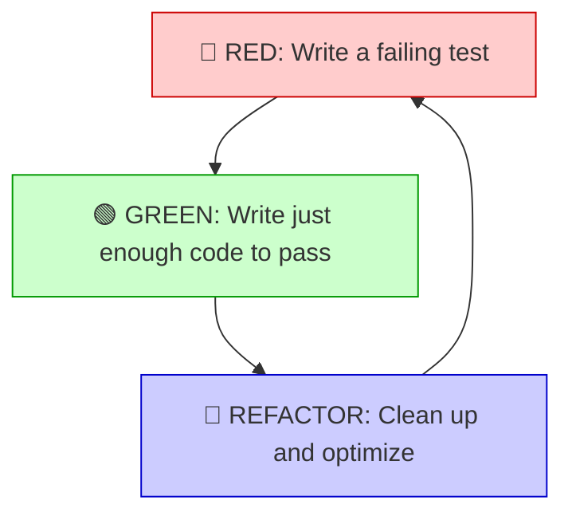
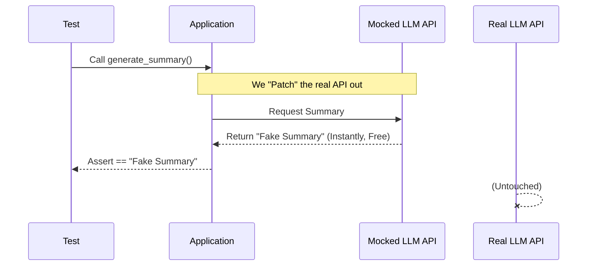
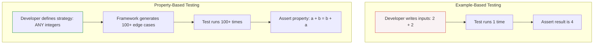
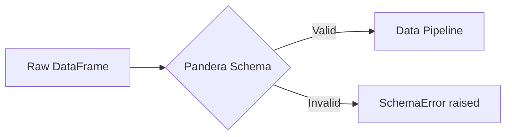

# Bulletproof Python – Unit Testing & Data Validation

This session is all about writing high-quality, testable code. We'll introduce unit testing and practice writing tests for a Python application using the pytest framework. We'll emphasize the principles of test-driven development (TDD) to build features that are robust from the start. Next, we'll introduce data validation and error handling. Students will learn how to write tests that specifically challenge Pydantic models to ensure that incoming data is always correctly formatted. We'll also cover best practices for creating custom validation logic.

-----

## Introduction: Why Test?

When building complex systems—whether orchestrating drones, chaining LLM agents, or processing large datasets—silent failures are your worst enemy. A badly formatted string or an unexpected null value can crash a pipeline hours into a run.

Unit testing allows us to verify that individual components of our code work exactly as intended in isolation.

!!! info "Core Concept"
    A **Unit Test** exercises the smallest testable part of an application (like a single function or method) to ensure it behaves correctly under various conditions.

### Test-Driven Development (TDD)

Test-Driven Development flips the traditional script: you write the test *before* you write the code. This forces you to think about the desired behavior and API design first.



---

## Project Structure: Organizing for Scale

Before we write a single test, we need to know where they live. As your application grows, dumping all your tests into a single `test.py` file becomes completely unmanageable.

The industry standard for Python projects is the **`src` layout**. This explicitly separates your application code from your testing code. It prevents import bleed, forces you to test your code exactly as a user would import it, and ensures you don't accidentally package your test suite into your final production build.

Here is how a professional Python repository is structured:

```text
my_agent_project/
├── pyproject.toml             # Project metadata and dependencies
├── src/                       # ALL production code lives inside here
│   └── my_app/                # Your main package
│       ├── __init__.py
│       ├── agents/            # Submodule for agents
│       │   ├── __init__.py
│       │   └── router.py      # E.g., The agent routing logic
│       └── utils/             # Submodule for utilities
│           ├── __init__.py
│           └── text.py        # E.g., Text cleaning functions
└── tests/                     # ALL testing code lives here
    ├── __init__.py
    ├── agents/                
    │   └── test_router.py     # Tests for router.py
    └── utils/
        └── test_text.py       # Tests for text.py

```

### The Golden Rules of Test Organization

1. **Strict Separation:** Keep your `tests/` directory entirely outside of your `src/` directory.
2. **Mirror the Architecture:** Your `tests/` folder should act as a perfect reflection of your `src/my_app/` folder. If you have a module at `src/my_app/utils/text.py`, its corresponding test file should live at `tests/utils/test_text.py`. This mirroring makes finding the relevant tests instant, even in massive codebases.
3. **The `test_` Prefix Convention:** `pytest` relies on automatic discovery. It will recursively search your entire project and automatically run:
* Any file named `test_*.py` or `*_test.py`
* Any function inside those files starting with `test_`


!!! tip "Best Practice: `__init__.py` in Tests"
    Notice the `__init__.py` files inside the `tests/` subdirectories. While `pytest` doesn't strictly require them to find your tests, including them prevents name collisions if you happen to have two test files with the exact same name in different subdirectories (e.g., `tests/agents/test_helpers.py` and `tests/utils/test_helpers.py`).

---

## The `pytest` Progression: From Simple to Production-Ready

We will use `pytest`, the industry standard for Python testing. It automatically discovers any files starting with `test_` and any functions inside them starting with `test_`. To master unit testing, we need to understand that tests scale in complexity alongside our application logic.

### Level 1: The Absolute Basics (Testing Pure Functions)

A **pure function** always produces the same output for the same input and has no side effects. These are the easiest to test.

```python linenums="1" title="text_utils.py"
def clean_prompt(text: str) -> str:
    """Removes excess whitespace and lowercases the string."""
    return " ".join(text.split()).lower()
```

```python linenums="1" title="tests/text_utils.py"
from text_utils import clean_prompt

def test_clean_prompt_standard():
    # Arrange
    raw_input = "  Translate THIS   to French.  "
    # Act
    result = clean_prompt(raw_input)
    # Assert
    assert result == "translate this to french."

def test_clean_prompt_empty():
    assert clean_prompt("   ") == ""
```

!!! tip "Pro Tip: Arrange, Act, Assert (AAA)"
    Notice the comments in the first test. This is the **AAA pattern**. Mentally following this pattern keeps your tests focused and readable.

### Level 2: Testing Edge Cases and Exceptions

Production code needs to aggressively reject bad data. We can test that the correct errors are raised safely.

```python linenums="1"
import pytest

def get_agent_role(role_id: int) -> str:
    roles = {1: "Researcher", 2: "Writer", 3: "Reviewer"}
    if role_id not in roles:
        raise ValueError(f"Invalid Role ID: {role_id}. Must be 1, 2, or 3.")
    return roles[role_id]

...

def test_get_agent_role_invalid_raises_error():
    # We use pytest.raises as a context manager to catch the expected error
    with pytest.raises(ValueError) as exc_info:
        get_agent_role(99)
    
    # We can assert that the error message is exactly what we expect
    assert "Must be 1, 2, or 3" in str(exc_info.value)
```

### Level 3: The Fake Out (Mocking External Services)

What happens when our function makes a network call to OpenAI or a database? The test becomes slow, requires the internet, and costs money. To solve this, we use **Mocking**.



```python linenums="1" title="app.py"
from unittest.mock import patch
import requests

def fetch_llm_response(prompt: str) -> str:
    response = requests.post("https://expensive-api.ai/v1/generate", json={"prompt": prompt})
    return response.json()["text"]
```

```python linenums="1" title="tests/test_app.py"
@patch('app.requests.post')
def test_fetch_llm_response_success(mock_post):
    # Arrange: Configure our fake mock object
    mock_post.return_value.json.return_value = {"text": "This is a mocked response."}
    
    # Act
    result = fetch_llm_response("What is the capital of France?")
    
    # Assert
    assert result == "This is a mocked response."
    mock_post.assert_called_once() 
```

### Level 4: Fixtures and Parametrization

As tests grow, setups become complex. **Fixtures** handle reusable setup/teardown logic (like creating temporary files or database connections), while **Parametrization** lets you run the same test with different data.

```python linenums="1"
import pytest
import os
import tempfile

# 1. Define a lifecycle fixture with Setup and Teardown
@pytest.fixture
def temp_config_file():
    fd, filepath = tempfile.mkstemp(suffix=".txt")
    with os.fdopen(fd, 'w') as f:
        f.write("api_key=12345")
    
    yield filepath # Pause and pass to the test
    
    if os.path.exists(filepath):
        os.remove(filepath) # Teardown runs after test finishes

# 2. Parametrize a test
def categorize_length(text: str) -> str:
    if len(text) < 5: return "short"
    return "long"

@pytest.mark.parametrize("input_text, expected_category", [
    ("Hi", "short"),
    ("This is a very long string indeed", "long"),
    ("", "short") 
])
def test_categorize_length(input_text, expected_category):
    assert categorize_length(input_text) == expected_category
```

---

## Property-Based Testing with Hypothesis

Up until now, we've used **Example-Based Testing**. We hardcode exact inputs. But what if we forget an edge case?

**Property-Based Testing** solves this. You define the *properties* (rules) that should always hold true, and the framework throws thousands of randomly generated edge cases at it.



`Hypothesis` is the premier property-based testing library for Python. If it finds a failing input, it performs **Shrinking**—systematically reducing the bad data to the absolute minimum input required to trigger your bug.

```python linenums="1"
from hypothesis import given, strategies as st
import pytest

def encode(text: str) -> str: pass # compression logic
def decode(text: str) -> str: pass # decompression logic

# We tell Hypothesis: Give us text. ANY valid string of text.
@given(s=st.text())
def test_encode_decode_roundtrip(s):
    # The Property: Decoding compressed data yields the original data
    assert decode(encode(s)) == s

```

---

## Structural Validation with Pydantic

When accepting data—like JSON payloads or API configs—we need absolute certainty about its shape and types before we process it. Pydantic enforces type hints at runtime.

```python linenums="1"
from pydantic import BaseModel, Field, field_validator, ValidationError
import pytest

class ModelConfig(BaseModel):
    model_name: str
    temperature: float = Field(ge=0.0, le=2.0)
    
    @field_validator('model_name')
    @classmethod
    def check_valid_model(cls, v: str) -> str:
        if v not in ["llama-3", "gpt-4"]:
            raise ValueError(f"Model {v} is not supported.")
        return v

def test_custom_model_validator():
    # Test that Pydantic catches bad data at initialization
    with pytest.raises(ValidationError) as exc_info:
        ModelConfig(model_name="unsupported-model", temperature=1.0)
    
    assert "Model unsupported-model is not supported." in str(exc_info.value)

```

!!! warning "Warning"
    Don't just test the "happy path." Always write tests that deliberately feed Pydantic malicious, malformed, or out-of-bounds data.

---

## Tabular Data Validation with Pandera

While Pydantic is brilliant for object-level data, data engineering relies heavily on tabular data. `pandera` allows us to define statistical schemas for pandas DataFrames.



```python linenums="1"
import pandas as pd
import pandera as pa
from pandera import Column, Check
import pytest

performance_schema = pa.DataFrameSchema({
    "participant_id": Column(int, Check.greater_than(0)),
    "metric_value": Column(float, Check.in_range(0.0, 100.0)),
})

def test_invalid_metrics_dataframe():
    invalid_data = pd.DataFrame({
        "participant_id": [1],
        "metric_value": [105.0] # Fails in_range check
    })
    
    with pytest.raises(pa.errors.SchemaError):
        performance_schema.validate(invalid_data)

```

---

## Suggested Practice Exercises

To solidify these concepts, work through these three exercises. They combine the tools we've learned to mirror real-world production scenarios, scaling from simple assertions to complex property validation.

### Exercise 1: The Warm-Up & The Time Machine (Mocking)

**Goal:** Practice basic assertions, exception handling, and mocking a slow local function (no APIs required!).

**Part A: Basic Assertions & Exceptions**

1. Write a pure function called `calculate_batch_size(total_records: int, workers: int) -> int`. It should return the floor division of records per worker.
2. If `workers` is `0`, it should explicitly raise a `ValueError` with the message: `"Cannot divide work among 0 workers."`
3. Write two `pytest` functions:
    * One that tests a standard input (e.g., 100 records, 4 workers) using standard `assert` statements.
    * One that uses `with pytest.raises(ValueError)` to ensure the exact error message is triggered when workers are 0.


**Part B: Mocking a Slow Function**

1. Create a dummy function to simulate a heavy workload:

```python
import time
def _run_heavy_computation(data: list) -> int:
    """Simulates a massive, 10-second data transformation."""
    time.sleep(10) 
    return len(data) * 42

```


2. Write a main function called `process_dataset(data: list)` that simply calls `_run_heavy_computation(data)` and returns the result.
3. **The Challenge:** If you test `process_dataset` normally, your test suite will pause for 10 seconds. Write a test using the `@patch` decorator to mock `_run_heavy_computation`. Configure your mock to instantly return `999`.
4. Assert that your `process_dataset` function returns `999` and that your mock was `called_once()`. You just time-traveled past a 10-second wait!

### Exercise 2: Bulletproofing with Hypothesis & Pydantic

**Goal:** Combine property-based testing with structural validation to catch bizarre edge cases.

1. Create a Pydantic model called `UserAccount` with fields: `username` (string, min 3 chars), `age` (int, strictly greater than 18), and `email` (string).
2. Write a custom Pydantic `@field_validator` for the email field that ensures it contains an `@` symbol.
3. Use Hypothesis `@given` to generate entirely random strings and integers for these three fields.
4. Write a test that attempts to instantiate `UserAccount` with this completely random Hypothesis data inside a `try/except ValidationError` block.
5. **The Logic:** If a `ValidationError` is raised, the test should `pass` (because Pydantic successfully blocked bad data). If the model initializes successfully without an error, write `assert` statements to prove that the randomly generated data *genuinely* meets all your strict criteria (e.g., `assert account.age > 18`).

### Exercise 3: The Data Pipeline Sandbox

**Goal:** Practice `pytest` setup/teardown lifecycle fixtures and Pandera DataFrame schemas.

1. Define a Pandera schema for a CSV containing housing data: `price` (float, strictly > 0), `bedrooms` (int, strictly > 0), and `zipcode` (string, length exactly 5).
2. Write a `pytest` fixture using the `yield` keyword that:
    * Creates a temporary CSV file.
    * Writes a few rows of valid data and one row of explicitly invalid data (e.g., a negative price) into the file.
    * Yields the temporary file path to the test.
    * Deletes the file in the teardown phase.

3. Write a test that accepts the fixture, loads the temporary CSV via pandas, and attempts to validate it with your Pandera schema.
4. Assert that a `SchemaError` is caught, proving your pipeline will safely reject bad files before they infect your database.
