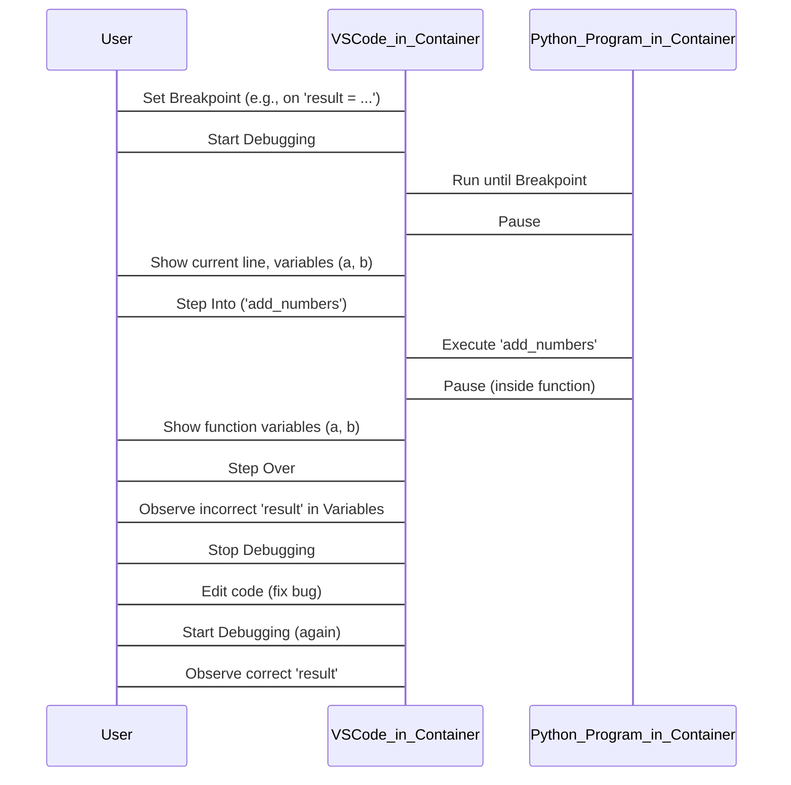

# Session 2: Introduction to IDEs with VS Code

Today, we're going to set up our primary coding environment: **Visual Studio Code (VS Code)**. We'll focus on how to use VS Code effectively for Python development, from writing code to debugging, all within a pre-configured DevContainer.

## Introduction to Visual Studio Code 🚀

!!! info inline end "Alternative IDEs"
    There are numerous IDE alternatives out there and many of them can perform have the same functionality, but we will be focused on VS Code in this course.

Visual Studio Code (VS Code) is a free, powerful, and highly customizable code editor developed by Microsoft. It's incredibly popular among developers due to its lightweight nature, robust features, and extensive ecosystem of extensions.

Why VS Code for Python?

- IntelliSense: Smart code completion, signature help, and quick info.
- Debugging: Integrated debugger for stepping through your code.
- Extensions: A vast marketplace for Python-specific tools, linters, formatters, and more.
- Integrated Terminal: Run commands directly within the editor.
- Git Integration: Seamlessly work with Git (though we'll continue using GitHub Desktop for most Git operations for now).

## Your First Steps: A Live Demo of VS Code with DevContainers ✨

Let's begin by familiarizing ourselves with the VS Code interface and opening our lesson materials within a consistent development environment.

!!! warning "Using Containers"
    To ensure we all have a similar development experience, we will be making use of Docker and "devcontainers". We will go into detail on Docker and devcontainers in a future lesson. Devcontainers are **NOT** a requirement to use VS Code effectively.

### Installing VS Code and the Remote Development Extension

- Install VS Code: If you haven't already, download and install VS Code from the official website: [code.visualstudio.com](https://code.visualstudio.com).
- Install Remote Development Extension: This powerful extension pack allows you to open any folder in a container.
    - Open VS Code.
    - Click the "Extensions" icon on the left sidebar (looks like four squares, one detached).
    - In the search bar, type "Remote Development" (or `ms-vscode-remote.vscode-remote-extensionpack`)
    - Find the "Remote Development" extension pack by Microsoft and click "Install". This pack includes the necessary "Dev Containers" extension.

### Open the Lesson Folder in a DevContainer 🐳

To ensure a consistent development experience, we'll open our lesson folder in a DevContainer. This uses Docker to create a pre-configured environment for you.

To Open the Lesson Folder in a Container:

- First, ensure you have Docker Desktop installed and running on your machine. And that you have this repository cloned on your computer.
- Open VS Code then open the command palatte with `ctrl+shift+p`/`cmd+shift+p`. Search for the option: `Dev Containers: Open Folder in Container`.
- Navigate to this cloned repository. Inside that repository, find the `examples/vscode-basic` folder. Select this `vscode-basic` folder and click "Open".
!!! note inline end "Slllooooooowwwww"
    We will cover this concept in the Docker lesson, but just know that the first time you launch the devcontainer it will take significant time to download some asset files. However, future attempts will be much faster due to caching.
- VS Code will now set up the container. Once complete, you'll be working inside a fully configured development environment!
- You'll see the Explorer (left sidebar) populate with your project's files and folders, now running within the DevContainer.


### Explore the Interface and Create Files

Now that we're inside the DevContainer, let's explore!

- The Explorer (Left Sidebar): This shows your project's files and folders.
    - New File: In the Explorer, hover over the vscode folder and click the "New File" icon (a document with a plus sign). Name it `hello.py`.
    - New Folder: Similarly, click the "New Folder" icon.
- The Editor Area (Middle): This is where you'll write your code.
    - Type `print("Hello from VS Code in a DevContainer!")` into `hello.py`.
- The Integrated Terminal (Bottom): This is your command line, already connected to the environment inside the container.
    - Open it by clicking "Terminal" > "New Terminal" (or Ctrl+` /Cmd+`  backtick).
- Run your script: `python hello.py`. You should see `"Hello from VS Code in a DevContainer!"` printed.

### Verify Python Extensions and Interpreter 🐍

!!! bug inline end "Python Interpreter / IntelliSense not showing?"
    Give it a minute for the extension to install and start properly. If you are noticing issues with the Python extension not working after installation, open the command palatte and search/run: `Developer: Reload Window`. Also, make sure if you have a python script active within the editor for the `Select Interpreter` option to appear.

- Installing the Python Extensions:
    - Click the "Extensions" icon on the left sidebar.
    - Search for the `Python` extension pack from Microsoft (`ms-python.python`) and install it within the devcontainer.
    - You'll notice a "LOCAL - INSTALLED" and "DEV CONTAINER - INSTALLED" section. The Python and Pylance extensions should appear under "DEV CONTAINER - INSTALLED".
- Verifying Python Interpreter:
    - Open a Python file (e.g., `main.py`).
    - Look at the bottom-right status bar in VS Code. You'll see the Python version (e.g., Python 3.10.12). This confirms which interpreter your container is using.

### Write Python Code with IntelliSense

Let's write a simple Python function to see IntelliSense in action. 

- In your vscode folder, create a new file named `calculator.py`.
- Type the following code:

```py title="calculator.py"
def add_numbers(a, b):
    return a + b


result = add_numbers(5, 3)
print(f"The result is: {result}")
```

- As you type add_numbers, notice how VS Code provides code completion suggestions (IntelliSense). This is a huge productivity booster!

!!! example "Try Importing"
    Try importing a library, such as `import numpy as np`, and experiment with the different features available - such as typing `np.` or right clicking `np`.


### Debug Your Python Code 🐛➡️✨

!!! tip inline end "`print("Here!")`"
    The act of debugging code by adding statements like `print("Made it here!")` is an anti-pattern that we want to avoid.

Debugging is essential for finding and fixing errors. VS Code's integrated debugger makes this process visual and efficient.

1. Introduce a Bug: Let's intentionally add a small bug to `calculator.py`. Change `return a + b` to `return a - b`.
1. Set a Breakpoint: Click in the gutter (the space to the left of the line numbers) on the line `result = add_numbers(5, 3)`. A red dot will appear, indicating a breakpoint.
1. Start Debugging:
    - Click the "Run and Debug" icon on the left sidebar (looks like a bug with a play symbol).
    - Click the "Run and Debug" button at the top.
1. Debug Controls:
    - Execution will pause at your breakpoint. A floating toolbar will appear:
        - Step Over (`F10`): Execute the current line and move to the next.
        - Step Into (`F11`): If the line is a function call, go inside that function.
        - Step Out (`Shift+F11`): Finish the current function and return to where it was called.
        - Continue (`F5`): Run until the next breakpoint or end of the program.
        - Stop (`Shift+F5`): End debugging.
    - Use Step Into on the `add_numbers` call.
1. Inspect Variables:
    - In the "Run and Debug" sidebar, look at the "Variables" section. You can see the values of `a` and `b` as you step through the `add_numbers` function.
    - Notice result is incorrect due to our bug.
1. Fix the Bug: Stop debugging, change `return a - b` back to `return a + b`, and try debugging again to see the correct behavior.



## Recommended Exercises & Further Reading

By the end of this session, and after completing these exercises, you should be comfortable navigating VS Code, writing and running Python code within a DevContainer, and performing basic debugging. This comfort is essential for all future modules.

### DevContainer Setup & Python Environment:

- Ensure you have Docker Desktop installed and running.
- Open the `examples/vscode-basic` folder of your Git repository in a DevContainer. Verify that VS Code reopens in the container and that the Python extension is active inside the container.

### Python Scripting & Execution:

- Inside the `examples/vscode-basic folder` (now open in your DevContainer), create a new Python file named `greeter.py`.
- Write a Python function that takes a name as an argument and prints a personalized greeting (e.g., `"Hello, [name]!"`).
- Add code to call this function with different names.
- Run `greeter.py` using the integrated terminal in VS Code.

### Debugging Challenge:

- In your `calculator.py` file, add a new function that attempts to divide two numbers.
- Introduce a bug where it might try to divide by zero without handling the error.
- Use the VS Code debugger to find and identify the line that causes the division by zero error.
- Implement basic error handling (e.g., using a `try-except` block) to gracefully handle this scenario.

!!! example "Try adding a break point within a `for` loop!"

!!! example "Try adding a breakpoint to a line within one python file (such as the `add_numbers` function) and try to call it from another script."


### Suggested Readings & Resources:
- VS Code Official Documentation:
    - [Getting Started with VS Code](https://code.visualstudio.com/docs/introvideos/basics) - A great overview of the editor's features.
    - [Python in VS Code](https://code.visualstudio.com/docs/python/python-tutorial) - The official tutorial for Python development.
    - [Debugging in VS Code](https://code.visualstudio.com/docs/debugtest/debugging) - Detailed guide on how to use the debugger.
- Dev Containers Documentation:
    - [Develop in a Container](https://code.visualstudio.com/docs/devcontainers/containers) - Learn more about what Dev Containers are and how they work.

## Next Steps & Questions

Mastering your development environment is a superpower. Take your time with these exercises. If you have any questions or run into issues, please ask! Being comfortable with VS Code for Python development within a DevContainer is a foundational skill for the rest of our bootcamp.
