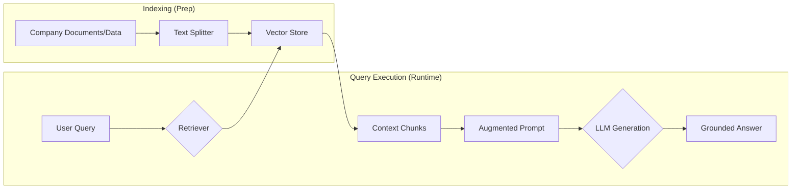

# Grounding, Structured Output, and the RAG Concept

Last time, we mastered the mechanics of the LLM API call. Today, we focus on making the response **reliable** and **predictable**. We will learn techniques to stop the model from making things up (**grounding**) and ensure the output is always in a format our code can trust (**structured output**).

-----

## Grounding: The Solution to Hallucination

The most significant limitation of any LLM is **hallucination**—the tendency to generate fluent, confident, yet factually incorrect information. The model is a prediction engine, not a database, so it often guesses.

The professional fix is **Grounding**: providing the model with external, verified knowledge and forcing it to base its response on that data.

!!! Note "The Hallucination Rule"
    LLMs will prioritize information you provide in the prompt context over their general training data. If you provide context, the model will use it. If you provide conflicting information, the model will typically use the provided context.

### Grounding via Manual Context Injection

The simplest way to ground an LLM is by including the relevant data directly into the prompt (in the **User** or **System** context).

**Copy/Paste Example: Testing Grounding**

Try asking your LLM the query below. It should not be able to answer correctly unless you provide the context.

| Context Block (System/User Role) | Query | Expected Result |
| :--- | :--- | :--- |
| **CONTEXT:** `The new protocol for user authentication, known as "Project Cerberus," was implemented on October 15th, 2024. This date supersedes all previous documentation.` | **Query:** `When was Project Cerberus implemented, and why is this date important?` | The model bases its answer *only* on the supplied October 15th date, ignoring its general training data. |

## Conceptual RAG: Scalable Grounding

While manual context injection works, it doesn't scale. If you have millions of documents, you can't manually find the one sentence the model needs.

**Retrieval-Augmented Generation (RAG)** is the professional, automated architecture that solves the scaling problem of grounding.

!!! Question "When do I need RAG?"
    You need RAG anytime your application needs to answer questions based on information that is **private, recent, or proprietary**—knowledge that the base LLM was not trained on (e.g., your company's policy manuals or yesterday's sales data). Additionally, RAG is useful to bypass context window limitations, like when your knowledge base is larger than the context limits of the chosen model.

### The RAG Pipeline

The RAG workflow has two phases: indexing (prep) and execution (query).



### The Retrieval Challenge (Keyword vs. Vector)

The most important step is the **Retriever**, which decides which external data is relevant to the user's question.

  * **Keyword Search:** Finds documents that contain the exact words used in the query. *Weakness: Fails if the user uses synonyms.*
  * **Vector Search:** The modern, powerful approach. It uses **embeddings** to find data that is **semantically similar** (meaning similar) to the query, even if the exact words are different. This is how RAG achieves high accuracy.

## Structured Output: Enforcing Predictability

Even a factually correct, grounded answer is useless if it's in a messy format. Our code needs to consume reliable **JSON** or **YAML** data, not free-form paragraphs.

### Approach 1: Simple Prompting (Fast, Fragile)

The fastest way to get structured output is to explicitly command the model in the prompt to only return a specific format.

**Copy/Paste Example: Data Extraction (NER)**

Here, we command the model to extract **Named Entities** and format them as JSON.

| System Instruction (Copy/Paste) | User Query (Copy/Paste) |
| :--- | :--- |
| `You are a data extractor. Convert the input text into a strict JSON object with the keys: person_name (string), event_date (string), and location (string). Only output the JSON and nothing else.` | **Input Text:** `Mr. John Smith traveled from Boston on June 4th to attend a conference in London.` |

!!! Warning "Fragility Alert"
    Simple prompting for structured output is **fragile**. The LLM is generating text, not running a JSON compiler. It can easily introduce small errors (e.g., missing a comma or using single quotes) that will cause your Python JSON parser to crash at runtime.

### Approach 2: Pydantic Enforcement (Robust, Production-Ready)

The professional solution is to use **Pydantic `BaseModel`s** and instruct the API to enforce that structure.

!!! Tip "Pydantic as a Contract"
    When using Pydantic, your code doesn't parse the model's text output; it sends the Pydantic schema to the API. The API then returns a validated JSON object, which you can load directly into a Pydantic object, guaranteeing its type and structure.

We use Pydantic to define the exact structure, and the API enforces it.

```python linenums="1"
from pydantic import BaseModel, Field
from typing import List

# Define the exact data structure we expect
class CustomerRecord(BaseModel):
    """A model for validating extracted customer data."""
    id: int = Field(description="The unique numeric ID of the customer.")
    name: str = Field(description="The customer's full name.")
    is_active: bool = Field(description="True if the account is currently active.")
```

## Recommended Exercises & Homework

Your homework focuses on applying Structured Output and testing the fundamental limits that necessitate the RAG architecture.

1.  **RAG Motivation Test (Relevance vs. Noise):**

      * Find a moderately long, single document (e.g., $\approx$ **600-800 words**—a project charter, policy manual, or a long blog post). Ensure the document has lots of surrounding detail (noise).
      * **Task:** Copy and paste this entire document into your `user` message. Immediately after, ask a single, *highly specific* question whose answer is only a short sentence buried deep within the text (e.g., "What is the policy for using personal headphones in the breakroom?").
      * **Observation:** The model will often fail to give the exact, correct answer, or it will give a generic summary, proving that simply including all the text is not enough. The **Retriever** (which RAG provides) is necessary to pull the **needle** out of the **haystack**.

2.  **Pydantic Validation (Extraction and Generation):**

      * Using your existing Python API setup and your API key, perform the following two tasks, enforcing the structure using **Pydantic** and the `text_format` or `response_format` parameter ([see OpenAI documentation](https://platform.openai.com/docs/guides/structured-outputs)).
      * **Task A: Data Extraction (Named Entity Recognition - NER):**

          * Define a Pydantic model called **`EntityExtraction`** with fields for `person_name` (string), `event_date` (string), and `location` (string).
          * Send the LLM a paragraph of text containing entities (e.g., "Ms. Eva Green met with the CEO in Paris on December 12th.").
          * Force the LLM to extract the data into your `EntityExtraction` model, and verify that the resulting JSON can be easily loaded into a valid Pydantic object.

      * **Task B: Data Generation (Recipe):**

          * Use the `Recipe` Pydantic model defined below.
          * Send the LLM a query asking it to "Generate a recipe for a simple chocolate chip cookie."
          * Force the LLM to return the output in the strict `Recipe` schema. Confirm the `ingredients` field is successfully returned as a clean Python list.

        <!-- end list -->

        ```python linenums="1"
        from pydantic import BaseModel, Field
        from typing import List
        class Recipe(BaseModel):
            """A model representing a structured recipe."""
            name: str = Field(description="The formal name of the dish.")
            prep_time_minutes: int = Field(description="The estimated preparation time in minutes.")
            ingredients: List[str] = Field(description="A list of required ingredients.")
        ```

!!! Danger "Keep it Secret, Keep it Safe"
    Treat your API key like a password. DO **NOT** share it with others you don't trust or commit to GitHub. If you wish to commit your code to Git, one method to keep your key safe is by storing it within an untracked environment variable (i.e., a `.env` file) which gets loaded into the script.
