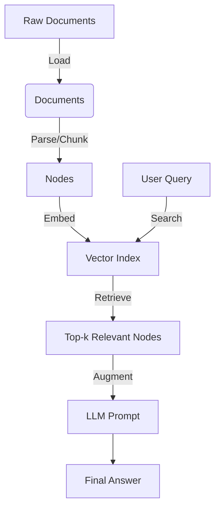
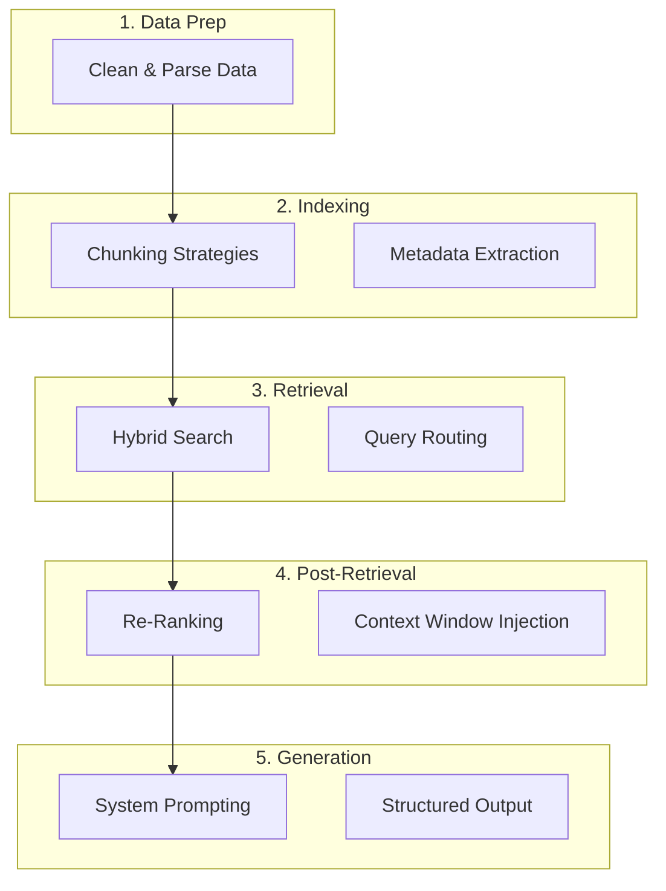
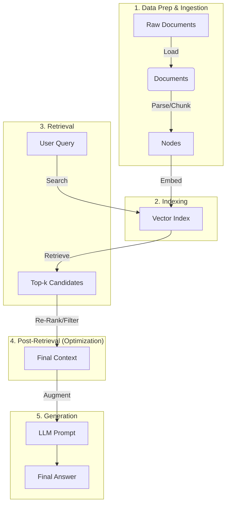

# Frameworks and Retrieval Systems (LlamaIndex)

In the previous sessions, we manually crafted API requests and conceptually understood RAG. You likely realized that managing document loading, chunking text, connecting to vector databases, and handling conversation history manually is a lot of "glue code."

Today, we introduce **Orchestration Frameworks**. These are "batteries-included" libraries that handle the heavy lifting, allowing you to focus on the logic of your application. We will focus specifically on **LlamaIndex**, a framework optimized for connecting LLMs to your data.

-----

## Why Frameworks? The Ecosystem

Building an LLM app with raw API calls is like building a web server using raw TCP sockets. Possible, but painful and inefficient. Frameworks provide abstractions for:

  * **Data Ingestion:** Loading PDFs, CSVs, Notion, SQL, etc.
  * **Indexing:** Managing how data is split and stored.
  * **Retrieval:** Finding the right data strategies (keyword vs. vector).
  * **Memory:** Managing chat history.

## The Landscape

There are several major players, each with a different philosophy:

  * **LlamaIndex:** The "Data Framework." Excellent for RAG, indexing, and structured data retrieval.
  * **LangChain:** The "Generalist." Great for chains, broad integrations, and complex workflows.
  * **LangGraph:** Built on LangChain, focuses on stateful, cyclic multi-agent workflows.
  * **Pydantic AI:** A newer, type-safe framework focusing on structured outputs and validation.
  * **Haystack:** Focused on modular NLP pipelines.
  * **DSPy:** A radical new approach that "compiles" prompts rather than writing them manually.
  * **Google AI SDK:** Google's native tooling for Gemini integration.
  * **...and tons more!**

We are focusing on **LlamaIndex** today because it offers the strong out-of-the-box tools for RAG and data processing.

!!! Note "If No Fit..."
    As you get more advanced, you soon realize that some of these frameworks are too bloated or don't support your niche processes. Thus, it is common to build these systems from scratch. However, I highly suggest starting with a framework until you know what you are doing (or know exactly what you need to build).


## LlamaIndex Core Concepts

To use LlamaIndex, you need to understand its primary objects:

1.  **Documents:** The raw data source (text, metadata).
2.  **Nodes:** A "chunk" of a document. This is what gets embedded and stored.
3.  **Index:** A data structure composed of Nodes (e.g., a Vector Store Index).
4.  **Retriever:** Fetches relevant Nodes based on a user query.
5.  **Query Engine:** A pipeline that retrieves nodes and sends them to the LLM to generate an answer.

<!-- end list -->



## The "Hello World" of RAG

Let's build a RAG system in about 5 lines of code. We will load a local text file and chat with it.

!!! Warning "Setup Required"
    You need to have the library installed: `pip install llama-index`. You also need your `OPENAI_API_KEY` set in your environment variables - or the relevant information for other model providers.

```python linenums="1"
import os
from llama_index.core import VectorStoreIndex, SimpleDirectoryReader, Settings
from llama_index.llms.openai import OpenAI

# 1. Setup (Using OpenAI or Gemini)
# Settings is a global config object in LlamaIndex
Settings.llm = OpenAI(model="gpt-4o", temperature=0.1)

# 2. Load Data
# Assumes you have a folder named 'data' with text files inside
# SimpleDirectoryReader is a magic tool that handles PDFs, TXT, CSVs automatically
documents = SimpleDirectoryReader("data").load_data()

# 3. Index Data (This handles chunking and embedding automatically)
index = VectorStoreIndex.from_documents(documents)

# 4. Create a Query Engine
query_engine = index.as_query_engine()

# 5. Ask a Question
response = query_engine.query("What is the summary of the document provided?")
print(response)
```

!!! Info "Under the Hood"
    Even though this looks simple, LlamaIndex automatically:
    1\. Split your text into chunks (default 1024 tokens).
    2\. Used an embedding model (default OpenAI text-embedding-3-small) to vectorize them.
    3\. Stored them in an in-memory vector database.
    4\. On query, searched for the top-k most similar chunks and sent them to GPT-4.


## Optimization Strategies: Improving RAG Performance

The "Hello World" example works for simple demos, but fails in production. To make RAG robust, we optimize at five different stages.



Updated RAG diagram:



### Data Creation & Preparation

Garbage in, garbage out. If your PDF parser mashes headers and footers into the text, the LLM will get confused.

  * **Strategy:** Use advanced parsers (like **LlamaParse**, **Docling**, or **Unstructured**) that understand document layout, tables, and images.

### Indexing Optimizations (Chunking)

How you split your text matters.

  * **Small Chunks:** High precision, but might miss context (split by words, sentences, lines, paragraph, etc.).
  * **Large Chunks:** Good context, but might include "noise" that confuses the LLM (split by paragraphs, pages, sections, etc.).
  * **Metadata:** Adding tags (e.g., `{"year": 2023}`) allows you to filter search results *before* the vector search, improving accuracy.

### Retrieval Optimizations

Sometimes the user asks a vague question.

  * **Query Expansion:** The system uses an LLM to rewrite the user's query into 3 or 4 better queries, searches for all of them, and combines the results (see _HyDE_).
  * **Hybrid Search:** Using Vector Search (semantic) AND Keyword Search (exact match) together.

### Post-Retrieval Optimization (The "Secret Sauce")

This is often the highest-impact optimization. After fetching the top 10 chunks, we refine them.

  * **Re-ranking:** Use a specialized model (like a Cross-Encoder) to re-score the retrieved chunks and pick the absolute best ones.
  * **Sentence Window Retrieval:** Index small sentences for high-accuracy searching, but when you retrieve them, swap the small sentence out for a larger "window" of surrounding text to give the LLM better context.

### Generation

  * **System Prompting:** Telling the LLM strictly "Answer only based on the context provided."
  * **Parameter Tuning:** Tweaking parameters like temperature, top-p, etc.
  * **LLM Selection:** Using a model with a larger context window or better reasoning capabilities.


## Recommended Exercises & Homework

Your task is to take a baseline RAG system and empirically improve its performance using LlamaIndex features, and then explore structured extraction.

**The Setup:**
Download a complex PDF (e.g., a 10-page financial report or a technical manual) and place it in a `data` folder. Use the "Hello World" code from Section 3 as your baseline.

### Task 1: Baseline vs. Optimization

1.  **Baseline Test:** Ask a specific question (e.g., "What was the operating margin in Q3?"). Note the answer. Is it correct? Is it missing details?
2.  **Optimization Investigation:** Choose **one** of the following advanced techniques to implement. Use the [LlamaIndex Optimization Guide](https://developers.llamaindex.ai/python/framework/optimizing/production_rag) to find the code patterns.
      * **Option A (Context):** Implement **Sentence Window Retrieval**. This involves changing the `NodeParser` to a `SentenceWindowNodeParser` and adding a `MetadataReplacementPostProcessor`.
      * **Option B (Accuracy):** Implement **Re-ranking**. Install `llama-index-postprocessor-colbert-rerank` (or similar) and add it to the `query_engine`'s `node_postprocessors` list.
      * Try both!
3.  **Report:** Compare the answer from the optimized system to the baseline.

!!! Tip "Debugging RAG"
    If you want to see exactly what text the retriever found, you can inspect the response object:
    `print(response.source_nodes[0].get_content())`
    This is essential for knowing if your retriever failed (found wrong text) or if the LLM failed (couldn't read the text).

### Task 2: Structured Data Extraction

RAG isn't just for chat; it's often used to scrape data from documents.

1.  **Goal:** Create a script that takes a Resume (PDF or Text) and extracts it into a Pydantic object.
2.  **Implementation:**
      * Define a Pydantic class `Resume` with fields like `name`, `skills` (list), and `experience_years` (int).
      * Use LlamaIndex's **Structured Data Extraction** capabilities. Look up the documentation for `program` or `structured_output`.
      * Instead of `query_engine.query()`, you will use the extraction program to parse the document and return a Python object.

## Suggested Readings & Resources

  * **LlamaIndex Docs:** [High-Level Concepts](https://docs.llamaindex.ai/en/stable/getting_started/concepts/)
  * **Optimization Guide:** [Production RAG Optimizations](https://developers.llamaindex.ai/python/framework/optimizing/production_rag)
  * **Structured Extraction:** [LlamaIndex Extraction Guide](https://developers.llamaindex.ai/python/framework/use_cases/extraction/)
