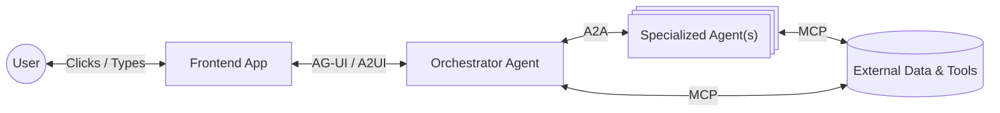
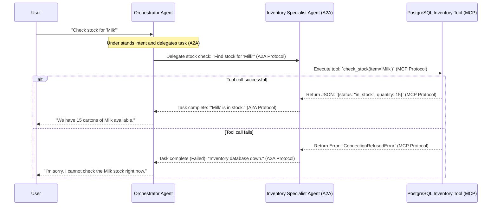
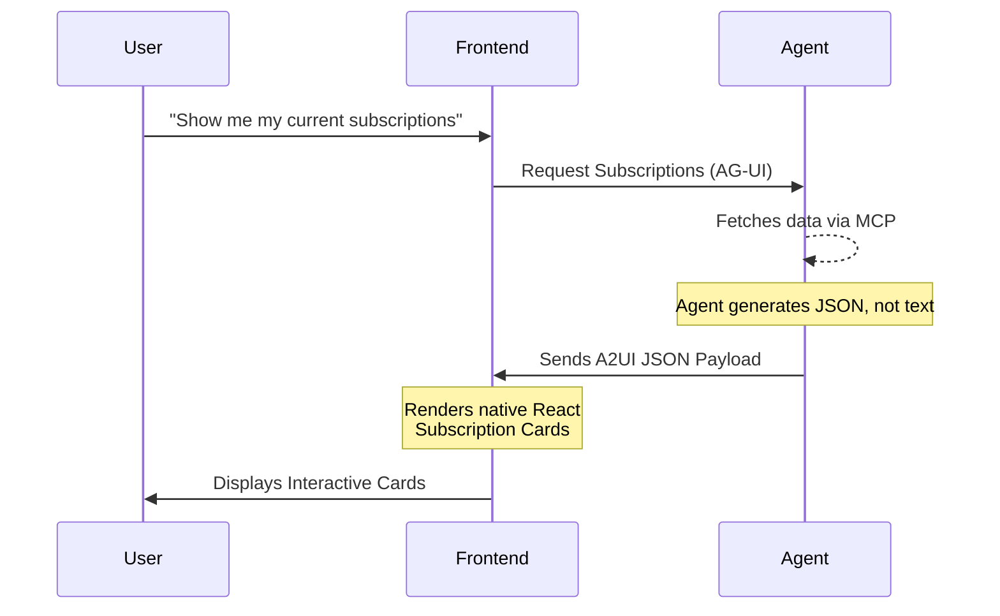

# Modern Agent Protocols

**Objective:** Move beyond simple text generation by connecting your deployed LLM to tools, users, and other agents using standardized industry protocols. 

---

## The Protocol Landscape

A raw text generator is not an "agent." To build autonomous, useful systems, the LLM must interact with the outside world.

!!! example "LLM vs Agent"
    * An LLM is like a brain in a jar. It can think, but it can't do anything.
    * An Agent is a brain connected to arms, legs, and senses. It can interact with the world.

For the past year, the industry relied on fragmented, custom API wrappers. Every developer wrote their own Python scripts to scrape web pages, query databases, or update UIs based on the LLM's text output. 

* **The Problem:** Hardcoding API calls for tool use and UI rendering is extremely fragile. If an API changes, the agent breaks. If you switch models, the prompt engineering required to trigger those specific APIs often fails.
* **The Solution:** Standardized protocols for different layers of the AI stack. By adopting open standards, we decouple the *model* from the *environment*, allowing for truly modular, plug-and-play architectures.

### The Modern Agentic Stack

!!! warning "Stop writing custom function-calling wrappers!"
    If you find yourself writing hundreds of lines of RegEx or custom JSON parsers to force an LLM to interact with your specific database, you are accumulating technical debt. The protocols discussed below are designed to eliminate this exact problem.

---

## Deep Dive into the Protocols

To build a modern application, you need to master how agents talk to tools, to users, and to each other. Here is the breakdown of the foundational protocols.

### Quick Reference Matrix

| Protocol | Acronym | Connects... | Core Function |
| :--- | :--- | :--- | :--- |
| **MCP** | Model Context Protocol | Agent ↔ Tools & Data | Standardizes tool execution and data retrieval without custom integration code. |
| **A2A** | Agent-to-Agent | Agent ↔ Agent | Uses `/.well-known/agent-card.json` to dynamically discover and delegate tasks. |
| **UCP** | Universal Commerce Protocol| Agent ↔ Merchants | Standardizes the shopping lifecycle with typed checkout schemas across any transport. |
| **AP2** | Agent Payments Protocol | Agent ↔ Payments | Adds cryptographic guardrails and typed mandates for non-repudiatable transaction approval. |
| **A2UI** | Agent-to-User Interface | Agent ↔ Generative UI | Dynamically composes native UI layouts using 18 safe JSON component primitives. |
| **AG-UI**| Agent-User Interaction | Agent ↔ Event Stream | Translates raw framework events into a standardized Server-Sent Events (SSE) stream. |

!!! info "Recommended Reading"
    For a more detailed breakdown of the protocols, check out the [Agent Protocols Guide by Google](https://developers.googleblog.com/developers-guide-to-ai-agent-protocols/), which provides an excellent overview of the current landscape.

---

### MCP (Model Context Protocol)
**Agent ↔ Tools & Data**

* **What it is:** An open standard introduced by Anthropic designed to securely connect LLMs to external data sources (like SQL databases, GitHub repositories, or Slack channels) and executable tools.
* **Why it matters:** MCP acts as a universal USB-C cable for AI agents. Instead of building a custom GitHub integration for your specific Llama 3 deployment, you simply spin up an open-source "GitHub MCP Server." Your agent connects to this server and instantly understands how to read code, create PRs, and review commits.
* **Key Concept:** It standardizes how context is provided to the model, ensuring the model knows exactly what tools are available, what arguments they require, and how to handle errors natively.

!!! tip "Recommended Reading"
    Check out the official [Model Context Protocol Documentation](https://modelcontextprotocol.io/) to see how you can build an MCP server in Node.js or Python, or explore the growing registry of pre-built open-source MCP servers.

---

### A2A (Agent-to-Agent)
**Agent ↔ Agent**

* **What it is:** An emerging standard (heavily pioneered by Google and multi-agent frameworks) allowing disparate AI agents to natively communicate, delegate tasks, and collaborate on complex workflows.
* **Why it matters:** It prevents the "Monolithic Agent" anti-pattern. You don't want a single 70B model trying to handle customer support, write SQL queries, and generate UI code simultaneously. 
* **The Workflow:** With A2A, an "Orchestrator Agent" receives a complex user request. It uses the A2A protocol to dispatch structured tasks to an MCP-powered "Database Agent" and a specialized "Copywriting Agent." It then aggregates their responses. This allows for massively scalable, highly specialized AI teams running asynchronously.

---

### UCP (Universal Commerce Protocol)
**Agent ↔ Merchants & Suppliers**

* **What it is:** Standardizes the entire shopping and procurement lifecycle into modular capabilities through strongly typed schemas (e.g., `CheckoutCreateRequest`, `LineItemCreateRequest`).
* **Why it matters:** If an autonomous system needs to source hardware or raw materials from multiple distributors, UCP ensures you don't have to build custom checkout flows for each supplier. It provides a unified pattern whether the connection is over REST, A2A, or MCP.
* **Key Features:** UCP defines a set of core commerce primitives (like `LineItem`, `Checkout`, `PaymentMethod`) and the interactions between them, allowing agents to seamlessly create carts, manage inventory, and complete purchases across any platform.

---

### AP2 (Agent Payments Protocol)
**Agent ↔ Secure Authorization**

* **What it is:** An extension of UCP that enforces configurable guardrails on transactions and provides a full audit trail.
* **Why it matters:** Agents cannot have uncontrolled spending power. AP2 introduces an `IntentMandate` that specifies allowed merchants and sets spending limits for auto-approval. The agent binds this to a specific cart via a `PaymentMandate`. If the order exceeds the limit, the mandate remains unsigned until a human explicitly approves it, closing the loop with a cryptographic `PaymentReceipt`.
* **Key Features:** AP2 ensures that all transactions are non-repudiable and auditable, providing peace of mind for both users and regulators when deploying agents that can make purchases on their behalf.

!!! warning "Security First"
    Never give an agent direct access to a payment method without AP2 guardrails. Always require explicit human approval for transactions above a certain threshold.

---

### A2UI (Agent to UI)
**Agent ↔ Generative Interface**

* **What it is:** A declarative JSON specification allowing agents to bypass text completely and "speak UI." 
* **Why it matters:** Users don't want to read a markdown table of flight options; they want interactive, clickable flight cards. 
* **How it works:** Instead of the agent replying with a block of text, it streams a secure JSON payload (or React Server Component). The client application parses this protocol and renders native frontend components (like interactive widgets, forms, or charts) directly in the chat interface.

!!! tip "Generative UI in Practice"
    The [Vercel AI SDK (`ai/rsc`)]([https://sdk.vercel.ai/docs](https://sdk.vercel.ai/docs)) is one of the leading implementations of A2UI concepts, allowing you to stream React components directly from your LLM backend to the user.

---

### AG-UI (Agent-User Interaction)
**Agent ↔ Application Frontend**

* **What it is:** An event-based protocol (popularized by frameworks like CopilotKit) that robustly connects an agentic backend to a user-facing application (React, iOS, etc.). 
* **Why it matters:** Chatbots are easy; integrated copilots are hard. AG-UI handles the incredibly complex bi-directional syncing required for modern apps.  Agents stream text incrementally and pause to wait for human-in-the-loop approvals. AG-UI eliminates the boilerplate needed to parse these streams by translating raw framework events into a standard SSE (Server-Sent Events) stream using typed events like `TOOL_CALL_START` and `TEXT_MESSAGE_CONTENT`.
* **Key Features:** It manages the state of the chat history, broadcasts tool-execution states to the user (e.g., showing a spinner that says *"Searching database..."*), and handles **Human-in-the-Loop** approvals (e.g., pausing the agent until the user clicks "Approve" before sending an email).

!!! info "Recommended Reading"
    Review the [CopilotKit Documentation](https://docs.copilotkit.ai/) to see how AG-UI patterns are implemented to deeply embed agents into React application states, allowing the AI to actually "see" what the user is doing on the screen.

!!! example "See it in action!"
    I recommend seeing AG-UI and A2UI in action by trying out this demo [AG-UI Interactive Dojo](https://dojo.ag-ui.com/), which showcases how agents can generate dynamic UIs and interact with users in real-time.

---

### Wrap Up

You do not need to implement all six protocols on day one. Most architectures start with **MCP** for robust data access and **A2A** to route logic to specialized sub-agents. As your system matures into executing real-world procurement or requiring rich real-time dashboards, you can strategically introduce **UCP**, **AP2**, **A2UI**, and **AG-UI**.
