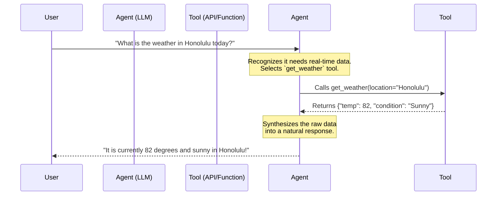
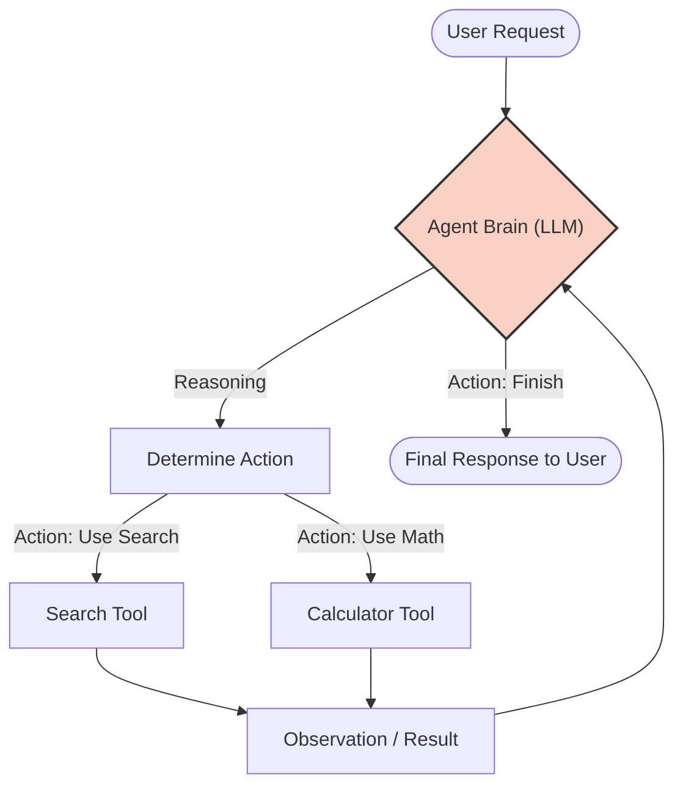
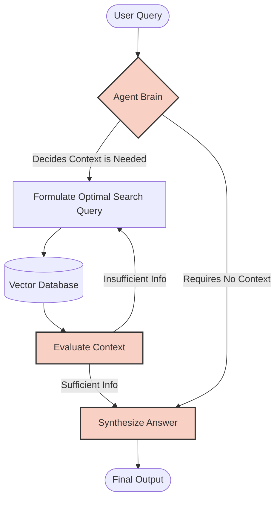

# Introduction to LLM Agents

Welcome to this comprehensive lesson on LLM Agents! In this module, we will explore how Large Language Models (LLMs) have evolved from simple text generators into autonomous entities capable of reasoning, planning, and interacting with the external world.

## Core Concepts

### What is an LLM?

A standard Large Language Model (LLM) is essentially a sophisticated next-word prediction engine. When you give it a prompt, it relies entirely on the static weights it learned during training to generate a response.

### What is an LLM Agent?

An **LLM Agent** is a system where an LLM acts as the "brain" or reasoning engine of a broader workflow. Instead of just returning text, an agent uses the LLM to decide *what actions to take*, *when to take them*, and *how to synthesize the results*. Agents possess three key components that standard LLMs lack out-of-the-box:

* **Planning/Reasoning:** Breaking down complex tasks into smaller steps.
* **Memory:** Maintaining state over long interactions (short-term conversational history and long-term vector storage).
* **Tools/Execution:** The ability to interact with external systems, APIs, or databases.

!!! info "LLMs vs. Agents"
    An LLM answers the question: *"Based on my training data, what is the most likely text to follow this prompt?"*
    An Agent answers the question: *"To solve this user's problem, what information do I need to fetch, what tools should I use, and how do I combine that into a final solution?"*

### Tool Calling (Function Calling)

Tool calling is the mechanism that bridges the gap between the LLM's text generation and the real world. You provide the LLM with a list of available tools (usually defined via JSON Schema) and their descriptions.

When the LLM encounters a query it cannot answer alone, it outputs a structured request specifying which tool to use and what arguments to pass.



## Building an Agent with LangChain

LangChain provides a robust framework for building agentic workflows. In this section, we will build a basic agent equipped with a search tool and a math tool.

### The Agent Architecture

Before looking at the code, let's visualize the architecture of a standard **ReAct** (Reasoning and Acting) agent loop:



### Python Implementation

Here is how you can create a tool-calling agent using LangChain's `create_agent`.

!!! info "LangChain Documentation"
    For more details on the `create_agent` function and its parameters, check out the [LangChain documentation](https://docs.langchain.com/oss/python/langchain/agents).

```python linenums="1"
import os
from langchain_openai import ChatOpenAI
from langchain.agents import create_agent
from langchain_core.prompts import ChatPromptTemplate
from langchain_core.tools import tool

# 1. Define Tools
@tool
def multiply(a: float, b: float) -> float:
    """Multiply two numbers together."""
    return a * b

@tool
def get_current_weather(location: str) -> str:
    """Get the current weather for a specific location."""
    # In a real app, this would call an external API
    return f"The weather in {location} is 75 degrees and breezy."

# 2. Initialize the LLM (Must support tool calling)
llm = ChatOpenAI(model="openai:gpt-5.4", temperature=0)

# 3. Create the Agent and Executor
agent = create_agent(
    llm,
    # Optionally, instead of instantiating the LLM separately, you can specify the model here and let LangChain handle it.
    # model="openai:gpt-5.4",
    tools=[multiply, get_current_weather],
    system_prompt="You are a helpful assistant equipped with tools. Use them when necessary.",
)

# 4. Invoke the Agent
response = agent.invoke({
    "messages": [
        {
            "role": "user",
            "content": "What is the weather in Honolulu? Then multiply the current temperature by 2."
        }
    ]
})

print(response)

```

## Agentic RAG: Elevating Retrieval

Retrieval-Augmented Generation (RAG) is a wildly popular technique for giving LLMs access to private documents. However, as applications scale, treating RAG as an agentic workflow rather than a static pipeline unlocks immense potential.

### Vanilla RAG vs. Agentic RAG

In a standard (Vanilla) RAG pipeline, the system blindly takes the user's raw input, retrieves the top-$k$ documents from a vector database, and shoves them into the LLM's prompt. It is a strictly **linear, one-shot process**. If the retrieval fails or brings back irrelevant data, the final answer will be flawed.

**Agentic RAG** transforms retrieval into a *tool* that the agent actively controls. Instead of forcing context into the prompt right away, the agent is given a `search_knowledge_base` tool - or multiple search tools (i.e. different search strategies).



### The Benefits of the Agentic Approach

By putting the LLM in the driver's seat of the retrieval process, you gain several massive advantages:

| Benefit | Description |
| --- | --- |
| **Query Reformulation** | Users often ask vague questions. An agent can translate a complex or poorly worded prompt into an optimized semantic search query before querying the database. |
| **Iterative Retrieval** | If the initial search results do not contain the answer, the agent can recognize this and search again using different keywords or parameters. |
| **Multi-hop Reasoning** | For questions like *"Who is the CEO of the company that acquired StartupX?"*, the agent can perform an initial search to find the acquiring company, read the result, and then perform a *second* search to find the CEO of that specific company. |
| **Graceful Fallbacks** | If an internal document search fails, the agent can decide to route the query to a standard web search tool or simply tell the user the information doesn't exist internally, rather than hallucinating based on bad context. |

## Exercise: Multi-Hop Agentic RAG with Multiple Tools

Now it's time to put these concepts into practice. In this exercise, you will build a ReAct-style agent capable of solving multi-hop questions by intelligently selecting and managing **multiple distinct tools**. This will show you the true power of an agent: knowing *which* tool to use at *what* specific stage of a problem.

### The Scenario

You are building an advanced internal HR assistant. A manager wants to calculate the financial liability of a specific employee's unused vacation time. To do this, the agent must figure out who the employee is, check an API for their PTO balance, and do some math.

### Your Task

Build a LangChain agent equipped with **three distinct tools** that can answer this specific prompt:

**"Who is the employee leading Project Phoenix, how many PTO days do they have left, and what is the total payout value of those PTO days if their daily rate is $350?"**

### Steps to Completion

1. **Build the Toolset:**
Use LangChain's `@tool` decorator to create the following three mock tools:
* `search_company_directory(query: str) -> str`: A retrieval tool. If the query contains "Phoenix", it returns: *"Project Phoenix is led by Sarah Jenkins."*
* `get_pto_balance(employee_name: str) -> int`: An API mockup tool. If the name is "Sarah Jenkins", it returns `14`.
* `multiply(a: float, b: float) -> float`: A calculator tool that multiplies two numbers and returns the result.


2. **Initialize the Agent:**
* Instantiate an LLM (e.g., `ChatOpenAI(model="gpt-4o", temperature=0)`).
* Bind **all three** of your tools (`tools = [search_company_directory, get_pto_balance, multiply]`) to the LLM.

3. **Execute the Complex Query:**
Pass the multi-part prompt to your agent.

### Expected Agent Behavior (The "ReAct" Loop)

If built correctly, your console output should show the agent taking multiple distinct steps, dynamically switching tools as it learns new information:

1. **Thought:** I need to find out who is leading Project Phoenix.
* **Action:** `search_company_directory("Project Phoenix lead")`
* **Observation:** "Project Phoenix is led by Sarah Jenkins."


2. **Thought:** Now I know the employee is Sarah Jenkins. I need to find out how many PTO days she has left.
* **Action:** `get_pto_balance("Sarah Jenkins")`
* **Observation:** `14`


3. **Thought:** Sarah has 14 PTO days. I need to calculate the payout value if her daily rate is $350. I will multiply 14 by 350.
* **Action:** `multiply(a=14, b=350)`
* **Observation:** `4900`


4. **Final Answer:** The employee leading Project Phoenix is Sarah Jenkins. She has 14 PTO days remaining, and the total payout value for those days is $4,900.


!!! warning "Tool Descriptions Matter!"
    If your agent gets confused about which tool to use, check your tool docstrings. The LLM relies either **entirely** on the docstring (e.g., `"""Use this tool to find an employee's remaining vacation days."""`) or a description provided in the tool decorator (e.g. `#!python @tool("calculator", description="Performs arithmetic calculations. Use this for any math problems.")`) to decide if a tool is appropriate for the current step. Write clear, descriptive instructions for each tool!

!!! example "Challenge: Structured Output"
    Try to get the agent to return a structured JSON response at the end, rather than a plain text answer. Hint: look at the langchain documentation for how to specify a structured output format.

!!! example "Challenge: Try Community Tools"
    Experiment with adding a community-managed tool, for example see some here: https://medium.com/@vamshiginna1606/langchain-tools-5-langchain-tools-every-llm-developer-should-know-ad698f06dcb5.

!!! example "Challenge: Streaming"
    Update your agent code to enable streaming responses from the LLM. This will allow you to see the agent's thought process and tool calls in real-time as it works through the problem. Check out the LangChain documentation for how to enable streaming with your LLM.
