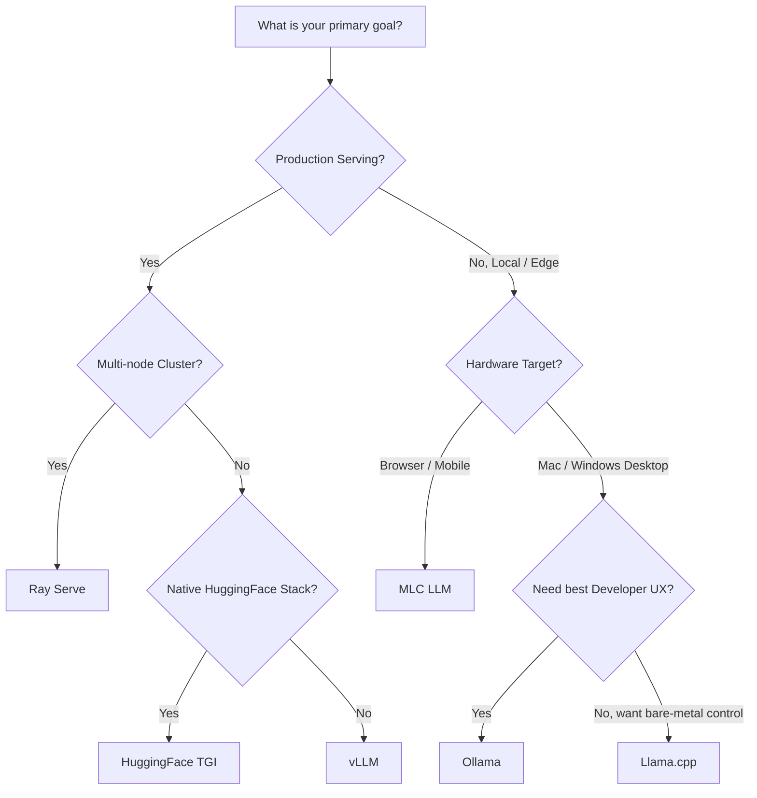

# Self-Hosting & Deploying Open Source LLMs

In this module, we will demystify the hardware required to run Large Language Models (LLMs) locally and explore the vast ecosystem of inference engines. By the end of this session, you will understand how to calculate your hardware constraints, choose the right quantization method, and select the best deployment framework for your specific use case.

---

## Model Sizes, Precision, & VRAM Requirements

Before spinning up a model, you must ensure your hardware can physically hold it. LLMs are memory-bound, meaning **VRAM (Video RAM)** on your GPU is your most precious resource. 

When you see a model like `Llama-3.1-8B`, the "8B" stands for 8 billion parameters. By default, these parameters are stored in 16-bit floating-point (FP16 or BF16) precision. 

!!! tip "The Rule of Thumb" 
    1 Billion parameters $\approx$ 2 GB of VRAM at 16-bit precision.

!!! example "Back of the envelope math"
    - 1 parameter $\approx$ 2 bytes (16 bits)
    - 7 billion parameters $\approx$ 14 billion bytes $\approx$ 14 GB of VRAM at 16-bit precision.
    - Modern consumer GPUs typically have between 8 GB and 24 GB of VRAM, which is why quantization is essential for running larger models.

### Understanding Quantization (The Secret to Local AI)

Running a 70B model at 16-bit requires roughly 140GB of VRAM—well out of reach for most consumer setups. To solve this, the community uses **Quantization**, which compresses the model's weights into lower-precision formats (like 8-bit, 4-bit, or even 2-bit integers). Think of it like compressing a massive `.WAV` audio file into an `.MP3`. 

**The Pros of Quantization:**

* **Drastically Reduced VRAM:** You can fit models on consumer laptops that would otherwise require data center GPUs.

* **Faster Inference:** Because LLM generation is bottlenecked by how fast data can move from memory to the processor (memory bandwidth), smaller weights transfer faster, often resulting in higher tokens-per-second generation.

**The Cons of Quantization:**

* **Perplexity / "Brain Damage":** Compressing weights inherently loses some mathematical nuance.
    
    * *8-bit:* Almost indistinguishable from the 16-bit original. Highly recommended.
    * *4-bit:* The industry "sweet spot." You save roughly 70% of the VRAM with only a negligible dip in reasoning quality. 
    * *2-bit:* Extreme compression. The model fits anywhere, but it suffers significant accuracy loss, struggles with complex logic, and is much more prone to hallucination.

!!! warning "Don't forget the KV Cache!"
    The estimates below are for **Model Weights Only**. When generating text, the LLM stores previous tokens in a memory bank called the Key-Value (KV) Cache. You generally need to add 10% to 20% extra VRAM overhead to account for the context window and the inference engine itself. 

!!! note "Apple Silicon (M3/M4) & Unified Memory"
    If you are using an Apple computer with an M-series chip (like the M3 Max or M4 Pro), your system utilizes **Unified Memory**. This means the CPU and GPU share the exact same pool of RAM. A Mac with 128GB of RAM effectively has 128GB of VRAM! This architectural advantage makes high-end Apple hardware incredibly powerful and cost-effective for running massive 70B+ quantized models locally.

---

## The Master Hardware Tiering Matrix

Use this matrix to determine exactly what size model you can run based on your available hardware and chosen quantization level.

| Size | Example Models | 16-bit (Uncompressed) | 8-bit Quant | 4-bit Quant | 2-bit Quant | Ideal Target Hardware (at 4-bit) |
| :--- | :--- | :--- | :--- | :--- | :--- | :--- |
| **1B** | Llama 3.2 1B, Qwen2.5 1.5B | ~3 GB | ~1.5 GB | **~0.8 GB** | ~0.5 GB | Raspberry Pi, Smartphones, Web Browsers |
| **3B** | Llama 3.2 3B, Phi-3 Mini | ~7 GB | ~3.5 GB | **~2 GB** | ~1 GB | Older Laptops, Modern Smartphones |
| **8B** | Llama 3.1 8B, Granite 3.0 8B | ~16 GB | ~8.5 GB | **~4.5 GB** | ~2.5 GB | Base Mac M1/M2 (8GB RAM), RTX 3060/4060 |
| **14B** | Qwen2.5 14B, Mistral Nemo 12B | ~28 GB | ~15 GB | **~8 GB** | ~4.5 GB | Mac M-Series (16GB RAM), RTX 4070/4080 |
| **30B** | Qwen2.5 32B, Command R 35B | ~65 GB | ~34 GB | **~18 GB** | ~10 GB | RTX 3090 / 4090 (24GB VRAM), Mac Studio |
| **70B** | Llama 3.1 70B, Nemotron 70B | ~140 GB | ~75 GB | **~40 GB** | ~20 GB | 2x RTX 3090/4090, Mac Ultra (64GB+ RAM) |
| **120B** | Mistral Large 123B | ~250 GB | ~130 GB | **~70 GB** | ~35 GB | 4x RTX 4090, Mac Ultra (128GB+ RAM), 2x A100 |
| **1T+** | Llama 3.1 405B, DeepSeek-V3, Kimi K2 scale | ~2,000 GB+ | ~1,000 GB | **~500 GB** | ~250 GB | Enterprise Multi-Node Cluster (8x H100s / A100s) |


!!! tip "Which model is the best for my use case?"
    The LLM landscape is rapidly evolving, and new models are being released every week. I recommend looking at LLM leaderboards, such as [Artificial Analysis](https://artificialanalysis.ai/leaderboards/models) or [Hugging Face Open LLM Leaderboard](https://huggingface.co/spaces/open-llm-leaderboard/open_llm_leaderboard#/) to see the latest models, their sizes, and how they perform on various benchmarks. For most users, starting with a 7B or 8B model is a sweet spot for local experimentation, while 14B and above are more suitable for production deployments with powerful hardware.

!!! tip "Bigger but Quantized or Smaller but Uncompressed?"
    In most cases, a quantized 70B model will usually outperform an uncompressed 7B model in terms of reasoning quality and capabilities. The compression from quantization is often worth the trade-off, especially when it allows you to run a more powerful model within your hardware constraints. Simple analogy:
    
    * Small models are like an intern for simple office tasks.
    * Highly quantized larger models are like a drunk PhD student who can still solve complex problems and give you better domain knowledge, but might occasionally forget where they are.

---

## The Deployment Framework Landscape

Moving an LLM from a HuggingFace repository to a running, queryable service requires an **inference engine**. The ecosystem has evolved rapidly, fragmenting into engines designed for local edge devices and engines built for massive data centers.


!!! warning "Too Many Options"
    The explosion of open-source LLMs has led to a corresponding explosion in inference engines. Each has its own unique features, optimizations, and ideal use cases. It can be overwhelming to choose the right one for your project, especially with new frameworks emerging regularly. The following sections will break down the most popular and widely adopted inference engines, but this is by no means an exhaustive list. Always keep an eye on the latest developments in the community, as new tools and optimizations are being released at a rapid pace.

### Choosing Your Engine



### Framework Comparison Table

| Framework | Best For... | Core Technology / Advantage | Target Hardware | Setup Difficulty |
| :--- | :--- | :--- | :--- | :--- |
| **Ollama** | Developer UX & Local Prototyping | Wraps Llama.cpp in a Docker-like CLI. Incredibly easy to pull and run models. | Mac, Windows, Linux (Consumer) | 🟢 Very Easy |
| **Llama.cpp** | Bare-metal execution & CPU fallback | Written in pure C/C++. Unmatched optimization for Apple Silicon (Metal) and CPU inference. | Edge devices, Mac, Raspberry Pi | 🟡 Medium |
| **vLLM** | High-throughput Production APIs | **PagedAttention:** Manages KV Cache like virtual memory, resulting in massive throughput gains for concurrent users. | Datacenter GPUs (NVIDIA/AMD) | 🟡 Medium |
| **HuggingFace TGI** | Enterprise Serving & HF Integration | Text Generation Inference. Native support for the newest models on HuggingFace on day one. | Datacenter GPUs | 🟡 Medium |
| **Ray Serve** | Complex, Multi-Node Pipelines | Distributed computing. Best for routing requests across multiple physical machines or combining LLMs with traditional ML. | Cloud Clusters (AWS/GCP) | 🔴 Hard |
| **MLC LLM** | Universal Edge Deployment | Compiles models to run natively in WebGPU (Browsers), iOS, and Android devices. | Phones, Browsers, Edge | 🔴 Hard |

### Summary Recommendations

To wrap up the framework landscape, here is a practical cheat sheet for making your architectural decisions:

* **Use vLLM** when maximum speed is required for batched prompt delivery and high-throughput text generation.
* **Opt for Text Generation Inference (TGI)** if you need native HuggingFace support and don’t plan to use multiple adapters (like LoRAs) for the core model.
* **Consider Ray Serve** for a stable pipeline and flexible deployment. It is best suited for more mature projects that require complex routing or multi-node orchestration.
* **Utilize MLC LLM** if you want to natively deploy LLMs on the client-side (edge computing), for instance, on Android or iPhone platforms.
* **Leverage Ollama / Llama.cpp** when building local development environments or shipping desktop applications.

!!! tip "🏆 Preferred Production Architecture"
    For enterprise-grade, highly scalable production systems, **my personal recommended approach is to use Ray Serve and vLLM together.** Ray Serve acts as the robust orchestrator—handling complex ML pipelines, auto-scaling, and routing across multiple servers—while vLLM acts as the underlying execution engine, providing unmatched PagedAttention inference speed for the LLM itself.

!!! tip "Adopting an LLM Framework"
    If you are using a framework, such as LangChain, LlamaIndex, etc. many have direct integrations with specific inference engines. For instance, LangChain has built-in support for Ollama and vLLM. This means you can usually swap between engines with 1-2 lines of code changes. If you choose a framework that doesn't have native support for your chosen inference engine, you can often use the engine's OpenAI-compatible API to connect it as a custom LLM backend.

---

## Quick Start: Spinning Up Your First LLM

Let's look at the two most popular paths: Local Prototyping (Ollama) and Production Serving (vLLM).

### Path A: The Developer Experience (Ollama)
If you are on a laptop and want a model running in 60 seconds, use Ollama.

```bash
# 1. Install Ollama (Mac/Linux/Windows)
curl -fsSL https://ollama.com/install.sh | sh

# 2. Pull and run a quantized 8B model (defaults to 4-bit)
ollama run llama3.1
```

!!! warning "GPU Support with Ollama"
    Ollama automatically detects and utilizes your GPU if available. On Apple Silicon, it leverages the Metal API for optimal performance. On Windows and Linux, it uses CUDA for NVIDIA GPUs. If no compatible GPU is found, Ollama will gracefully fall back to CPU inference, allowing you to run models even on less powerful hardware (albeit with slower performance).

Alternatively, using Docker:

```bash
docker run -d -v ollama:/root/.ollama -p 11434:11434 --name ollama ollama/ollama
```

!!! warning "GPU Passthrough with Ollama"
    As usual with Docker containers, Ollama uses CPU inference by default. If you have an NVIDIA GPU and want to leverage it for faster performance, you can enable GPU passthrough. This allows the container to access your GPU directly, significantly improving inference speed for larger models. To do this, reference Ollama/Nvidia documentation, such as [here](https://docs.ollama.com/docker#nvidia-gpu) or [here](https://docs.nvidia.com/datacenter/cloud-native/container-toolkit/latest/install-guide.html)for detailed instructions on setting up GPU support within the container.

### Path B: The Production Engine (vLLM)
If you are on a Linux server with an NVIDIA GPU and need to serve 100 concurrent users, use vLLM.

```bash
# 1. Install via uv pip
# See https://docs.vllm.ai/en/latest/getting_started/installation/ for more installation options (conda, source, etc.)
uv pip install vllm --torch-backend=auto


# 2. Start an OpenAI-compatible server (Downloads FP16/BF16 weights)
vllm serve Qwen/Qwen2.5-1.5B-Instruct
```

!!! warning "vLLM GPU Support"
    vLLM is optimized for NVIDIA GPUs and requires CUDA to run. Ensure you have the appropriate NVIDIA drivers and CUDA toolkit installed on your Linux server to leverage GPU acceleration. vLLM will automatically detect available GPUs and utilize them for inference, providing significant performance improvements over CPU-only execution. However, similar to Ollama, if no compatible GPU is found, vLLM will fall back to CPU inference, allowing you to run the model even without a GPU (though with much slower performance).

## Testing the Deployment

Once your server is running, testing it is as simple as sending a standard HTTP request. Notice how we format the JSON payload exactly as we would for OpenAI.

```bash
curl http://localhost:8000/v1/completions \
    -H "Content-Type: application/json" \
    -d '{
        "model": "Qwen/Qwen2.5-1.5B-Instruct",
        "prompt": "San Francisco is a",
        "max_tokens": 7,
        "temperature": 0
    }'
```

!!! tip "OpenAI API Compatibility"
    Both Ollama and vLLM provide OpenAI-compatible APIs, meaning you can use the same code and tools designed for OpenAI's API to interact with your locally hosted models. This allows for seamless integration with existing applications, frameworks, and libraries that support OpenAI's API, making it easier to switch between local and cloud-based models without significant code changes. For example,

    ??? example "Code snippet for OpenAI API compatibility"
        ```python
        from openai import OpenAI

        # Modify OpenAI's API key and API base to use vLLM's API server.
        openai_api_key = "EMPTY"
        openai_api_base = "http://localhost:8000/v1"
        client = OpenAI(
            api_key=openai_api_key,
            base_url=openai_api_base,
        )
        # Now you can use the OpenAI client as usual, but it will send requests to your local vLLM server instead of OpenAI's cloud API.
        completion = client.completions.create(
            model="Qwen/Qwen2.5-1.5B-Instruct",
            prompt="San Francisco is a",
        )
        print("Completion result:", completion)
        ```

With the model successfully deployed and responding to API calls, we can now integrate it into applications, build chat interfaces, or connect it to other services. The flexibility of these frameworks allows you to scale from a single local instance to a distributed cluster as your needs grow.
