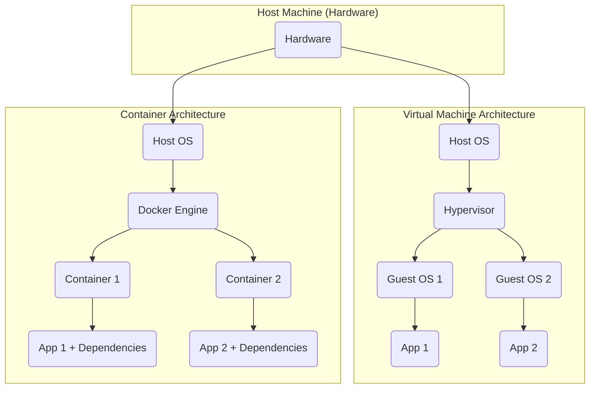

# Session 3: Docker Fundamentals

Today, we're taking a significant leap into the world of Docker, a technology that's revolutionized how developers build, ship, and run applications.

## Introduction to Docker 🐳
Docker is a platform that uses OS-level virtualization to deliver software in packages called containers. These containers are isolated, lightweight, and portable, allowing applications to run consistently across different environments.

Think of it like this: If your code is a recipe, and your computer is a kitchen, then Docker helps you package your recipe (code) and all its necessary ingredients (dependencies) into a perfectly organized meal prep kit (container). This kit can then be reliably cooked (run) in any kitchen, anywhere!

## Containers vs. Virtual Machines (VMs)
Before diving deeper, it's crucial to understand why Docker containers are so powerful. Let's compare them to Virtual Machines (VMs), which you might be more familiar with.

Virtual Machines (VMs): VMs abstract the entire hardware, requiring a full guest operating system (OS) for each application. This makes them heavier and slower to start.

Containers: Containers abstract the operating system itself. They share the host OS's kernel and only package the application and its dependencies, making them extremely lightweight and fast.

Here's a visual comparison:



Key benefits of Docker:

Portability: Runs the same everywhere.

Isolation: Applications are isolated from each other and the host system.

Efficiency: Uses fewer resources than VMs.

Speed: Starts up much faster than VMs.

## The Docker Workflow: From Code to Container 🧑‍💻
The magic of Docker lies in a straightforward workflow: you define your application's environment, build it into a reusable package, and then run it. Let's walk through this process with a simple Python application.


### Step 1: Write a Dockerfile (Defining Your Environment)

A Dockerfile is a text file that contains all the instructions needed to build a Docker image. An image is a read-only template that bundles your application code, runtime, libraries, and environment variables into a single, self-contained unit.

Let's set up a simple Python application in our DevContainer:

Open the Lesson Folder: Ensure you have the examples/docker folder (from the class repository) open in your DevContainer.

Create a Python App (app.py):

```py title="app.py"
import time

print("Hello from inside the Docker container!")
for i in range(3):
    print(f"Counting: {i+1}")
    time.sleep(1)
print("Application finished.")
```

Create a `requirements.txt`: (Even for simple apps, it's good practice)

```text  title="requirements.txt"
numpy
pandas
```


Create Your Dockerfile: In the same docker folder, create a file named `Dockerfile` (no extension) and add these instructions:

```docker title="Dockerfile" linenums="1"
# Use an official Python runtime as a parent image (1)
FROM python:3.9-slim-buster 

# Set the working directory in the container (2)
WORKDIR /app

# Copy the requirements file first to leverage Docker's build cache (3)
COPY requirements.txt .

# Install any needed packages specified in requirements.txt (4)
RUN pip install -r requirements.txt

# Copy your application code into the container (5)
# This copies 'app.py' from your current (host) directory into '/app' in the image
COPY app.py .

# Command to run app.py when the container launches (6)
CMD ["python", "app.py"]
```
{ .annotate }

1. Starts with a base image that already has Python installed. slim-bookworm is a lightweight version.
2. Sets the default directory inside the container for subsequent commands.
3. Copies your requirements.txt file from your local machine (where you run docker build) into the /app directory in the image. This is a crucial step for getting your code and configuration into the container's filesystem.
4. Executes commands during the image build to install Python dependencies.
5. Copies your main application file (app.py) into the /app directory in the image.
6. Specifies the default command to run when a container starts from this image.

### Step 2: Build the Docker Image

Once your Dockerfile is ready, you use the docker build command to create an image.

Open the Integrated Terminal in VS Code (ensure you're in the examples/docker directory).

Run this command:

```sh
docker build -t my-python-app .
```

`docker build`: The command to initiate an image build.

- `-t my-python-app`: Tags the image with a name (`my-python-app`). This makes it easy to refer to later.
- `.`: Tells Docker to look for the Dockerfile in the current directory.

!!! tip "Dynamic Context"
    The ability to specifiy where the Dockerfile is allows you to specify "context". Meaning, I can point to a Dockerfile in a different folder, while using the context (ie relative pathing) from where you execute the command.

You can verify the image was created and see its details:

```sh
docker images
```

### Step 3: Run the Docker Container (and Volume Mounts)

An image is a template; a container is a running instance of an image. You use the docker run command to start a container.

From the same terminal, run:

```sh
docker run my-python-app
```

You should see your Python script (`app.py`) execute within the isolated Docker container.


#### Understanding Volume Mounts:

While COPY puts files into the image during build time, volume mounts allow you to share a directory from your host machine (your local computer) directly with the running container. This is incredibly useful for:

Development: You can edit code on your host machine, and the changes are immediately reflected in the running container without rebuilding the image.

Data Persistence: Store data generated by your container on your host machine, so it's not lost when the container stops or is removed.

Let's try running our app with a volume mount:

```sh
# Make sure your current terminal directory is 'examples/docker'
docker run -v "$(pwd):/app" my-python-app
```

- `#!sh -v "$(pwd):/app"`: This is the volume mount.
- `#!sh $(pwd)`: This is a shell command that gets your current working directory on your host machine (e.g., `/path/to/your/repo/examples/docker`).
- `#!sh :`: Separates the host path from the container path.
- `#!sh /app`: This is the directory inside the container that will be "mounted" to your host directory. Now, any changes you make to `app.py` on your host will instantly be seen by the container if you restart it, without a rebuild!

### Step 4: Optionally Push the Image to a Registry (Sharing Your Work)

After building your image, you can optionally push it to a Docker registry like Docker Hub. This makes your image available for others to pull and run, or for deployment to cloud platforms.

To push an image, you'd first need to tag it with your Docker Hub username and then use docker push:

```sh
# Example: Tag your image with your Docker Hub username
docker tag my-python-app yourusername/my-python-app:latest
docker push yourusername/my-python-app:latest
```

(We won't do this live in this session, but it's an important part of the workflow).

## Docker Hub: A Registry for Docker Images 🌐

Docker Hub is the world's largest library and community for container images. It's a central place where you can find, manage, and share Docker images.

- Official Images: Most major software projects (e.g., Python, Node.js, Redis, PostgreSQL) publish official, pre-built images on Docker Hub. These are often the FROM images you'll use in your Dockerfiles.
- Community Images: Developers worldwide share their own custom images.
- Exploration: You can search for various images, inspect their details, and sometimes even view their Dockerfiles to understand how they were built.

### Exploring Docker Hub: Jupyter Lab Example

Jupyter Lab is a popular environment for data science, and instead of installing everything locally, you can simply run a Docker container pre-configured with Jupyter Lab and many common data science libraries.

- Go to hub.docker.com.
- Search for jupyter/jupyterlab.
- Notice the different tags (versions) available. This illustrates how complex, ready-to-use environments can be easily accessed via Docker Hub.

## Docker Desktop: Your Container Control Panel 📊

While you'll use the terminal for most Docker commands, Docker Desktop (the application you installed) provides a graphical interface to manage your Docker environment. It's a convenient way to visualize and control your containers and images.

- Containers: See all your running and stopped containers. You can easily start, stop, restart, and delete them.
- Logs: View the real-time output (logs) from your running containers, which is critical for debugging.
- Images: Manage the Docker images stored locally on your machine.
- Volumes: Inspect and manage any volumes you've created for data persistence.

## Live Demonstration: The Docker Workflow & Docker Desktop in Action 🎬

We'll perform these steps live together, so follow along in your DevContainer and with the Docker Desktop application.

- Verify Docker Desktop is Running: Confirm the Docker Desktop application is active.
- Navigate in DevContainer: Ensure the examples/docker folder is open in VS Code, inside the DevContainer.
- Review app.py and requirements.txt: We'll quickly look at the simple Python application and its requirements.
- Create and Explain Dockerfile: We'll build the Dockerfile step-by-step, explaining each instruction, paying special attention to COPY.
- Build Image: Execute docker build -t my-python-app . and analyze the build output.
- List Images: Run docker images to see your new my-python-app image.
- Run Container (Basic): Execute docker run my-python-app and observe the Python script running.
- Run Container (with Volume Mount): Execute docker run -v "$(pwd):/app" my-python-app.
    - Demo: While the app is running, quickly edit app.py on your host machine (e.g., change the print message). Restart the container to show the changes are reflected without rebuilding the image. This highlights the power of volume mounts for development.
- Explore Docker Desktop:
    - Open Docker Desktop.
    - Navigate to the "Containers" tab to see my-python-app (and potentially other containers).
    - Click on your running container to view its logs.
    - Demonstrate how to stop and restart the container from the GUI.
- Explore Docker Hub: Briefly navigate to hub.docker.com and search for jupyter/jupyterlab to illustrate finding and exploring pre-built images.

## Recommended Exercises & Further Reading

By the end of this session and after completing these exercises, you should have a solid grasp of the Docker workflow: writing a Dockerfile, building images, running containers with volume mounts, and understanding Docker Hub and Docker Desktop.

### Containerize a Python Script with Dependencies and Volume Mount:

In a new subfolder within examples/docker, create a Python script that uses a common library like requests to fetch data from a public API (e.g., a simple "hello world" API).

Ensure your requirements.txt file lists the requests library.

Write a Dockerfile to containerize this Python script.

Build the image (e.g., docker build -t my-script-app .).

Run the container using a volume mount for your code (e.g., docker run -v "$(pwd)/path/to/script:/app" my-script-app).

Verify that the script executes correctly inside the container and prints the expected output.

Bonus: Modify the script on your host machine and rerun the container (without rebuilding) to see the changes.

### Customize a Jupyter Lab Environment:

In a new subfolder within examples/docker (e.g., jupyter-custom), create a new Dockerfile.

Base Image: Start your Dockerfile from a Jupyter Docker Stack image. For instance, use FROM jupyter/scipy-notebook:latest. You can explore other options on the Jupyter Docker Stacks documentation.

Add Custom Packages: Create a requirements.txt file in the same folder as your Dockerfile. Add a couple of Python libraries that aren't typically pre-installed in Jupyter (e.g., folium for mapping, scikit-image for image processing).

```text title="requirements.txt"
folium
scikit-image
```

Dockerfile Instructions: Add COPY requirements.txt . and RUN pip install --no-cache-dir -r requirements.txt to your Dockerfile to install these additional packages during the image build.

Build the Image: Build your custom Jupyter Lab image (e.g., docker build -t my-jupyter-env .).

Run the Container: Run a container from your image, mapping the port:

docker run -p 8888:8888 my-jupyter-env

Verify Installation:

Open the URL provided in your terminal output (it usually starts with http://127.0.0.1:8888/?token=...) in your browser to access Jupyter Lab.

Create a new Python 3 notebook.

In a code cell, try to import the libraries you added (e.g., import folium and import skimage). If no errors occur, your custom packages were successfully installed!

### Explore Docker Desktop Further:

After running your containers from exercises 1 and 2, use Docker Desktop to:

View the running containers.

Inspect their logs.

Stop and then start one of the containers from the GUI.

Remove a container (after stopping it).

View the images you've built under the "Images" tab.

## Suggested Readings & Resources:

Docker Official Documentation:

Get Started with Docker - Docker's official introduction. Focus on the "Containers and Images" section.

Dockerfile Reference - Detailed explanation of all Dockerfile instructions.

Use Bind Mounts - Deep dive into how volume mounts work.

Docker Hub:

hub.docker.com - Explore the vast library of Docker images.

Jupyter Docker Stacks:

Selecting an Image - Official documentation for choosing a base Jupyter image.

## Next Steps & Questions

Understanding Docker is fundamental for modern development, especially as we move into distributed systems and DevContainers. Experiment with building and running containers. If you encounter any issues or have questions, please reach out! Next, we'll build on this by exploring Docker Compose and DevContainers in more detail.
