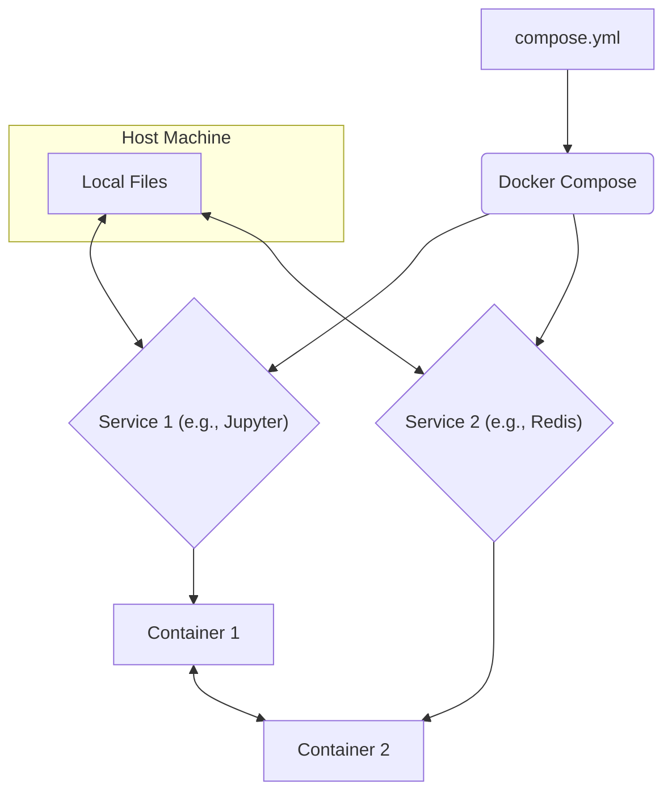
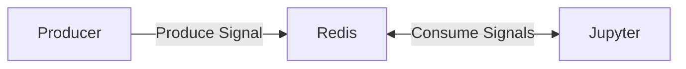

# Session 4: Orchestration and Reproducible Environments

In our last session, we mastered Docker by containerizing a simple Python application. We learned how a single `Dockerfile` can build a reusable image and how to run a container from it.

But what if your application isn't a single unit? What if it needs a database, a web server, or another service to function? That's where **Docker Compose** comes in.


!!! danger "Where did my storage go?"
	If you find that you are running out of room after all of the previous docker lessons, try running `docker system prune --volumes --all`. This will clear all non-running containers, volumes, and caches. This does mean your next builds will take longer.


## The Need for Orchestration: Why Docker Compose?

Running a single container with `docker run` is great, but real-world applications often involve multiple interconnected services. Manually managing each container and its network settings would be cumbersome and prone to error.

**Docker Compose** is a tool for defining and running multi-container Docker applications. With a single YAML file, you can configure your application's services, networks, and volumes, and then launch everything with a single command. It's the "orchestra conductor" for your containers.

Here's a diagram illustrating the relationship:



In this model, the `compose.yml` file is the blueprint for your entire application stack, defining each service and how they should be configured.

-----

## The Live Demonstration: Setting Up Our Environment

Let's put this into practice by building a powerful, reproducible development environment. We'll start with a single Jupyter container and then add a Redis service to demonstrate the power of Compose.

### Single-Container Environment

First, let's create a development environment with just Jupyter. This shows that you can use Compose even for a single service to manage its configuration.

Open the `examples/docker-compose-jupyter` folder. Inside, you'll find a `requirements.txt` and a `Dockerfile`. The `Dockerfile` simply installs the `requirements.txt` on top of the base Jupyter image. The main file is `compose.yml`. Let's look at it.

```yaml title="compose.yml" linenums="1"
services:  # (1)!
  # Define the Jupyter service
  jupyter:
	# You don't need to build the image if you use a pre-built one
	# image: quay.io/jupyter/minimal-notebook:python-3.12
	# However, if you want to build your own image:
	build: # (2)!
		context: . # Path to the directory containing the Dockerfile (current directory)
		dockerfile: Dockerfile  # Name of the Dockerfile
	ports:  # (3)!
	  - "8888:8888"
	volumes:  # (4)!
	  - .:/home/jovyan/app  # COPY current directory to /home/jovyan/app in the container
	working_dir: /home/jovyan/app  # Set working directory inside the container (5)
	environment:  # (6)!
	  FOO: bar  # Example environment variable
	# The following is optional, but useful for Jupyter
	command: start-notebook.sh --NotebookApp.token=''  # Start Jupyter without a token (7)
```
{ .annotate }

1. `services`: This is where we define our containers. In this case, we have a single service named `jupyter`.
2. `build`: Instead of pulling a pre-built image, we are building our custom image from the `Dockerfile` in the current directory (`.`).
3. `ports`: The `8888:8888` line maps port `8888` on our local machine to port `8888` inside the container, allowing us to access the Jupyter server in our browser.
4. `volumes`: This is a crucial line for development. It creates a **volume mount** that synchronizes our local project directory (`.`) with the `/home/jovyan/app` directory inside the container. This means any changes we make to our local files will be immediately visible to the container, and vice versa.
5. `working_dir`: Sets the default directory inside the container to `/home/jovyan/app`.
6. `environment`: Set environment variables for the container. Alternatively, or in tandem, you can specify `env_file` if you have environment variables stored in a file, i.e. `.env`.
7. `command`: We are overriding the default startup command to run Jupyter without requiring a token, making access easier for our local development.

Open the integrated terminal in VS Code, navigate to the `docker-compose-jupyter` folder, and run:

```bash
docker compose up
```

This will build the image and start the container. You'll see the logs, and after a moment, you can access Jupyter Lab at `http://localhost:8888`.

To stop the services, simply `ctrl+c` to hault the services, then run:

```bash
docker compose down
```

!!! warning "Change my docker environment"
	If you make changes to your docker environment, i.e. changes to the Dockerfile, requirements, etc. Your changes will not reflect automatically. Much like the previous Docker lesson, you must rebuild. Which you can do with `docker compose build`.

### Multi-Container Environment

Now, let's add a second service to this setup. Most applications need a database or some kind of data store. Instead of a full database, we'll add **Redis**, an in-memory key-value store, which is perfect for this example.

Open the `examples/docker-compose-jupyter-redis` folder. In this folder, you will find a similar `Dockerfile` and `requirements.txt`, but this time the `requirements.txt` includes the `redis` Python library. Now, let's examine the `compose.yml` file.

```yaml title="compose.yml" linenums="1"
services:
  # Define the Jupyter service
  jupyter:
    # You don't need to build the image if you use a pre-built one
    # image: quay.io/jupyter/minimal-notebook:python-3.12
    # However, if you want to build your own image, uncomment the lines below
    build:
      context: .  # Path to the directory containing the Dockerfile (current directory)
      dockerfile: Dockerfile  # Name of the Dockerfile
    ports:
      - "8888:8888"
    volumes:
      - .:/home/jovyan/app  # COPY current directory to /home/jovyan/app in the container
    working_dir: /home/jovyan/app  # Set working directory inside the container
    environment:
      FOO: bar  # Example environment variable
    # The following is optional, but useful for Jupyter
    command: start-notebook.sh --NotebookApp.token=''  # Start Jupyter without a token
    networks:  # (2)!
      - my-network  # Connect to a custom network

  # Compose is very useful to run multiple services together
  # Here is an example of a simple Redis service
  redis:  # (1)!
    image: "redis:6.0-alpine"
    container_name: my-redis
    ports:
      - "6379:6379"
    networks:  # (2)!
      - my-network  # Connect to a custom network

networks:
  my-network:
    driver: bridge  # Use the default bridge network driver
```
{ .annotate }

1. **`redis` service:** We've added a new service. The `image` is set to `redis:6.0-alpine`, a lightweight Redis image from Docker Hub.
2. **`networks`:** This is the most important new section. When Docker Compose runs, it creates a virtual network by default, and services can find each other using their service names as hostnames. By explicitly defining our `my-network` and assigning both services to it, we ensure that they can communicate with each other. This is how the Jupyter container will be able to find and talk to the Redis container.

Now, open the terminal, navigate to the `docker-compose-jupyter-redis` folder, and run:

```bash
docker compose up
```

!!! tip "Information Overload!"
	As you increase the number of containers, or add particularly expressive ones, you may notice that your terminal gets flooded with logging statements. You can instead run `docker compose up -d` which runs the containers detached (in the background). This means you also don't have to `ctrl+c` to hault the containers, you can just proceed to `docker compose down`.

Docker Compose will now build the Jupyter image and pull the Redis image, and then start both containers at the same time. You will see the logs for both services in the same terminal.

Access Jupyter Lab at `http://localhost:8888`. Open a new notebook and try to connect to the Redis container using the following code:

```python title="notebooks/redis.ipynb" linenums="1"
import redis

# Use the service name 'redis' and the default Redis port
r = redis.Redis(host='redis', port=6379, db=0)

# Set a key-value pair in Redis
r.set('student_name', 'Alex')
print("Key 'student_name' set in Redis.")

# Retrieve the value from Redis
retrieved_value = r.get('student_name')

# Decode the value from bytes to a string for printing
if retrieved_value:
	print(f"Retrieved value for 'student_name': {retrieved_value.decode('utf-8')}")
else:
	print("Key 'student_name' not found.")
```

If you see messages printed, then it means your `jupyter` and `redis` services are correctly communicating with each other on the Docker network. This is a powerful demonstration of multi-container orchestration.

!!! info "To `localhost` or not to `localhost`"
	Although you may access redis from your local computer at `http://localhost:6379`, this is not the case for the jupyter container. Notice that the hostname for the redis service is `redis`, this means from the Jupyter service that it's trying to access redis at `http://redis:6379`, NOT on the `localhost`. If you were to specify `http://localhost:6379`, it will try to resolve something running on `6379` WITHIN the jupyter container. It's okay if this is "uncomfortable" - it'll make a lot more sense when we learn web application development.

## Recommended Practice Exercises:

### Docker Compose CLI

Read through some of the other docker compose options running `docker compose --help` in your terminal. Also read through some of the [documentation](https://docs.docker.com/reference/cli/docker/compose/).

Investigate and get comfortable with the following commands and their options:

- `up`
- `down`
- `build`
- `run`
- `exec`

!!! success "Don't Boil the Ocean"
	Setting up docker compose projects from scratch takes some practice. But know, when it comes down to _using_ docker compose, it really boils down to 3 commands: `docker compose build`, `docker compose up`, `docker compose down`. You can even cut that down to two if you combine the first two using `docker compose up --build`.

### Explore and Experiment with Your Compose File:

- **Change a port:** In `compose.yml`, change the `ports` mapping for the `jupyter` service to something else, like `"8000:8888"`. Rerun `docker compose up` and access Jupyter at the new port (`http://localhost:8000`).
- **Add a container name:** Add the `container_name` property to your `jupyter` service (e.g., `container_name: my-jupyter-instance`). Rerun Compose and check Docker Desktop to see the new name.
- **Set an environment variable:** Add a new environment variable to the `jupyter` service (e.g., `TZ: 'America/New_York'`). In your Jupyter notebook, run `import os; os.environ.get('TZ')` to see if the variable was correctly set.
- **Change the Redis image:** In the `redis` service, change the `image` to a different version, like `"redis:7.2-alpine"`. Rerun Compose to see the new image being pulled and used.

### Simple Producer/Consumer with Redis:

This exercise demonstrates inter-container communication in a more complete way. You'll create one container to act as a "producer" and use your existing Jupyter container as a "consumer."

First, set up some new files:
- Inside the `examples/docker-compose-jupyter-redis` folder, create a new subfolder called `producer`.
- In this new folder, create a `Dockerfile`, a `requirements.txt` file, and a `producer.py` script.

```title="requirements.txt"
redis
```

- A sample python script which that will write to Redis every few seconds. Mocking a data transmitter.

```python title="producer.py" linenums="1"
import redis
import time

r = redis.Redis(host='redis', port=6379, db=0)

print("Producer is starting...")
while True:
	timestamp = time.time()
	message = f"Message sent at {timestamp}"
	print(f"Producer sending: '{message}'")
	r.set('latest_message', message)
	time.sleep(5)
```
- Create a Dockerfile based `FROM python:3.12-slim-bookworm`.
```docker title="Dockerfile" linenums="1"
FROM python:3.12-slim-bookworm
# Do this your self!
```

- Update the `docker-compose-jupyter-redis/compose.yml` file to include this producer as a new service. Make sure to pay attention to the network settings.

- In your terminal, navigate to the **`producer`** folder and run `docker compose up`. This will start the producer container, which will continuously send messages to Redis.

- Consume the signal: Go back to the jupyterlab service in your browser, create a new notebook with the following code.

```python
import redis
import time

r = redis.Redis(host='redis', port=6379, db=0)

print("Consumer is starting...")
while True:
	message = r.get('latest_message')
	if message:
		print(f"Consumer received: '{message.decode('utf-8')}'")
	else:
		print("Consumer received: No message yet.")
	time.sleep(5)
```

This demonstrates that three separate applications can communicate on the same Docker network (Jupyter (Consumer) -> Redis <-- Producer).




## Suggested Readings & Resources:

- **Docker Compose Official Documentation:** [Overview of Docker Compose](https://docs.docker.com/compose/) - Docker's official guide to Compose.
- **Redis-Py Documentation:** [Quickstart](https://www.google.com/search?q=https://redis-py.readthedocs.io/en/stable/examples/quickstart.html) - Learn more about the Python library for Redis.
- **Jupyter Docker Stacks:** [Using the Docker Stacks](https://jupyter-docker-stacks.readthedocs.io/en/latest/using/selecting.html) - Official documentation for the Jupyter base images.
