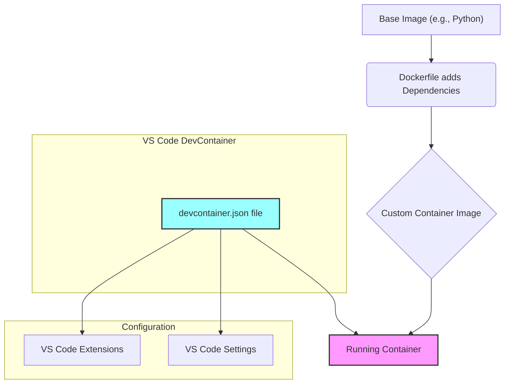

# Building Reproducible Development Environments using DevContainers

In our last two sessions, we mastered the core concepts of **Docker** and **Docker Compose**. We learned how to containerize our applications and use a single file to define and run multi-service applications. Today, we'll build on that foundation to create fully configured, shareable, and reproducible development environments using **VS Code DevContainers**.

## What is a DevContainer?

A **DevContainer** is a running Docker container that is fully configured for a specific development task. It includes all the necessary code, runtimes, tools, and extensions for your project.

Think of it as a blueprint for a perfect developer setup. When a new team member joins, they don't have to worry about installing Python, Git, or specific VS Code extensions; they just open the project, and VS Code automatically builds and connects to the DevContainer, giving them an identical, ready-to-use environment.

This concept combines the power of:
- **Docker:** For creating an isolated and consistent environment.
- **VS Code:** For a rich and user-friendly development experience.

-----

## The Core DevContainer Files

To create a DevContainer, you typically need two main files:

- **`Dockerfile`:** This defines the container's base environment. It specifies the operating system, installs any necessary software (like Python, Git, or a compiler), and copies over your project's files. It's the same kind of Dockerfile we've already learned about.
- **`devcontainer.json`:** This is the magic file. It tells VS Code how to build and configure the container for development. It specifies which Dockerfile to use, which VS Code extensions to install, and any other settings specific to the project.
- **compose.yml (_optional_):**: Optionally, you can point the devcontainer.json to reference an existing (or multiple) Docker Compose configurations.

DevContainers extend existing Docker containers or images, adding a layer of configuration specific to a developer's workflow. This makes it a great way to mirror your development and production environments by basing your DevContainer on the same image you use in production.

Here's how it works:



-----

## Live Demonstration: A Basic DevContainer Example

Let's explore a simple DevContainer setup to see how these files work together.

- **Install the Extension:** First, you'll need the **Remote Development** extension pack. If you don't have it installed already, open the Extensions view in VS Code and search for `Remote Development` (or `ms-vscode-remote.vscode-remote-extensionpack`) and install it. This is what allows VS Code to connect to and manage containers.

- **Open the Project:** In VS Code, open the `examples/vscode-basic` folder.

- **Examine the `Dockerfile`:** Take a look at the `Dockerfile`. It's a standard Dockerfile that sets up a Python environment and installs `sudo` and `git`. It's a clean, simple, and self-contained environment.

```dockerfile title="Dockerfile" linenums="1"
FROM python:3.12-slim-bookworm

RUN apt-get update && \
    apt-get install -y sudo git

COPY ./requirements.txt /requirements.txt

RUN pip install -r /requirements.txt
```

- **Examine the `devcontainer.json`:** Now, look at the `.devcontainer` folder. Inside, you'll find `devcontainer.json`. This file tells VS Code what to do with the Dockerfile.

```json title="devcontainer.json" linenums="1"
{
    "name": "VSCode Basic Devcontainer",  // (1)!
    "build": {
        // Sets the run context to one level up instead of the .devcontainer folder.
        "context": "..",  // (2)!
        // Update the 'dockerFile' property if you aren't using the standard 'Dockerfile' filename.
        "dockerfile": "../Dockerfile"  // (3)!
    }
}
```
{ .annotate }

1. **`"name"`:** The name that will appear in VS Code for this container.
2. **`"context": ".."`:** The build context is the directory containing the `Dockerfile`. We use `..` to point one directory up, to our main project folder.
3. **`"dockerfile": "../Dockerfile"`:** Specifies the location of the `Dockerfile` relative to our project folder.

!!! tip "Alternatives to `build`"
    You don't have to specify a `build` target in your devcontainer.json, instead you can point to an existing image by `{name}:{tag}`, a compose.yml file, or even multiple compose.yml files.

- **Reopen in Container:** Now, a prompt should appear in the bottom-right corner of VS Code asking you to **"Reopen in Container."** Click it. If you don't see it, you can open the Command Palette (`F1` or `Cmd/Ctrl+Shift+P`) and select **"Dev Containers: Reopen in Container."**

- **Observe the Magic:** VS Code will now build the container (if it's the first time) and connect to it. Once it's running, you can:

      - **Open the terminal:** Notice that the terminal now reflects the DevContainer's environment (e.g., `root@...`).
      - **Run commands:** Try running `git --version` or `python --version`. These commands work because they were installed inside the container by our `Dockerfile`.

-----

## Recommended Practice Exercises:

### Understand Previous Example

Take a look at the `examples/vscode-basic` example project, understand how the devcontainer was set up, and try to run it again.

### Create a DevContainer for the Jupyter/Redis Project

- Go to your `examples/docker-compose-jupyter-redis` folder from the last session.
- Create a new folder inside it named **`.devcontainer`**.
- Inside the `.devcontainer` folder, create a new file named `devcontainer.json`.
- Your `devcontainer.json` file needs to be configured to use your existing `compose.yml` file and attach to the **Jupyter** service.
- Your configuration should look something like this:

```json title="devcontainer.json" linenums="1"
{
    "name": "Jupyter/Redis Dev Environment",
    "dockerComposeFile": "../compose.yml",  // (1)!
    "service": "jupyter",  // (2)!
    "workspaceFolder": "/home/jovyan/app",  // (3)!
    "customizations": {  // (4)!
        "vscode": {
            "extensions": [
            "ms-python.python",
            "ms-toolsai.jupyter"
            // Try to add some other extensions!
            ]
        }
    }
}
```
{ . annotate }

1. `dockerComposeFile`: Points to your main Compose file.
2. `service`: Specifies the service to which VS Code should attach. This is how VS Code knows to connect to your `jupyter` container and not your `redis` container.
3. `workspaceFolder`: Sets the directory inside the container that VS Code should open.
4. `customizations`: This is the most powerful feature for sharing settings. We use it to automatically install the `Python` and `Jupyter` extensions for anyone who opens this project in a DevContainer.

!!! info "Multiple Compose Files"
    Although not shown here, sometimes it is useful to define multiple compose files - one for production and another for development. Since the `dockerComposeFile` parameter allows you to specify an array, you an actually _compose_ multiple compose files. In other words, start from a "prod" definition and override with select "dev" specific configurations. We will see this in action in future lessons.

**Verify Your DevContainer**

- Now, in VS Code, close the window and re-open the `examples/docker-compose-jupyter-redis` folder.
- You should be prompted to **"Reopen in Container."** Select it.
- After the container starts, verify the following:
    - The Python and Jupyter extensions were automatically installed.
    - The integrated terminal is connected to the DevContainer.
    - You can open your Jupyter notebooks and connect to the Redis service as you did in the last lesson.

## Suggested Readings & Resources:

- **VSCode Dev Containers Documentation:** https://code.visualstudio.com/docs/devcontainers/containers
