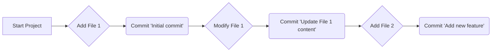
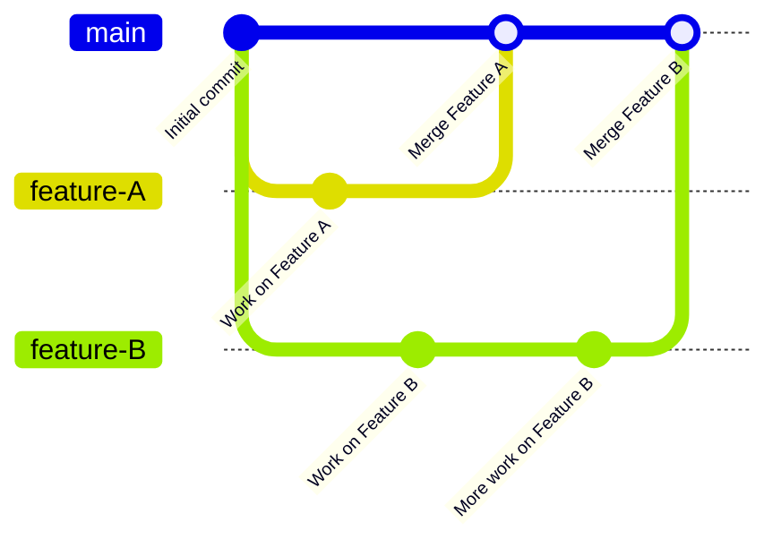
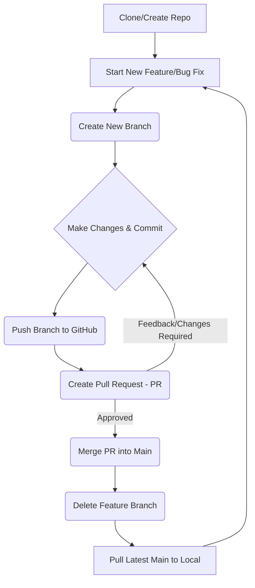

# Session 1: Git & GitHub Essentials 💻

Welcome to the first session of our software development bootcamp! Today, we're diving into the world of Git and GitHub, essential tools for any modern developer. We'll be focusing on using the GitHub Desktop application, which provides a user-friendly graphical interface for managing your code.

## Introduction to Version Control

Imagine you're writing a really important document. You save it, then make some changes, and save it again. What if you want to go back to an earlier version? Or what if you're working with a team, and everyone is making changes at the same time? This is where Version Control Systems (VCS) come in!

Git is the most popular distributed version control system. It helps you:

- Track changes to your code over time.
- Revert to previous versions if something goes wrong.
- Collaborate with other developers without overwriting each other's work.

A repository (often shortened to "repo") is simply a project folder that Git is tracking.

## Getting Started with GitHub Desktop

!!! info inline end "Other Options"
    There are numerous other options for working with git-like tools, besides GitHub Desktop (such as using the git CLI directly). However, I find that GitHub Desktop covers all we need and is far more beginner friendly.

Before we dive into Git concepts, let's get you set up with the tool we'll be using: GitHub Desktop.

Installation and Sign-In:

1. **Download GitHub Desktop**: If you haven't already, go to [GitHub Desktop](https://github.com/apps/desktop) and download the application for your operating system.
1. **Install**: Follow the on-screen instructions to install GitHub Desktop.
1. **Sign In**: When you open GitHub Desktop for the first time, you'll be prompted to sign in with your GitHub account. If you don't have one, you'll need to create one on github.com first. This links your local GitHub Desktop application to your online GitHub profile.

## Basic Git Concepts (Illustrated with GitHub Desktop in Mind)
Let's look at the core ideas behind Git that GitHub Desktop helps you manage.

### Commits: Snapshots of Your Work
Think of a commit as a snapshot of your project at a specific point in time. Every time you save a set of related changes, you create a commit. Each commit has a unique ID, a message describing the changes, and information about who made the commit and when.

In GitHub Desktop, the "Changes" tab shows you what files you've modified. Once you've selected the changes you want to save, you'll write a commit message and click "Commit to [Branch Name]".

!!! tip "Making good commit messages"
    At the bare minimum, a commit message must descriptive enough to describe the change. However, there is a standard called [Coventional Commits](https://www.conventionalcommits.org/en/v1.0.0/) which describes a standard structure which promotes good practices. See [HERE](https://gist.github.com/qoomon/5dfcdf8eec66a051ecd85625518cfd13) for a useful cheatsheet which I personally reference often.

### Branches: Parallel Lines of Development
Branches allow you to work on new features or bug fixes without affecting the main version of your project. Imagine the "main" branch as your stable, working code. When you start a new feature, you create a new branch from `main`, work on it independently, and then merge it back when it's ready.

In GitHub Desktop, you can easily create new branches, switch between them, and see which branch you're currently on using the "Current Branch" dropdown.

!!! tip "Keep branches purposeful"
    When building software, it's always good to build things in small pieces, rather than chasing perfection in one commit. When building (or maintaining) software, it's generally good practice that each new feature (or bug fix, etc.) is placed on a new branch, and then merged when it's "good enough" to join the `main` branch.

## The General Software Development Cycle with GitHub
Here's a typical workflow you'll follow when developing software with Git and GitHub:

1. **Clone a Repository**: Get a copy of the project's code onto your local machine.
1. **Create a New Branch**: Start working on a new feature or fix in isolation.
1. **Make Changes & Commit**: Write code, save changes, and create commits to record your progress.
1. **Push Changes**: Upload your local commits to the remote GitHub repository.
1. **Create a Pull Request (PR)**: Propose your changes to be reviewed and merged into the `main` branch.
1. **Review & Discuss**: Other team members review your code, suggest improvements, and engage in discussions.
1. **Merge**: Once approved, your changes are integrated into the `main` branch.
1. **Pull Changes**: Update your local repository with the latest changes from the `main` branch.

Here's a visual representation of this cycle:

## Essential GitHub Desktop Operations (Live Demo Focus)
We'll demonstrate these steps live using GitHub Desktop. Pay close attention to the interface elements!

### Cloning a Repository

- **Purpose**: To get a copy of an existing GitHub repository onto your computer.
- GitHub Desktop Steps:
    - Click "File" > "Clone Repository".
    - Select the repository from your GitHub.com account, or use the URL if it's a public repository.
    - Choose a local path where you want to save the repository.
    - Click "Clone".

### Making Changes & Committing
- **Purpose**: To save a snapshot of your work.
- GitHub Desktop Steps:
    - Open the cloned repository folder in your favorite code editor (like VS Code, which we'll cover in Session 2!).
    - Make some changes to a file, or create a new file.
    - Go back to GitHub Desktop. You'll see your modified files listed in the "Changes" tab.
    - Staging (Implied in Desktop): In GitHub Desktop, simply checking the box next to a file stages it for the next commit. You can select which changes you want to include.
    - Write a clear and concise Summary (the commit message title) and optionally a Description.
    - Click "Commit to [current branch name]".

### Branching
- **Purpose**: To create an isolated environment for new work.
- GitHub Desktop Steps:
    - From the "Current Branch" dropdown at the top of the interface, click "New Branch".
    - Give your branch a descriptive name (e.g., add-contact-form, fix-login-bug).
    - Click "Create Branch". GitHub Desktop will automatically switch you to this new branch.

### Pushing Changes
- **Purpose**: To upload your local commits to the remote GitHub repository.
- GitHub Desktop Steps:
    - After making commits on your local branch, a "Publish Branch" button (for a new branch) or "Push origin" button (for an existing remote branch) will appear at the top.
    - Click this button. Your commits will now be visible on GitHub.com.

### Submitting a Pull Request (PR)
- **Purpose**: To propose your changes from your branch to be merged into another branch (usually `main`). This is where code review happens.
- GitHub Desktop Steps:
    - After pushing your branch, GitHub Desktop will often show a prompt to "Create Pull Request".
    - Clicking this will take you to GitHub.com, pre-filling much of the PR information.
    - Review: On GitHub.com, you can then add reviewers, describe your changes, and initiate the review process.
    - Reviewing a PR: If someone else creates a PR, you can view the changes, add comments, and approve or request changes directly on GitHub.com.

## Git & GitHub Best Practices: Dos and Don'ts ✅❌
To make your Git and GitHub experience smooth and collaborative, keep these best practices in mind:

### ✅ Do's:

- [x] **Do commit early and often**: Make small, focused commits. Each commit should represent a single logical change. This makes it easier to track progress and revert changes if needed.
!!! tip inline end "Making good commit messages"
    At the bare minimum, a commit message must descriptive enough to describe the change. However, there is a standard called [Coventional Commits](https://www.conventionalcommits.org/en/v1.0.0/) which describes a standard structure which promotes good practices. See [HERE](https://gist.github.com/qoomon/5dfcdf8eec66a051ecd85625518cfd13) for a useful cheatsheet which I personally reference often.
- [x] **Do write clear, concise commit messages**: Your commit message should briefly explain what you changed and why. A good message tells a story. 
- [x] **Do use branches for new features/fixes**: Always work on a new branch, not directly on `main`. This keeps `main` stable and allows for isolated development.
- [x] **Do pull frequently**: Regularly pull changes from the `main` branch to keep your local repository up-to-date and minimize merge conflicts.
- [x] **Do review Pull Requests thoroughly**: When reviewing others' code, provide constructive feedback and ask clarifying questions.

### ❌ Don'ts:
!!! tip inline end "Data Should be Ephemeral"
    In general, when data is generated programmatically, rather than worrying about saving/archiving the data, it's best to make sure the data can be regenerted easily programmatically. There are some exceptions when data gets larger (and expensive to recompute), however the general concept applies.
- [ ] **Don't commit large data files or binaries**: Git is designed for tracking text-based code. Large files like images, videos, or `.csv` files should generally not be committed directly to Git. Use services like Git LFS (Large File Storage) or external storage solutions for these.
- [ ] **Don't commit sensitive information**: Never commit API keys, passwords, private keys, or other sensitive credentials directly into your repository. Use environment variables or secure configuration management.
- [ ] **Don't force push to shared branches**: "Force pushing" rewrites commit history. While sometimes necessary on personal branches, it can cause major issues on shared branches like `main` as it deletes other people's work.
!!! example inline end "Good Starting Points"
    The community has curated useful `.gitignore` templates for a variety of projects which you can start from [https://github.com/github/gitignore](https://github.com/github/gitignore). Furthermore, when creating a new repo with GitHub Desktop, it may even prompt you to start with a suggested .gitignore. 
- [ ] **Don't ignore `.gitignore`**: Use a `.gitignore` file to tell Git which files and directories to ignore (e.g., `__pycache__`, virtual environments, logs, temporary/sensitive files). This keeps your repository clean.
- [ ] **Don't commit commented-out code**: If code isn't needed, delete it. Git history preserves it if you ever need to retrieve 

## Optional Practice & Further Reading

To really solidify your understanding, try these exercises and explore the suggested resources. By the start of our next session, you should feel comfortable cloning or creating a repository and contributing to it using GitHub Desktop.

### Optional Practice Exercises:

#### Create Your First Repository:

- In GitHub Desktop, go to File > New Repository.
 - Give it a meaningful name (e.g., `my-first-git-repo`).
- Initialize it with a `README.md` file.
- Make a simple change to the `README.md` file (e.g., add your name), commit it, and push it to GitHub.com.

#### Clone a Sample Project:

- Find a small, open-source project on GitHub (you can search for "beginner python projects" or "hello world repository").
- Use GitHub Desktop to clone this repository to your local machine.
- Make a small, non-breaking change (e.g., fix a typo in a comment, add your name to a CONTRIBUTORS file if one exists).
- Create a new branch for your change.
- Commit your change on this new branch.
- Push your branch to GitHub.
- Create a pull request (you don't need it to be merged, just demonstrate you can create one).

#### Branching Practice:

- In one of your local repositories, create three new branches: `feature-a`, `feature-b`, and `bugfix-c`.
- On `feature-a`, make one commit.
- Switch to `feature-b`, make a different commit.
- Switch to `bugfix-c`, make another commit.
- Push all three branches to GitHub.
- Try merging `feature-a` into `main` (if you feel comfortable, or just observe the merge in GitHub Desktop).

## Next Steps & Questions

We've covered a lot today! The key takeaway is that GitHub Desktop simplifies these powerful Git concepts into a visual workflow. Practice these operations, and don't hesitate to ask questions.
