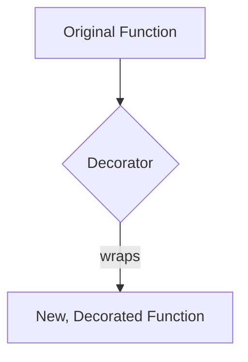
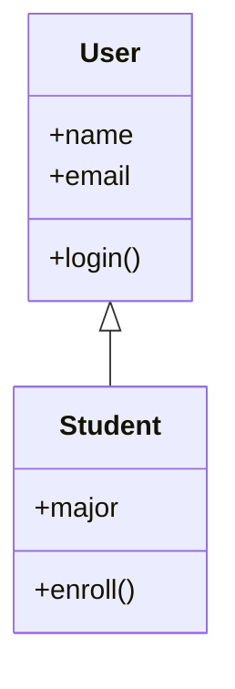

# Advanced Python Concepts - From Functions to Classes

We've built a strong foundation with our developer tools; now it's time to level up our Python skills. Today, we're transitioning from writing simple scripts to building more structured and organized applications. We'll explore advanced functional programming and then dive into **Object-Oriented Programming (OOP)**, a powerful paradigm for managing complexity and modeling real-world entities in your code.

-----

## Advanced Functional Programming

While we've used functions to organize code, Python also has powerful features that let us treat functions as "first-class citizens." This means we can pass them as arguments, return them from other functions, and assign them to variables.

### List/Set Comprehensions

**List/set comprehensions** provide a concise and elegant way to create lists or sets. They are often more readable and efficient than using a for loop. Sometimes this is simpler than defining a custom function/lambda and loops.

```python linenums="1"
# Using a for loop to create a list of squares
squares = []
for i in range(5):
    squares.append(i * i)

# The equivalent list comprehension
squares_comp = [i * i for i in range(5)]
# Output: [0, 1, 4, 9, 16]

# A set comprehension
even_numbers = {i for i in range(10) if i % 2 == 0}
# Output: {0, 2, 4, 6, 8}
```

### `*args` and `**kwargs`

These special syntax features allow functions to accept a variable number of arguments.

`*args` (non-keyword arguments): Gathers any number of positional arguments into a tuple.

`**kwargs` (keyword arguments): Gathers any number of keyword arguments into a dictionary.

They are incredibly useful for writing flexible functions that can handle many different inputs.

```python linenums="1"
def print_arguments(*args, **kwargs):
    print("Positional arguments:")
    for arg in args:
        print(f" - {arg}")
    print("\nKeyword arguments:")
    for key, value in kwargs.items():
        print(f" - {key}: {value}")

print_arguments("hello", 1, name="Alice", age=30)
# Output:
# Positional arguments:
#  - hello
#  - 1
#
# Keyword arguments:
#  - name: Alice
#  - age: 30
```

### Lambda Functions

**Lambda functions** are small, anonymous functions defined with the `lambda` keyword. They are perfect for one-off operations where a full `def` statement would be overkill.

```python linenums="1"
# A standard function
def is_even(n):
    return n % 2 == 0

# The equivalent lambda function
is_even_lambda = lambda n: n % 2 == 0

print(is_even(4))        # Output: True
print(is_even_lambda(5)) # Output: False
```

### Higher-Order Functions and `functools.partial`

A **higher-order function** is one that takes another function as an argument. The built-in `map()` and `filter()` functions are great examples. We can use them with lambda functions to write very concise, readable code.

```python linenums="1"
numbers = [1, 2, 3, 4, 5, 6]

# Use a lambda with filter() to get only even numbers
even_numbers = list(filter(lambda x: x % 2 == 0, numbers))
print(even_numbers) # Output: [2, 4, 6]
```

Sometimes, you need to use a function but want to "pre-fill" some of its arguments. That's what `functools.partial` is for. It lets you create a new, simpler version of a function with some of its arguments already provided.

```python linenums="1"
from functools import partial

def power(base, exponent):
    return base ** exponent

# Create a new function that is a "power of 2" function
power_of_two = partial(power, exponent=2)

print(power_of_two(4)) # Output: 16 (equivalent to 4 ** 2)
```

### Function Decorators

A **decorator** is a special kind of higher-order function that adds new functionality to an existing function without changing its structure. They are commonly used for tasks like logging, timing, and access control. We apply a decorator using the `@` syntax.



Here is a simple example of a decorator that prints a message before and after a function runs.

```python linenums="1"
def my_decorator(func):
    def wrapper():
        print("Something is happening before the function is called.")
        func()
        print("Something is happening after the function is called.")
    return wrapper

@my_decorator
def say_hello():
    print("Hello!")

say_hello()
```

-----

## Object-Oriented Programming (OOP)

The two fundamental concepts in OOP are **classes** and **objects**.

- A **class** is a blueprint or a template for creating objects. Think of a class as a cookie cutter.
- An **object** is an instance of a class. It's the actual thing you create from the blueprint. Following our analogy, an object is the actual cookie.

### Defining Classes, Methods, and Dunder Methods

You define a class using the `class` keyword. A **method** is a function defined inside a class that describes an object's behavior.

A **dunder method** (named for "double underscore") is a special method used by Python to implement core functionality. The most common is `__init__`, the initializer, which runs when you create a new object. Another useful one is `__str__`, which provides a user-friendly string representation of an object.

```python linenums="1"
class User:
    def __init__(self, name, email):
        self.name = name
        self.email = email
        self.is_logged_in = False

    def __str__(self):
        return f"{self.name} <{self.email}>"

    def login(self):
        self.is_logged_in = True

user1 = User("Alice", "alice@example.com")
print(user1) # This calls the __str__ method
```

!!! example "Dun Dun Dun"
    There are numerous powerful dunder methods that can super power your classes. [See here for other examples.](https://www.geeksforgeeks.org/python/dunder-magic-methods-python/). For example, `__add__` can be used to define how you add two custom objects together.

### Inheritance

**Inheritance** is a core concept that allows a class to inherit attributes and methods from another class. The inheriting class is called the **child** or **subclass**, and the class it inherits from is the **parent** or **superclass**. This is powerful for modeling relationships like "is a." A `Student` is a `User`, so the `Student` class can inherit from the `User` class.



```python linenums="1"
class Student(User): # Student inherits from User
    def __init__(self, name, email, major):
        super().__init__(name, email) # Call the parent's initializer
        self.major = major

    def enroll(self):
        print(f"{self.name} is now enrolled in {self.major}.")

student1 = Student("Bob", "bob@school.edu", "Computer Science")
student1.login() # This method was inherited from User!
student1.enroll()
```

!!! tip "To `__init__` or not to `__init__`"
    When inheriting from a parent class which contains an `__init__` method, you don't have to supply an `__init__` in the child class. However, if you need to extend the initializer to include additional properties, you can use the `super().__init__(...)`.

### Static and Class Methods

These are methods that belong to the class rather than an individual object.

- A **static method** doesn't require access to the instance (`self`) or the class (`cls`). It's just a regular function logically grouped within the class. We use the `@staticmethod` decorator.
- A **class method** receives the class itself as the first argument (`cls`). This is often used as a "factory method" to create an instance of the class from a different format. We use the `@classmethod` decorator.

```python linenums="1"
class User:
    @staticmethod
    def is_valid_email(email):
        return "@" in email

    @classmethod
    def create_from_tuple(cls, user_data):
        name, email = user_data
        return cls(name, email)

user_tuple = ("Eve", "eve@example.com")
user2 = User.create_from_tuple(user_tuple)
```

-----

## Recommended Exercises & Homework

For homework, you'll be tasked with applying these new functional and OOP concepts.

### Development Environment

Recall, what you know about Git, Docker, and DevContainers to set yourself up for success. Set up a development environment which you can use for the rest of this advanced python section - and don't reinvent the wheel.

### **Create a Class Hierarchy**

- Create a parent class named `Shape` with an `__init__` method that takes a `color` as an argument.
- Create two child classes, `Circle` and `Square`, that **inherit** from `Shape`.
- The `Circle` class should have an instance attribute for `radius`.
- The `Square` class should have an instance attribute for `side_length`.
- Both `Circle` and `Square` should have a method called `area()` that calculates and returns their respective area.

!!! tip "More Advanced _Abstractions_"
    There are simple ways to implement the above exercise. However, you can look into another advanced technique, [`Abstract Base Class (abc)`](https://www.geeksforgeeks.org/python/abstract-classes-in-python/#), to do this better.

### **Add Dunder Methods and Inheritance**

- To your `Shape`, `Circle`, and `Square` classes, add a `__str__` method that returns a user-friendly string representation of the object (e.g., `"A red square with a side length of 5 and area 25."`).
- Implement a class method on the `Shape` class called `create_red_shape(cls)`. This method should return a new instance of the class (`cls`) with the color already set to `'red'`.
- Change the `area` calculation to a private method, which is automatically called sets a `self.area` property upon initialization.
- Implement `__add__` and `__sub__` methods, which defines you to add/subtract shapes together. As an example, make it so when you add two shapes, you return the sum of each area.

### **Decorators Challenge**

- Create a new Python file and write a decorator called `@timer`. This decorator should print the executions time of the wrapped function.
- Apply this decorator to the `area()` method on your `Circle` and `Square` classes.

## Suggested Readings & Resources

- [Python.org: `functools` module](https://www.google.com/search?q=%5Bhttps://docs.python.org/3/library/functools.html%5D\(https://docs.python.org/3/library/functools.html\))
- [W3Schools: Python Decorators](https://www.w3schools.com/python/python_decorators.asp)
- [Real Python: Object-Oriented Programming (OOP) in Python 3](https://realpython.com/python3-object-oriented-programming/)
- [Dunder Methods](https://www.geeksforgeeks.org/python/dunder-magic-methods-python/)
- [`Abstract Base Class (abc)`](https://www.geeksforgeeks.org/python/abstract-classes-in-python/#)
