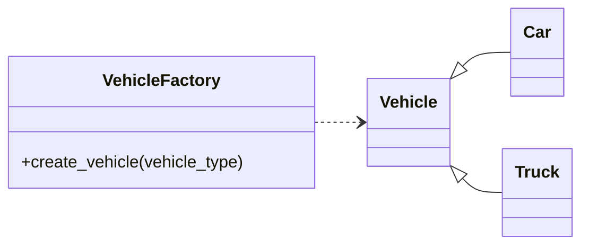

# Advanced Python Concepts - Organizing and Designing Code

We learned that classes and objects provide a powerful way to model real-world concepts. Today, we're going to expand on that by learning how to structure entire applications. We'll go from single classes to well-organized programs, and we'll introduce design patterns that make our code more flexible and scalable.


!!! tip "Functions vs Classes"
    Although the following lesson is heavily focused on object-oriented design patterns, you don't have to consolidate all of your functions under classes! Sometimes, object oriented is actually a bad choice, both in terms of readability/maintainability but also performance. You can define functions in your module and import them when needed.

-----

## From Scripts to Packages

When a project is small, a single Python file works just fine. But as your codebase grows, it's essential to organize your code into logical, reusable units. These are called **modules** and **packages**.

- A **module** is simply a single Python file (`.py`).
- A **package** is a directory that contains multiple modules and a special (often empty) `__init__.py` file. This is how you group related functionality.

Let's walk through an example. Imagine we have a project that involves different kinds of vehicles. A bad way to structure this would be to put all the classes in one file:

```
my_project/
└── vehicles.py  # A single, messy file with all classes
```

Instead, let's create a well-organized **package** for our project.

1. We'll start by creating a project directory with the following structure. The `__init__.py` files are what make Python recognize these folders as a package.

    !!! note "`__init__.py`: The Gatekeeper"
        An `__init__.py` file serves two main purposes:
        
        1. It tells Python that the directory should be treated as a package. Without this file, a directory with Python scripts is just a regular folder and can't be imported from.
        
        2. It can contain initialization code for the package. For example, you can use it to automatically import certain modules or define a public API for the package, so users can `import my_project.transport.Car` instead of the full path like `my_project.transport.cars.Car`.
    
    ```
    my_project/
    ├── __init__.py
    ├── core/
    │   ├── __init__.py
    │   └── components.py  # For things like an Engine class
    ├── transport/
    │   ├── __init__.py
    │   └── cars.py        # For our Car class
    └── main.py
    ```

    !!! danger "`ModuleNotFoundError`...Where am I?"
        Note, a common annoyance of Python modules is making sure that Python/scripts know where to find your custom module(s). There are many ways to solve this issue, however since we are working in _containers_, in our build/compose we can set the `PYTHONPATH` environment variable to point to our module. For example `PYTHONPATH="${PYTHONPATH}:/path/to/my_project/"`

2. Next, we'll write our `Engine` class in `core/components.py` and our `Car` class in `transport/cars.py`.

3. Finally, we'll open `main.py` and demonstrate how easy it is to import and use classes from any module within the package:

    ```python title="main.py" linenums="1"
    from my_project.core.components import Engine
    from my_project.transport.cars import Car

    engine = Engine()
    car = Car(engine)
    car.start()
    ```

This structure makes our code more readable, reusable, and easy to navigate.

-----

## Deepening Your OOP

We've already learned about inheritance and composition, but there are other powerful OOP concepts which are crucial for building maintainable codebases.

### **Encapsulation (Hiding Complexity)**

**Encapsulation** is the principle of hiding an object's internal state and only exposing what is necessary. It protects your object's data from unintended changes. In Python, we use a naming convention to signal encapsulation:

  - `_variable_name` (single underscore): A convention that signals, "This is an internal variable; please don't use it directly."
  - `__variable_name` (double underscore): Python "mangles" the name, making it harder to access from outside the class.

1.  We'll update our `Engine` class to have a private attribute called `__rpm` to represent its speed.

2.  We'll create public methods (`get_rpm` and `set_rpm`) to control access to this data.

    ```python title="core/components.py" linenums="1"
    class Engine:
        def __init__(self):
            self.__rpm = 0

        def get_rpm(self):
            return self.__rpm

        def set_rpm(self, value):
            if value >= 0:
                self.__rpm = value
    ```

This ensures the `__rpm` attribute can only be modified through the `set_rpm` method, allowing us to enforce business logic (e.g., `rpm` can't be negative).

### Abstraction

Abstraction is about simplifying complex reality by modeling classes based on the essential properties and behaviors of an object. You hide the internal details and only show what's necessary to the user. A great analogy is driving a car. You know how to start it and press the gas pedal, but you don't need to understand the internal combustion engine's intricate mechanics. The car's controls are the abstraction.

In Python, you can achieve abstraction through **abstract base classes (ABCs)** using the `abc` module. An ABC can't be instantiated; it's meant to be inherited by other classes. It can also define **abstract methods**, which a subclass must implement. If a concrete subclass doesn't implement all the abstract methods, you'll get a `TypeError`.

```python linenums="1"
from abc import ABC, abstractmethod

# ABC cannot be instantiated
class Vehicle(ABC):
    @abstractmethod
    def start_engine(self):
        pass

    def drive(self):
        print("Driving...")

class Car(Vehicle):
    def start_engine(self):
        print("Car engine started.")

# This will raise a TypeError because `Motorcycle` doesn't implement `start_engine`
# class Motorcycle(Vehicle):
#     pass

car = Car()
car.start_engine()
car.drive()
```

### Polymorphism

Polymorphism, which means "many forms," is the ability of an object to take on many forms. In OOP, it refers to the ability of different classes to respond to the same method call in their own way. This allows you to write more flexible and reusable code.

The most common form of polymorphism in Python is **duck typing**. The saying goes, "If it looks like a duck, swims like a duck, and quacks like a duck, then it's a duck." In programming, this means if an object has the methods and properties you need, you can use it, regardless of its class. The two main ways to achieve polymorphism are method overriding and method overloading.

  * **Method Overriding:** A subclass provides a specific implementation of a method that is already defined in its parent class. This is what you already did with the `__init__` method in your `Student` class example.
  * **Method Overloading:** This involves defining multiple methods with the same name but with different parameters. Python doesn't support traditional method overloading like Java or C++. Instead, you can achieve similar functionality using optional arguments, default values, or variable-length arguments.

<!-- end list -->

```python title="Polymorphism with Method Overriding" linenums="1"
class Dog:
    def speak(self):
        return "Woof!"

class Cat:
    def speak(self):
        return "Meow!"

class Duck:
    def speak(self):
        return "Quack!"

def animal_sound(animal):
    print(animal.speak())

animal_sound(Dog())
animal_sound(Cat())
animal_sound(Duck())

```

-----

## Introducing Design Patterns: Strategies for Common Problems

A **design pattern** is a reusable solution to a common problem in software design. They aren't concrete code you copy and paste; they are templates you adapt to solve a specific problem. Knowing them gives you a common vocabulary to discuss code architecture.

### **The Factory Pattern**

The **Factory Pattern** provides a centralized way to create objects without exposing the complex creation logic. It's especially useful when you need to create different types of objects based on some input.

1.  Let's expand on our `Car` and `Engine` classes. We'll create a `Truck` class that has a more powerful `TruckEngine`.
2.  Next, we'll create a central `VehicleFactory` class that can create different vehicles based on a type.

<!-- end list -->



Here's how we'd implement it:

```python title="transport/vehicles.py" linenums="1"
class Vehicle:
    def __init__(self, engine):
        self.engine = engine

    def start(self):
        return self.engine.start()
```

```python title="transport/cars.py" linenums="1"
from my_project.core.components import Engine
from my_project.transport.vehicle import Vehicle

class Car(Vehicle):
    def __init__(self):
        super().__init__(Engine())
```

```python title="transport/trucks.py" linenums="1"
from my_project.core.components import HeavyDutyEngine
from my_project.transport.vehicle import Vehicle

class Truck(Vehicle):
    def __init__(self):
        super().__init__(HeavyDutyEngine())
```

```python title="factory.py" linenums="1"
from my_project.transport.cars import Car
from my_project.transport.trucks import Truck

class VehicleFactory:
    def create_vehicle(self, vehicle_type):
        match vehicle_type:
            case "car":
                return Car()
            case "truck":
                return Truck()
            case _:
                raise ValueError("Unknown vehicle type")
```

This design hides the logic of creating the correct `Car` or `Truck` from the rest of your application. You simply ask the factory for a "car" or a "truck," and it handles the rest.

### **The Strategy Pattern**

The **Strategy Pattern** allows you to define a family of algorithms and make them interchangeable. This is useful when an object needs to perform an action but the specific implementation of that action can change.

1.  Imagine our `Car` needs to warn the user about a low fuel level. We could have a `FuelWarning` method that uses a specific strategy.

2.  First, let's define a family of notification strategies:

    ```python title="core/components.py" linenums="1"
    class NotificationStrategy:
        def send_warning(self, message):
            pass

    class ConsoleStrategy(NotificationStrategy):
        def send_warning(self, message):
            print(f"[CONSOLE WARNING]: {message}")

    class EmailStrategy(NotificationStrategy):
        def send_warning(self, message):
            # In a real app, this would send an email
            print(f"[EMAIL WARNING]: {message}")
    ```

3.  Now, our `Car` class can use **composition** to hold a reference to a `NotificationStrategy` object.

    ```python title="transport/cars.py" linenums="1"
    from my_project.core.components import ConsoleStrategy, Engine
    from my_project.transport.vehicle import Vehicle

    class Car(Vehicle):
        def __init__(self, notification_strategy: NotificationStrategy):  # (1)!
            super().__init__(Engine())
            self.notification_strategy = notification_strategy

        def check_fuel(self, fuel_level):
            if fuel_level < 5:
                message = "Fuel level is low!"
                self.notification_strategy.send_warning(message)
    ```
    { .annotate }

    1. The `notification_strategy: NotificationStrategy` is called a type hint, we will expand on this in the next lesson.

This design allows us to easily switch between sending console warnings and emails by simply passing a different strategy object when creating the `Car`.

-----

## Updated Exercises & Homework

Your homework is to apply these code organization and design principles to build a single, cohesive application. Follow these steps in the order they are presented.

1.  **Project Setup:**

      * Create a new project folder called `my_project`.
      * Inside it, set up the following package structure. Make sure to add `__init__.py` files to each folder to define them as Python packages.

    <!-- end list -->

    ```
    my_project/
    ├── transport/
    │   └── vehicles/
    └── notifications/
    ```

2.  **Abstraction with Abstract Base Classes:**

      * In the `transport` subpackage, create a file named `base.py`.
      * Using the `abc` module, define an abstract base class called **`Vehicle`**.
      * This class should have a private attribute `__fuel_level` initialized to `100` and a concrete method **`get_fuel_level()`** that returns the fuel level.
      * Add an abstract method **`refuel()`** that takes `amount` as an argument. The `refuel` method should be responsible for updating the `__fuel_level`, but its specific implementation will be handled by subclasses.
      * This step establishes the core contract that all vehicles must follow.

3.  **Polymorphism with Method Overriding:**

      * Inside `transport/vehicles/`, create two files: `cars.py` and `motorcycles.py`.
      * In `cars.py`, create a class **`Car`** that inherits from the abstract **`Vehicle`** class (from `transport.base`).
      * In `motorcycles.py`, create a class **`Motorcycle`** that also inherits from `Vehicle`.
      * Each of these concrete classes must provide its own implementation of the abstract **`refuel()`** method, which they inherited. For example, the `Car.refuel()` method could print "Car is refueling..." and update the fuel level, while the `Motorcycle.refuel()` method prints "Motorcycle is refueling...".
      * This demonstrates **polymorphism** by showing different objects responding to the same method call (`refuel()`) in their own unique way.

4.  **Implementing the Strategy Pattern:**

      * Inside the `notifications` package, create a file named `base.py`.
      * In this file, define an abstract base class **`FuelWarningStrategy`** with an abstract method **`send_warning(message)`**.
      * Next, create a file `console_strategy.py` in the same `notifications` package. In this file, create a concrete class **`ConsoleWarningStrategy`** that inherits from `FuelWarningStrategy` and implements the `send_warning()` method by printing the message to the console.
      * Create another file `email_strategy.py` and implement a concrete class **`EmailWarningStrategy`** that prints a simulated email message.
      * This prepares the different "strategies" that our vehicle objects will use.

5.  **Putting It All Together with Composition:**

      * Update your **`Vehicle`** abstract class in `transport/base.py`.
      * Add a concrete method called **`check_fuel()`** to this class. This method should accept a `FuelWarningStrategy` object as an argument.
      * Inside `check_fuel()`, add logic to check if the vehicle's fuel level is below a certain threshold (e.g., less than 50).
      * If the fuel is low, call the `send_warning()` method on the provided strategy object with a message. This demonstrates **composition**—a `Vehicle` object "has a" `FuelWarningStrategy` object.

6.  **Creating the Vehicle Factory:**

      * Inside `transport/vehicles/`, create a file `vehicle_factory.py`.
      * Create a **`VehicleFactory`** class that has a single method, `create_vehicle(vehicle_type)`.
      * This method should return a new instance of a `Car` or `Motorcycle` based on the `vehicle_type` string.

7.  **Final Execution:**

      * In the root `my_project` directory, create a `main.py` file.
      * Import your `VehicleFactory`, your concrete vehicle classes, and your warning strategies.
      * Use the `VehicleFactory` to create a `Car` and a `Motorcycle`.
      * Call the `refuel()` method on one of the vehicles to demonstrate the polymorphic behavior.
      * Next, call the `check_fuel()` method on both vehicles, but pass a different strategy object to each one (e.g., `Car.check_fuel(ConsoleWarningStrategy())` and `Motorcycle.check_fuel(EmailWarningStrategy())`). This will show how your design allows for flexible and interchangeable behavior.

!!! example "Final Directory Structure"

    Here is the final, complete directory structure for your project. This layout is what you will have created after completing all the exercises. The use of `__init__.py` files is crucial as they tell Python that these directories are packages and can be imported from.

    ```
    my_project/
    ├── main.py
    ├── __init__.py
    ├── transport/
    │   ├── __init__.py
    │   ├── base.py
    │   └── vehicles/
    │       ├── __init__.py
    │       ├── cars.py
    │       ├── motorcycles.py
    │       └── vehicle_factory.py
    └── notifications/
        ├── __init__.py
        ├── base.py
        ├── console_strategy.py
        └── email_strategy.py
    ```

    This structure effectively separates the different components of your application:

    * **`main.py`**: The entry point of your program.
    * **`transport/`**: Holds all classes related to vehicles.
    * **`transport/base.py`**: Contains the abstract **`Vehicle`** class, which acts as the blueprint for all vehicles.
    * **`transport/vehicles/`**: Contains the concrete vehicle implementations (**`Car`** and **`Motorcycle`**) and the **`VehicleFactory`**.
    * **`notifications/`**: Contains all the different warning strategies.
    * **`notifications/base.py`**: Holds the abstract **`FuelWarningStrategy`** class.
    * **`notifications/console_strategy.py`** and **`email_strategy.py`**: The concrete implementations of the warning strategies.

## Suggested Readings & Resources

  - [Real Python: Python Packages](https://realpython.com/python-packages/)
  - [Refactoring Guru: Design Patterns](https://refactoring.guru/design-patterns/python) - A fantastic resource for learning about design patterns.
  - [Python.org: Modules](https://docs.python.org/3/tutorial/modules.html)
  - [Python ABCs](https://docs.python.org/3/library/abc.html)
  - [More on Duck Typing](https://realpython.com/duck-typing-python/)
