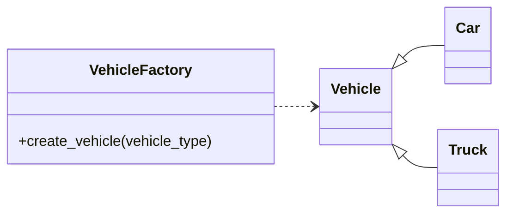

# Organizing and Designing Code

We learned that classes and objects provide a powerful way to model real-world concepts. Today, we're going to expand on that by learning how to structure entire applications. We'll go from single classes to well-organized programs, and we'll introduce design patterns that make our code more flexible and scalable.


!!! tip "Functions vs Classes"
    Although the following lesson is heavily focused on object-oriented design patterns, you don't have to consolidate all of your functions under classes! Sometimes, object oriented is actually a bad choice, both in terms of readability/maintainability but also performance. You can define functions in your module and import them when needed.

-----

## From Scripts to Packages

When a project is small, a single Python file works just fine. But as your codebase grows, it's essential to organize your code into logical, reusable units. These are called **modules** and **packages**.

- A **module** is simply a single Python file (`.py`).
- A **package** is a directory that contains multiple modules and a special (often empty) `__init__.py` file. This is how you group related functionality.

Let's walk through an example. Imagine we have a project that involves different kinds of vehicles. A bad way to structure this would be to put all the classes in one file:

```
my_project/
└── vehicles.py  # A single, messy file with all classes
```

Instead, let's create a well-organized **package** for our project.

1. We'll start by creating a project directory with the following structure. The `__init__.py` files are what make Python recognize these folders as a package.

    !!! danger inline end "`ModuleNotFoundError`...Where am I?"
        Note, a common annoyance of Python modules is making sure that Python/scripts know where to find your custom module(s). There are many ways to solve this issue, however since we are working in _containers_, in our build/compose we can set the `PYTHONPATH` environment variable to point to our module. For example `PYTHONPATH="${PYTHONPATH}:/path/to/my_project/"`
    
    ```
    my_project/
    ├── __init__.py
    ├── core/
    │   ├── __init__.py
    │   └── components.py  # For things like an Engine class
    ├── transport/
    │   ├── __init__.py
    │   └── cars.py        # For our Car class
    └── main.py
    ```

2. Next, we'll write our `Engine` class in `core/components.py` and our `Car` class in `transport/cars.py`.

3. Finally, we'll open `main.py` and demonstrate how easy it is to import and use classes from any module within the package:

    ```python linenums="1"
    from my_project.core.components import Engine
    from my_project.transport.cars import Car

    engine = Engine()
    car = Car(engine)
    car.start()
    ```

This structure makes our code more readable, reusable, and easy to navigate.

-----

## Deepening Your OOP: Composition and Encapsulation

We've already learned about inheritance, but two other powerful OOP concepts are crucial for building maintainable codebases.

### **Composition (The "Has A" Relationship)**

**Composition** is when a class contains an instance of another class as an attribute. It models a "has a" relationship, and it is often preferred over inheritance because it's more flexible.

1.  Let's define a simple `Engine` class in `core/components.py`. This class has the behavior of starting and stopping.

    ```python title="core/components.py" linenums="1"
    class Engine:
        def start(self):
            return "Engine started."

        def stop(self):
            return "Engine stopped."
    ```

2.  Now, in `transport/cars.py`, we'll create a `Car` class that **has an** `Engine`. We do this by creating an instance of the `Engine` class within the `Car`'s `__init__` method.

    ```python title="transport/cars.py" linenums="1"
    from my_project.core.components import Engine

    class Car:
        def __init__(self):
            # Composition: A Car object "has an" Engine object
            self.engine = Engine()

        def start(self):
            return self.engine.start()

        def stop(self):
            return self.engine.stop()
    ```

### **Encapsulation (Hiding Complexity)**

**Encapsulation** is the principle of hiding an object's internal state and only exposing what is necessary. It protects your object's data from unintended changes. In Python, we use a naming convention to signal encapsulation:

  - `_variable_name` (single underscore): A convention that signals, "This is an internal variable; please don't use it directly."
  - `__variable_name` (double underscore): Python "mangles" the name, making it harder to access from outside the class.

1.  We'll update our `Engine` class to have a private attribute called `__rpm` to represent its speed.

2.  We'll create public methods (`get_rpm` and `set_rpm`) to control access to this data.

    ```python title="core/components.py" linenums="1"
    class Engine:
        def __init__(self):
            self.__rpm = 0

        def get_rpm(self):
            return self.__rpm

        def set_rpm(self, value):
            if value >= 0:
                self.__rpm = value
    ```

This ensures the `__rpm` attribute can only be modified through the `set_rpm` method, allowing us to enforce business logic (e.g., `rpm` can't be negative).

-----

## Introducing Design Patterns: Strategies for Common Problems

A **design pattern** is a reusable solution to a common problem in software design. They aren't concrete code you copy and paste; they are templates you adapt to solve a specific problem. Knowing them gives you a common vocabulary to discuss code architecture.

### **The Factory Pattern**

The **Factory Pattern** provides a centralized way to create objects without exposing the complex creation logic. It's especially useful when you need to create different types of objects based on some input.

1.  Let's expand on our `Car` and `Engine` classes. We'll create a `Truck` class that has a more powerful `TruckEngine`.
2.  Next, we'll create a central `VehicleFactory` class that can create different vehicles based on a type.

<!-- end list -->



Here's how we'd implement it:

```python title="transport/vehicles.py" linenums="1"
class Vehicle:
    def __init__(self, engine):
        self.engine = engine

    def start(self):
        return self.engine.start()
```

```python title="transport/cars.py" linenums="1"
from my_project.core.components import Engine
from my_project.transport.vehicle import Vehicle

class Car(Vehicle):
    def __init__(self):
        super().__init__(Engine())
```

```python title="transport/trucks.py" linenums="1"
from my_project.core.components import HeavyDutyEngine
from my_project.transport.vehicle import Vehicle

class Truck(Vehicle):
    def __init__(self):
        super().__init__(HeavyDutyEngine())
```

```python title="factory.py" linenums="1"
from my_project.transport.cars import Car
from my_project.transport.trucks import Truck

class VehicleFactory:
    def create_vehicle(self, vehicle_type):
        match vehicle_type:
            case "car":
                return Car()
            case "truck":
                return Truck()
            case _:
                raise ValueError("Unknown vehicle type")
```

This design hides the logic of creating the correct `Car` or `Truck` from the rest of your application. You simply ask the factory for a "car" or a "truck," and it handles the rest.

### **The Strategy Pattern**

The **Strategy Pattern** allows you to define a family of algorithms and make them interchangeable. This is useful when an object needs to perform an action but the specific implementation of that action can change.

1.  Imagine our `Car` needs to warn the user about a low fuel level. We could have a `FuelWarning` method that uses a specific strategy.

2.  First, let's define a family of notification strategies:

    ```python title="core/components.py" linenums="1"
    class NotificationStrategy:
        def send_warning(self, message):
            pass

    class ConsoleStrategy(NotificationStrategy):
        def send_warning(self, message):
            print(f"[CONSOLE WARNING]: {message}")

    class EmailStrategy(NotificationStrategy):
        def send_warning(self, message):
            # In a real app, this would send an email
            print(f"[EMAIL WARNING]: {message}")
    ```

3.  Now, our `Car` class can use **composition** to hold a reference to a `NotificationStrategy` object.

    ```python title="transport/cars.py" linenums="1"
    from my_project.core.components import ConsoleStrategy, Engine
    from my_project.transport.vehicle import Vehicle

    class Car(Vehicle):
        def __init__(self, notification_strategy: NotificationStrategy):  # (1)!
            super().__init__(Engine())
            self.notification_strategy = notification_strategy

        def check_fuel(self, fuel_level):
            if fuel_level < 5:
                message = "Fuel level is low!"
                self.notification_strategy.send_warning(message)
    ```
    { .annotate }

    1. The `notification_strategy: NotificationStrategy` is called a type hint, we will expand on this in the next lesson.

This design allows us to easily switch between sending console warnings and emails by simply passing a different strategy object when creating the `Car`.

-----

## Recommended Exercises & Homework

Your homework is to apply these code organization and design principles to build a single, cohesive application.

1.  **Project Setup & Factory:** Create a new project folder and set up a package structure with at least two sub-packages, like `vehicles` and `notifications`. In the `vehicles` package, create a `VehicleFactory` class that can produce different types of vehicles (e.g., a `Car` and a `Motorcycle`).

2.  **Vehicle Hierarchy:** Create a `Vehicle` parent class and have `Car` and `Motorcycle` inherit from it. The `Vehicle` class should have a private attribute for fuel level and a `refuel()` method.

3.  **Strategy Pattern:** Implement the Strategy Pattern. Create a base `FuelWarningStrategy` class and two or more concrete strategies, such as `ConsoleWarningStrategy` and `EmailWarningStrategy`.

4.  **Putting It All Together:** Add a `check_fuel()` method to the `Vehicle` class. This method should take a `FuelWarningStrategy` as an argument. If the fuel is low, it should call the strategy's method to send a warning. In a final script, use your `VehicleFactory` to create a new vehicle and then call `check_fuel()` with different strategies to show the different warning messages.

## Suggested Readings & Resources

  - [Real Python: Python Packages](https://realpython.com/python-packages/)
  - [Refactoring Guru: Design Patterns](https://refactoring.guru/design-patterns/python) - A fantastic resource for learning about design patterns.
  - [Python.org: Modules](https://docs.python.org/3/tutorial/modules.html)
