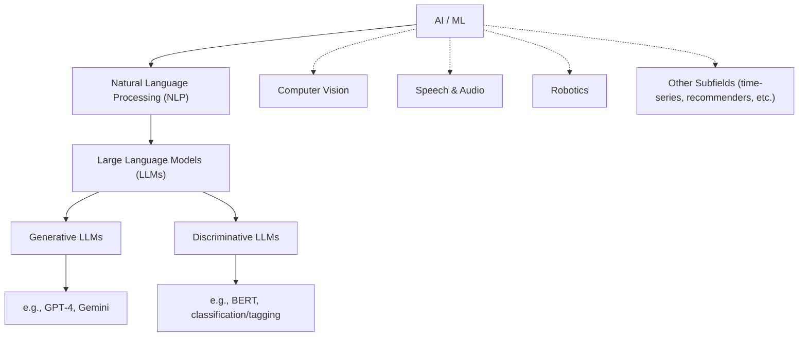

#LLM Fundamentals & Direct API Interaction

This session is designed to give you a robust, practical understanding of Large Language Models and, most importantly, to execute your first direct API calls to them. By the end of this class, you'll know the core components of an LLM system and the structure of the request you send and the response you receive.

-----

## LLMs in Context: Generative vs. Discriminative AI

To understand **Large Language Models (LLMs)**, we must first place them within the landscape of Machine Learning (ML).



| Type | Goal | Task Examples | Example Model |
| :--- | :--- | :--- | :--- |
| **Discriminative AI** | **Classification.** Learns to distinguish between existing classes or labels. | Spam detection, image classification (Cat/Dog), predicting churn (Yes/No). | **BERT** (Analyzes existing text). |
| **Generative AI** | **Creation.** Learns patterns to create entirely new content that did not exist before. | Creating new text, generating images, writing novel code. | **Gemini, GPT-4, DALL-E** (Creates new content). |

LLMs are the most advanced subset of Generative AI focused on language. They are fundamentally designed to predict the next token in a sequence, which allows them to "generate" fluent and coherent text.


!!! danger "Lack of Understanding"
    It's important to remember that generative LLMs don't have any fundamental "understanding" (yet), rather the goals is to generate sequence that looks statistically probable. I like to think of it like stirring a bowl of "alphabet soup" in the right way that _looks_ like a right answer.


## The LLM Engine: Tokens, Vectors, and Context

An LLM cannot directly process text; it must convert it into a numerical format. Understanding this process is key to managing prompt length and model output.

### Tokens: The Basic Unit of Text

An LLM reads and predicts tokens, which are the fundamental building blocks of language used by the model.

- **What are they?** Tokens are chunks of text that can represent whole words, subwords, or punctuation. For example, "unbelievable" might be broken into the tokens "un," "believe," and "able."
- Estimation Rule of Thumb: This is crucial for managing your context window:
    - 1 token ~ 3/4 word
    - 100 tokens ~ 75 words
    
The entire interaction—your prompt, the data, and the model’s response—is calculated in tokens, which directly impacts processing time and cost.


!!! example "OpenAI Tokenizer"

    We can see an example of tokenization using the online [OpenAI Tokenizer](https://platform.openai.com/tokenizer) tool. Try entering the following examples one at a time and note the results.

    - `The quick brown fox jumps over the lazy dog.`
    - `I'm going to ride the rollercoaster!`
    - `It's a beautiful day, isn't it`
    - `even_numbers = {i for i in range(10) if i % 2 == 0}`

### Vectors and Embeddings: The Numerical Language

Every token is converted into a **vector** (a list of floating-point numbers) that represents its meaning and relationship to other tokens. This numerical form, called an **embedding**, is what the model actually uses to understand and process language.  This numerical representation allows the model to perform complex calculations on text.


!!! example "Naive Example"

    A very simplistic example is the "Bag of Words" approach, which takes your text and generates vectors based on term frequency/prescence within your defined vocabulary. For example, take the example `It was the best of times`.  The scoring of the document could look as follows:

    ```
    “it” = 1
    “was” = 1
    “the” = 1
    “best” = 1
    “of” = 1
    “times” = 1
    “worst” = 0
    “age” = 0
    “wisdom” = 0
    “foolishness” = 0
    ```

    As a binary vector, it would look like: `[1, 1, 1, 1, 1, 1, 0, 0, 0, 0]`. Other examples:

    ```
    "it was the worst of times" = [1, 1, 1, 0, 1, 1, 1, 0, 0, 0]
    "it was the age of wisdom" = [1, 1, 1, 0, 1, 0, 0, 1, 1, 0]
    "it was the age of foolishness" = [1, 1, 1, 0, 1, 0, 0, 1, 0, 1]
    ```

    Granted, modern embedding approaches are more sophisticated, but this should give you a good mental image of the concept.


### Context Window: The Memory Limit

Every model has a **context window**, which is the absolute maximum number of tokens (input + output) it can process in a single request.

- This limit dictates how much data, conversation history, and system instructions you can send at once.
- If your total token count exceeds the context window, the model will fail to process the request, or the output will be truncated.

## Prompt Engineering: Communicating with the Model

**Prompt Engineering** is the practice of writing effective instructions for an LLM. When interacting with any LLM platform's user interface, your input is structured logically into three parts:

| Component | Purpose | Example |
| :--- | :--- | :--- |
| **System Instruction** | Defines the model's persona, tone, and permanent rules. This sets the **stage**. | "Act as a pirate who loves Python code." |
| **User Query** | The specific question or request the model must fulfill right now. | "Write a short function to calculate area." |
| **Context/Examples** | External information the model needs (data, documents, or examples). | *Example:* A JSON object it needs to parse. |

### Prompt Patterns

| Pattern | Description | When to Use |
| :--- | :--- | :--- |
| **Zero-Shot** | The prompt gives **no examples**. It relies only on the model's pre-trained knowledge. | Quick, general questions (e.g., "Summarize this article."). |
| **Few-Shot** | The prompt includes 1-3 pairs of **example inputs and outputs** to teach the model a specific style or format. | Tasks requiring custom formatting (e.g., translating names to a specific JSON structure). |

!!! example "Zero Shot Prompt Examples"

    The goal of a Zero-Shot prompt is to rely purely on the model's vast pre-trained knowledge and your explicit instruction. There are no examples provided.

    | Goal | System Instruction | User Query | Expected Behavior |
    | :--- | :--- | :--- | :--- |
    | **Simple Translation** | You are an expert translator. Your only job is to translate text from English to French. | Translate the following: "The quick brown fox jumps over the lazy dog." | The model translates the text directly without any formatting fluff. |
    | **Factual Summary** | You are a concise history professor. Summarize the key causes of World War I in three concise bullet points. | What were the three main causes of World War I? | The model uses its knowledge base to extract and format the requested information. |
    | **Code Interpretation** | You are a helpful Python assistant. Explain the following code and suggest one improvement. | `def area(w, h): return w*h` | The model explains the function calculates area and might suggest adding type hints or docstrings. |


!!! example "Few-Shot Prompt Examples"

    The goal of a Few-Shot prompt is to teach the model a specific input/output format, style, or transformation by providing 1-3 working examples within the context. 

    | Goal | System Instruction | User Query | Examples Provided in Prompt |
    | :--- | :--- | :--- | :--- |
    | **Tone Transformation** | Your job is to convert formal technical documentation into the style of a medieval blacksmith. | **Input:** I am designing a new database schema for customer data. | **Example 1:** Input: `I need to install the latest dependency`. Output: `"Aye, I must hammer the new parts into the bellows."` **Example 2:** Input: `The current system is too slow.` Output: `"Verily, this ancient forge is burdened by sluggish coal."` |
    | **Structured Output** | You are a data extraction bot. Convert the input into a strict JSON format with keys: `item`, `cost`, `location`. | **Input:** A used laptop for $450 in Brooklyn. | **Example 1:** Input: `New speakers for $120 in Manhattan.` Output: `{"item": "New speakers", "cost": 120, "location": "Manhattan"}` |
    | **Custom Code Style** | You are a legacy C++ developer. Convert the user's Python code into C++ code that exclusively uses pointers and C-style arrays. | **Input:** `def add(a, b): return a + b` | **Example 1:** Input: `def print_msg(msg): print(msg)` Output: `void print_msg(char *msg) { printf("%s", msg); }` |

### Tips for Better Prompting

A well-engineered prompt is the cheapest way to improve your model's performance. Focus on these elements (you can find more detailed patterns at resources like [promptingguide.ai](https://www.promptingguide.ai/)):

  * **Be Explicit with Role and Goal:** Don't just ask a question; tell the model *who* it is ("You are a senior analyst") and *what* it must achieve ("Summarize the main points into exactly three bullet points").
  * **Use Delimiters:** Use clear separators (like triple quotes `"""..."""` or `<data>...</data>`) to separate the instructions from the data. This helps the model distinguish what it should process from what it should follow.
  * **Give Constraints:** Always constrain the output format (e.g., "Respond in valid JSON," "Keep the answer under 50 words," or "Do not mention the word 'amazing'").

## Direct API Interaction: Controlling the Output

All interactions with LLMs, whether through a simple chat interface or a complex framework, rely on API (Application Programming Interface) calls.

- An API defines a set of rules (endpoints, methods, data formats) that allow two pieces of software to talk to each other.
- In the case of LLMs, your code acts as the client, and the LLM service acts as the server.

### Making the Request: HTTP and JSON

You communicate with the LLM API using the HTTP protocol and sending data formatted as JSON (JavaScript Object Notation).

| Command | Protocol | Description |
| :--- | :--- | :--- |
| **`cURL`** | Command Line | A standard tool for manually testing API endpoints. Requires passing the JSON data and headers (including the API key). |
| **`requests`** | Python Library | The most common Python library for making HTTP requests, simplifying the process of sending JSON payloads. |

### Model Parameters

When you make an API call, you include parameters to control the model's creativity and diversity.

  * **`temperature`**: This is the most crucial control. It adjusts the randomness of the token selection. Use a low value (e.g., `0.1`) for factual or code generation tasks, and a high value (e.g., `0.8`) for creative or brainstorming tasks.
  * **`top_p` (Nucleus Sampling):** Limits the selection of the next token to the smallest set of tokens whose cumulative probability exceeds the value of `top_p`. This is an alternative to `temperature` for controlling output diversity.
  * **`max_tokens`**: A hard limit on the length of the model's response. Essential for managing costs and context window size.

### The Payload Structure

We will focus on the structure required by the OpenAI Chat Completions API, as it's the standard for many commercial applications. Notice how the concepts from Section 3 map directly to the JSON keys, particularly the **System** and **User** roles in the `messages` array.

```json
{
    "model": "gpt-3.5-turbo",
    "messages": [
        // Role: system (Our System Instruction/Persona)
        {"role": "system", "content": "You are a concise, professional technical writer."},
        
        // Role: user (Our User Query/Instruction)
        {"role": "user", "content": "Explain Git branching in simple terms."}
    ],
    
    // Generation Parameters (Controlling creativity and length)
    "temperature": 0.2, 
    "max_tokens": 1024
}
```

## Recommended Exercises & Homework

For this week's homework, you will provision your own API key and use basic Python to execute an authenticated request. This builds a foundational understanding of the underlying HTTP requests that all LLM libraries rely on.

1.  **OpenAI API Key Provisioning:**

    * Sign up for an OpenAI account and generate a new **API Key**. **Treat this key like a password.**

    !!! Danger "Keep it Secret, Keep it Safe"
        Treat your API key like a password. DO **NOT** share it with others you don't trust or commit to GitHub. If you wish to commit your code to Git, one method to keep your key safe by storing it within an untracked environment variable (i.e. `.env` file) which gets loaded into the script.

2.  **Hardened API Request:** You will use Python's built-in `requests` library to send a complex payload to the OpenAI Chat Completion endpoint.

    * **Goal:** Use Python to send the prompt below and observe the output. **Experiment** by changing the system prompt, temperature, and other parameters to see the change in the model's behavior.

    * Use the following code as a starting point. Replace `YOUR_API_KEY` and experiment with the values inside the `payload` to complete the required tests. Note, you shouldn't require any third party package installs:

    ```python title="Example OpenAI Request" linenums="1"
    import requests
    import json

    # 1. Configuration (REPLACE API KEY)
    API_KEY = "YOUR_API_KEY"
    API_URL = "https://api.openai.com/v1/chat/completions"

    headers = {
        "Content-Type": "application/json",
        "Authorization": f"Bearer {API_KEY}"
    }

    # 2. Payload Structure (STARTING POINT)
    payload = {
        "model": "gpt-3.5-turbo",
        "messages": [
            # SYSTEM MESSAGE: Defines the model's persona and output format rules
            {"role": "system", "content": "Act as a professional YAML formatting tool. You MUST only respond with the YAML code and nothing else."},

            # USER MESSAGE: The data to be converted
            {"role": "user", "content": "Convert this data to YAML: Item: Monitor, Price: 299.99, InStock: true, Store: Midtown"}
        ],
        "temperature": 0.1
    }

    # 3. Execution (The Request)
    try:
        response = requests.post(API_URL, headers=headers, json=payload)
        response.raise_for_status() # Raise an exception for bad status codes

        # Print the model's response content
        data = response.json()
        yaml_output = data['choices'][0]['message']['content']
        print("--- API Call Successful ---")
        print(yaml_output)

    except requests.exceptions.RequestException as e:
        print(f"An error occurred during the API call: {e}")
        if 'response' in locals():
            print(f"Response text: {response.text}")
    ```

    !!! tip "Boilerplate"

        If this looks kinda rough to use (with all the extra boiler plate code to send/recieve/process the request/response), that's because it is. For most practical use cases, I advise against making "direct" API calls and instead use official libraries/abstractions -- i.e. OpenAI, LangChain, LlamaIndex -- however, I think it is good to learn and see it at least once.

3.  **Experimentation and Observation:**

      * **Experiment 1 (Persona Shift):** Change the `system` message to: **"You are a friendly, overly enthusiastic motivational speaker who must respond in short, punchy sentences."** Keep the query the same. What is the difference in the output?

      * **Experiment 2 (Creativity Test):** Restore the original professional `system` message, but change the query to: **"Write a short, silly poem about Python code and Docker."** Change `temperature` from `0.1` to `0.9`. How does the style of the poem change?

      * **Experiment 3 (Constraint Test):** Restore the original professional `system` message and set `temperature` to `0.1`. Change the `user` message to: **"Explain why the API key is important, but keep the explanation under 20 words."** Observe whether the model adheres to the word count constraint.

      * **Experiment 4 (OpenAI):** Try to use the official OpenAI python library to conduct these experiments.

By the end of this exercise, you'll have a clear, practical understanding of how every parameter in the API payload controls the LLM's final output.
