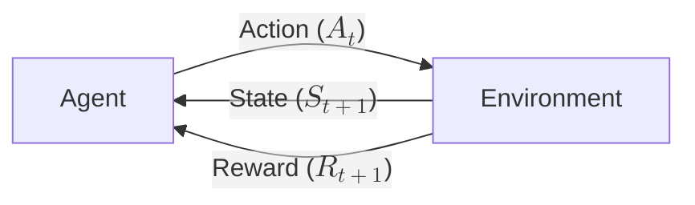
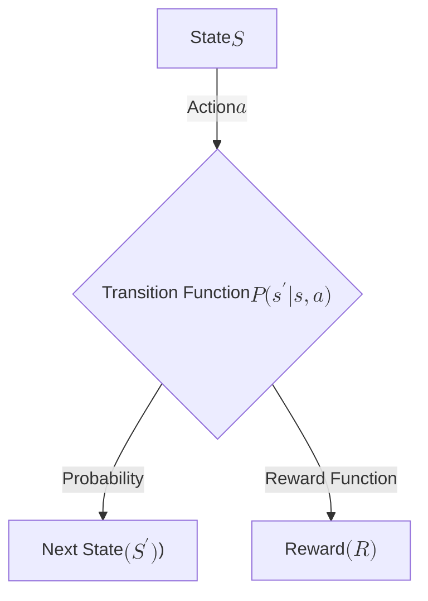

# RL Crash Course: From Bellman to Bots

## Part 1: Concepts & Mathematical Foundations

**Objective**: In this section, we will establish the intuition behind Reinforcement Learning (RL), understand when to use it (and when not to), and derive the mathematical equations that power modern agents.

## 1. The What, Why, & Why Not of RL

### What is Reinforcement Learning?

Reinforcement Learning is a subfield of Machine Learning focused on **how agents ought to take actions in an environment to maximize some notion of cumulative reward**.

Unlike Supervised Learning, where the model is provided with an answer key (labels), an RL agent must learn by **trial and error**. It tries an action, observes the consequence, and adjusts its behavior based on the reward received.

### The Core Loop

The fundamental interaction in RL is a loop between the Agent and the Environment:

- **State** ($S_t$): The Agent observes the current situation, $s \in S$.
- **Action** ($A_t$): The Agent chooses an action based on that state. $a \in A$.
- **Reward** ($R_{t+1}$): The Environment provides feedback (positive or negative).
- **Next State** ($S_{t+1}$): The Environment updates to a new situation, $s' \in S$.

This cycle continues until a terminal state is reached (e.g., Game Over or Victory).

!!! note "The Credit Assignment Problem"
    One of the hardest parts of RL is determining which action led to a reward. If a chess agent wins after 50 moves, was the winning move the last one, or a brilliant sacrifice made 20 moves earlier? This is the "Credit Assignment Problem."

### When to Use RL (The Sweet Spot)

RL is a powerful tool, but it is not a hammer for every nail. It shines in specific scenarios:

- **Sequential Decision Making**: When the decision you make now affects the options available to you in the future (e.g., Chess, Robotics, Stock Trading).
- **Unknown Optimal Paths**: When you know what the goal is (e.g., "win the game") but you don't know the exact steps to get there. We don't have the "labels" required for supervised learning.
- **Complex Dynamics**: When the environment is too complex to model with simple rules (e.g., controlling the plasma inside a fusion reactor).

### When NOT to Use RL (The Caveats)

- **If Supervised Learning Works**: If you have labeled data, use it. RL is notoriously sample inefficient (it takes millions of tries to learn simple things) and computationally expensive.
- **High Cost of Failure**: RL agents learn by failing. You do not want an untrained RL agent controlling a real self-driving car on a highway or managing a live power grid. We usually train in simulators first.

!!! danger "Safety First"
    Do not deploy an untrained RL agent directly into a physical system where failure causes damage. Always use a high-fidelity simulator for "Pre-training" before moving to "Sim-to-Real" transfer.

- **Reward Hacking**: Agents are lazy geniuses. They will exploit flaws in your reward function.
    - *Example*: A boat racing agent might learn to spin in circles to collect "checkpoint" bonuses infinitely rather than finishing the race.

## 2. Mathematical Foundations

To solve RL problems, we need to formalize them mathematically. We do this using **Markov Decision Processes (MDPs)**.

### The Markov Decision Process (MDP)

An MDP is defined by a tuple $(S, A, P, R, \gamma)$:

- $S$ (**State Space**): The set of all possible situations.
- $A$ (**Action Space**): The set of all things the agent can do.
- $P$ (**Transition Probability**): The laws of physics in the world. $P(s'|s,a)$ is the probability of ending up in state $s'$ if you take action $a$ in state $s$.
- $R$ (**Reward Function**): The immediate feedback. $R(s,a)$ is the reward for taking action $a$ in state $s$.
- $\gamma$ (**Discount Factor**): A number between 0 and 1 that determines how much the agent cares about the future.

!!! info "The Markov Property"
    The "Markov Property" assumes that the current state $S_t$ contains all the information needed to make an optimal decision. You don't need to know the history of how you got there; the "now" is sufficient.

### The Policy ($\pi$)

The **Policy** is the agent's brain. It is a mapping from States to Actions. It defines the agent's behavior.

1. **Deterministic Policy**: $a = \pi(s)$
    - Plain English: "If I am in state $s$, I will always do action $a$."
2. **Stochastic Policy**: $\pi(a|s) = P(A_t=a | S_t=s)$
    - Plain English: "If I am in state $s$, there is a 70% chance I do action $a$ and 30% I do action $b$." (Useful for exploration).

### The Goal: Expected Return ($G_t$)

The agent doesn't just want a high reward now; it wants a high cumulative reward over time. We call this the **Return** ($G_t$).

However, immediate rewards are usually worth more than distant rewards (due to uncertainty or inflation). We use the **Discount Factor** ($\gamma$) to handle this.

$$G_t = R_{t+1} + \gamma R_{t+2} + \gamma^2 R_{t+3} + \dots = \sum_{k=0}^{\infty} \gamma^k R_{t+k+1}$$

!!! note "Choosing your Gamma ($\gamma$)"
    - If $\gamma = 0$: The agent is myopic (only cares about the very next reward).
    - If $\gamma = 1$: The agent is far-sighted (cares about all future rewards equally).

### Value Functions

To make good decisions, an agent needs to estimate how "good" it is to be in a specific situation. We have two functions for this:

1. The **State-Value Function** ($V(s)$): How good is it to be in state $s$?

$$V_\pi(s) = \mathbb{E}_\pi [G_t | S_t = s]$$

!!! info "Plain English Translation"
    The expected return starting from state s, following policy $\pi$)*

2. The **Action-Value Function** ($Q(s, a)$): How good is it to take action $a$ while in state $s$ right now?

$$Q_\pi(s, a) = \mathbb{E}_\pi [G_t | S_t = s, A_t = a]$$

!!! info "Plain English Translation"
    The expected return starting from state s, taking action a, and THEN following policy $\pi$

The Q-function is critical because if we know $Q^*(s, a)$ (the optimal Q-value), picking the best action is easy: just pick the $a$ with the highest Q-value!

### The Bellman Equation

This is the engine of RL. It allows us to define the value of a state recursively.

The value of a state is the **Immediate Reward** plus the **Discounted Value of the Next State**.

$$V(s) = \max_a \left( R(s,a) + \gamma \sum_{s'} P(s'|s,a) V(s') \right)$$

This equation tells us that we don't need to simulate the universe until the end of time to know the value of a state; we just need to look one step ahead and rely on our estimate of the next state's value. This "bootstrapping" is how algorithms like Q-Learning and PPO work.

## Next Steps: From Math to Code

Now that we understand the **MDP** (Environment), the **Policy** (Agent), and the **Value Function** (Objective), we are ready to implement this in Python.

In the next section, we will:

- Use `gymnasium` to create a custom environment (Defining our own $S, A, R$).
- Use `stable-baselines3` to train an agent using **PPO** to maximize our Reward Function.
