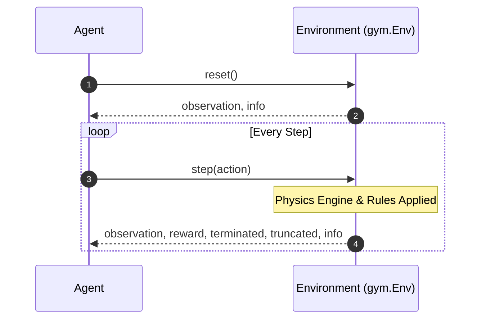
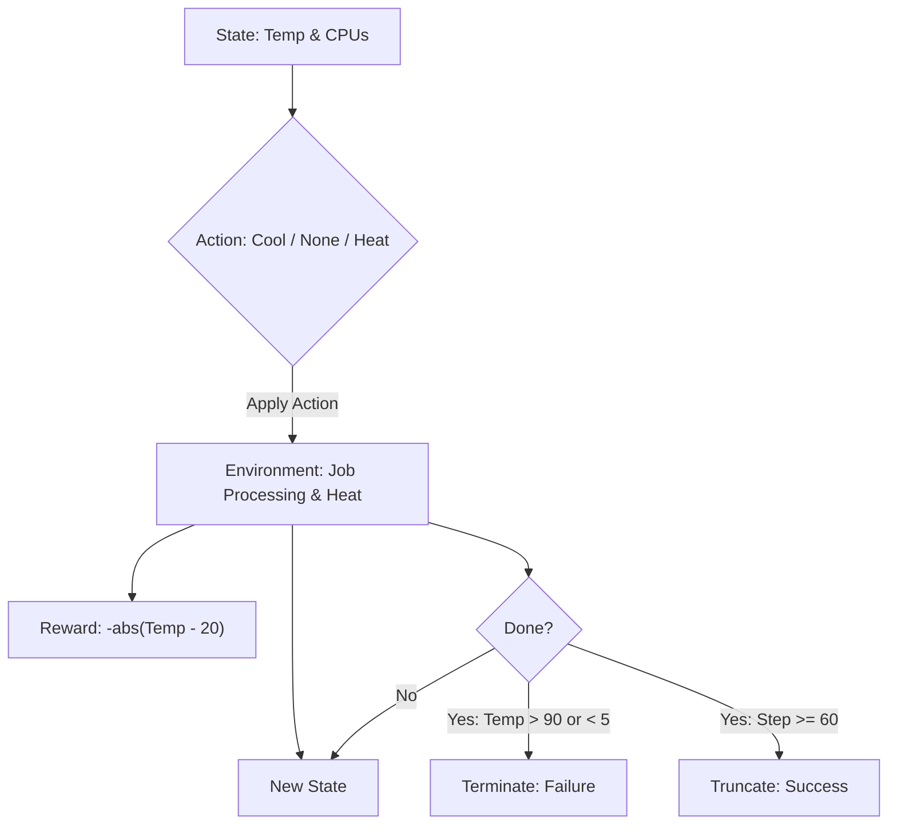

# RL Crash Course: From Bellman to Bots

## Part 2: Building a Custom Environment with Gymnasium

**Objective**: In this section, we transition from theory to practice. We will learn the industry-standard API for RL environments and build a custom simulation of a server room thermostat from scratch.

### The Gymnasium API

!!! warning inline end "Gymnasium vs. OpenAI Gym"
    Gymnasium is the maintained, modern version of the classic *OpenAI Gym* library. All new RL projects should use `gymnasium`, as the original `gym` library is no longer supported by the community!

Before an agent can learn, it needs a world to interact with. In Python, the standard framework for creating these worlds is **Gymnasium** (formerly OpenAI Gym).

Gymnasium provides a standardized interface. As long as your environment follows this specific set of rules, any modern RL algorithm can interact with it.

#### Spaces: Defining the Boundaries

How does an agent know what it can see or do? We define the boundaries using `gymnasium.spaces`. These objects describe the exact shape, bounds, and data types of inputs and outputs.

!!! info inline end "Why do we need to define Spaces?"
    The RL algorithm needs to know the shape and type of the data it will receive (observations) and the data it can send (actions). By defining these spaces, we ensure that our environment and agent can communicate effectively without type errors or mismatched dimensions. Remember, these machine learning algorithms are mathematical functions that expect inputs of a specific shape and type. The spaces act as a contract between the environment and the agent, ensuring they speak the same language.

- `Discrete(n)`: A single integer from `0` to `n-1`. Used when there are distinct, separate options (e.g., `Discrete(3)` for moving Left, Right, or Jumping).
- `Box(low, high, shape)`: An n-dimensional array of continuous numbers (floats). Used for continuous readings (e.g., a camera frame, joint angles, or speedometer).
- `MultiDiscrete([n, m])`: Multiple discrete actions at once. (e.g., pressing 'A' and 'Up' simultaneously on a controller).
- `Dict(...)`: A dictionary of simpler spaces. Great for composite observations where variables have different types (e.g., combining a camera frame `Box` with a scalar health value `Discrete`).
- `Tuple(...)`: Similar to a Dict, but structures the spaces as a tuple instead of named keys.

!!! tip "Start with Discrete Actions"
    When building your first environments, try to frame your problem using discrete action spaces if possible. Algorithms generally learn faster and more reliably in finite discrete spaces than in continuous Box spaces where the options are practically infinite!


#### The Core Methods

Every Gymnasium environment is a Python class that inherits from `gym.Env` and implements four main methods:



1. `__init__(self)`: Sets up the environment, defining what the agent can see (**Observation Space**) and what it can do (**Action Space**).
2. `reset(self)`: Restarts the environment to an initial state and returns the first observation. (Think of this as hitting the reset button on a console). It can also accept a `seed` for reproducibility and an `options` dictionary for custom configurations. Returns a tuple: `(initial observation, info)`.
3. `step(self, action)`: The core physics engine. It takes the agent's action, updates the world, and returns:
    - `observation`: The new state ($S_{t+1}$).
    - `reward`: The feedback ($R_{t+1}$).
    - `terminated`: A boolean indicating if the episode ended due to the rules (e.g., agent crashed).
    - `truncated`: A boolean indicating if the episode ended due to a time limit.
    - `info`: A dictionary for debugging.
4. `render(self)`: (Optional) Draws the environment to the screen for human viewing.

### Hands-On: The Server Room Thermostat (Advanced)

Let's build a custom environment.

!!! example inline end "Real World Case Study: Server Room Thermostat"
    This is a toy model of a real-world problem. Data centers consume massive amounts of energy, and cooling is a huge part of that cost. An intelligent thermostat could learn to pre-cool the room just before a big job starts, saving energy while keeping the servers safe.

**The Scenario**: You manage a server room. Instead of constant random heat, heat is generated by **Jobs**. Jobs are submitted randomly, one at a time, and require a certain number of CPUs for a few timesteps. More CPUs generate more heat. Your agent controls a thermostat and must keep the room temperature as close to 20°C as possible.

!!! info "Why are we adding jobs?"
    Because the agent can see the active processes, it can learn to pre-emptively cool the room when a massive job arrives, rather than just reacting after the temperature has already spiked. This teaches the foundation of predictive action!

#### Step 1: Defining the MDP (State, Action, Reward, Termination)

Before writing code, we must translate our real-world problem into the mathematical framework we learned in Part 1.



- **Action Space** ($A$): The agent can make 3 choices: Cool down (-1), Do nothing (0), Heat up (+1). We will use a `Discrete(3)` space.
- **Observation Space** ($S$): The agent reads TWO things of completely different types: the current temperature (a continuous float from 0.0°C - 100.0°C) and the number of active CPUs currently running a job (an integer from 0 - 100). We will use a composite `Dict` space containing a `Box` and a `Discrete` space.
- **Reward** ($R$): The agent gets punished the further the temperature strays from the target of 20°C. `Reward = -abs(Current_Temp - 20)`. And a large bonus reward of `+100` for surviving the entire episode without melting or freezing the servers.

!!! warning inline end "Termination vs. Truncation"
    The difference between these two is massive to an RL algorithm!

    - Termination tells the agent: "This was a failure state, avoid this behavior entirely."
    - Truncation tells the agent: "Time ran out for this simulation, but the state itself wasn't necessarily bad."

- **Termination & Truncation (Done Conditions)**: We need to know when the episode ends.
    - **Termination (Failure)**: If the temperature hits 90.0°C (servers melt) or drops to 5.0°C (servers freeze), the episode immediately ends in failure.
    - **Truncation (Success)**: If the agent manages the room successfully for 60 timesteps without a failure, the episode ends successfully (time limit reached).


#### Step 2: Writing the Code

Let's write the actual Python code for our environment.

```python title="custom_env.py" linenums="1"
import gymnasium as gym
from gymnasium import spaces
import numpy as np
import random

class ServerRoomEnv(gym.Env):
    """
    Custom Environment that follows gym interface.
    The agent must keep the server room temperature near 20°C 
    by predicting heat generated by random CPU jobs.
    """
    def __init__(self, verbose=False):
        super(ServerRoomEnv, self).__init__()
        self.verbose = verbose
        
        # Target temperature
        self.target_temp = 20.0
        
        # Actions: 0 = Cool, 1 = Do Nothing, 2 = Heat
        self.action_space = spaces.Discrete(3)
        
        # Observation: Dictionary of Temp (Box) and Active CPUs (Discrete)
        # Temp ranges from 0-100 (float), CPUs range from 0-100 (int)
        self.observation_space = spaces.Dict(
            {
                "temperature": spaces.Box(
                    low=0.0, 
                    high=100.0, 
                    shape=(1,), 
                    dtype=np.float32
                ),
                "cpus": spaces.Discrete(101) # Allows integer values from 0 to 100
            }
        )
        
        # State variables
        self.current_temp = 20.0
        self.active_cpus = 0
        self.job_timer = 0  # Tracks how long the current job lasts
        
        self.episode_length = 60 # 60 steps per episode
        self.current_step = 0

    def _get_obs(self):
        """Helper method to format the observation dictionary."""
        return {
            "temperature": np.array([self.current_temp], dtype=np.float32),
            "cpus": int(self.active_cpus)
        }

    def reset(self, seed=None, options=None):
        """Restarts the environment for a new episode."""
        super().reset(seed=seed)
        
        # Start at a random temperature near the target
        self.current_temp = random.uniform(18.0, 22.0)
        self.active_cpus = 0
        self.job_timer = 0
        self.current_step = 0
        
        return self._get_obs(), {}

    def step(self, action):
        """Applies the action, processes jobs, and calculates the reward."""
        self.current_step += 1
        
        # 1. Apply Agent's Action Effects
        if action == 0:   # Cool
            self.current_temp -= 3.0
        elif action == 1: # Do Nothing
            pass
        elif action == 2: # Heat
            self.current_temp += 3.0
            
        # 2. Process Job Lifecycle
        if self.job_timer > 0:
            # Job is currently running
            self.job_timer -= 1
            if self.job_timer == 0:
                self.active_cpus = 0 # Job finished
        else:
            # No active job. 30% chance a new job arrives this step.
            if random.random() < 0.30:
                self.active_cpus = random.randint(10, 80) # Requires 10-80 CPUs
                self.job_timer = random.randint(3, 8)     # Lasts 3-8 timesteps
                
        # 3. Apply Environmental Heat (Calculated from active CPUs + slight noise)
        # Each active CPU adds 0.05 degrees, plus some minor fluctuation
        cpu_heat = (self.active_cpus * 0.05) 
        ambient_noise = random.uniform(-0.5, 0.5)
        self.current_temp += (cpu_heat + ambient_noise)
        
        # Clip temperature to stay within our defined bounds
        self.current_temp = np.clip(self.current_temp, 0.0, 100.0)
        
        # 4. Calculate Reward (Negative distance from target)
        reward = -abs(self.current_temp - self.target_temp)
        
        # 5. Check for Termination / Truncation
        terminated = False
        
        # Terminate if the servers melt or freeze (Failure condition)
        if self.current_temp >= 90.0:
            if self.verbose:
                print(f"\n🔥 BOOM! Servers melted at {self.current_temp:.1f}°C! You exploded! 🔥")
            terminated = True
        elif self.current_temp <= 5.0:
            if self.verbose:
                print(f"\n❄️ ICE AGE! Servers froze solid at {self.current_temp:.1f}°C! Welcome to Hoth! ❄️")
            terminated = True
        
        # Truncate if we hit the maximum time limit (Success condition)
        truncated = bool(self.current_step >= self.episode_length)
        if truncated and not terminated:
            if self.verbose:
                print("\n✅ SHIFT OVER! You survived the day without destroying the server room.")
            reward += 100.0 # Bonus for surviving the whole episode
        
        # 6. Format the return values
        info = {}
        return self._get_obs(), reward, terminated, truncated, info

    def render(self):
        """Simple text printout of the environment state."""
        print(f"Step: {self.current_step:02d} | Temp: {self.current_temp:.2f}°C | Active CPUs: {self.active_cpus}")
```

#### Step 3: Testing the Environment with a Random Agent

Before we apply advanced AI to solve this, we must ensure the physics engine works. We can test it by letting an agent take completely random actions.

```python title="custom_env.py" linenums="122"
if __name__ == "__main__":
    # Instantiate our new environment
    env = ServerRoomEnv(verbose=True) # Set verbose to True to see detailed output

    # Reset the environment to start
    obs, info = env.reset()
    print(f"Starting Temperature: {obs['temperature'][0]:.2f}°C | Starting CPUs: {obs['cpus']}")

    episodes = 1
    for ep in range(episodes):
        obs, info = env.reset()
        done = False
        score = 0
        
        while not done:
            # Sample a random action from the action space (0, 1, or 2)
            action = env.action_space.sample() 
            # action = my_cool_policy(obs) # Replace with your policy function later
            
            # Step the environment forward
            obs, reward, terminated, truncated, info = env.step(action)
            score += reward
            
            env.render()
            
            # Episode ends if terminated (bounds exceeded) or truncated (time up)
            done = terminated or truncated

        print(f"Episode {ep + 1} finished with Total Reward: {score:.2f}")

    # Always close the environment when done
    env.close()
```

Example output:

```
Starting Temperature: 21.14°C | Starting CPUs: 0
Step: 01 | Temp: 26.61°C | Active CPUs: 58
Step: 02 | Temp: 32.63°C | Active CPUs: 58
Step: 03 | Temp: 32.98°C | Active CPUs: 58
Step: 04 | Temp: 32.85°C | Active CPUs: 58
Step: 05 | Temp: 36.06°C | Active CPUs: 58
Step: 06 | Temp: 38.90°C | Active CPUs: 0 
...
🔥 BOOM! Servers melted at 93.1°C! You exploded! 🔥
Step: 59 | Temp: 93.07°C | Active CPUs: 57
Episode 1 finished with Total Reward: -2398.05
```

If you run this code, you will notice the `Active CPUs` periodically spike up. A random agent will just guess, leading to huge temperature swings. Eventually, you'll see one of our fatal print statements trigger when the random agent inevitably freezes or melts the servers!

**Next Steps**: In the final section, we will train a Deep Reinforcement Learning algorithm (PPO). The neural network will learn the correlation between `Active CPUs` and rising temperature, allowing it to pre-cool the room exactly when a massive 80-CPU job is submitted!
