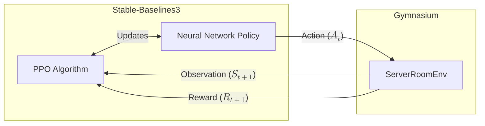

# RL Crash Course: From Bellman to Bots

## Part 3: Training with PPO and Advanced Frontiers

**Objective**: In this final section, we will replace our random agent with a state-of-the-art Deep Reinforcement Learning algorithm. We'll train it to perfectly manage our server room, discuss how to tune it, and briefly explore the cutting-edge of RL.

### Training a Custom Environment with PPO

Writing RL algorithms from scratch is highly prone to bugs and sometimes very complex. Instead, the industry relies on robust, optimized libraries. We will use **Stable-Baselines3 (SB3)**, which is built on PyTorch and integrates perfectly with Gymnasium. Supported by [Stable-Baselines3 algorithms](https://stable-baselines3.readthedocs.io/en/master/guide/algos.html) as of 2026/02/29 

| Name           | Box | Discrete | MultiDiscrete | MultiBinary | Multi Processing |
|----------------|-----|----------|---------------|-------------|------------------|
| ARS 1          | ✔️   | ✔️        | ❌             | ❌           | ✔️                |
| A2C            | ✔️   | ✔️        | ✔️             | ✔️           | ✔️                |
| CrossQ 1       | ✔️   | ❌        | ❌             | ❌           | ✔️                |
| DDPG           | ✔️   | ❌        | ❌             | ❌           | ✔️                |
| DQN            | ❌   | ✔️        | ❌             | ❌           | ✔️                |
| HER            | ✔️   | ✔️        | ❌             | ❌           | ✔️                |
| PPO            | ✔️   | ✔️        | ✔️             | ✔️           | ✔️                |
| QR-DQN 1       | ❌   | ️ ✔️       | ❌             | ❌           | ✔️                |
| RecurrentPPO 1 | ✔️   | ✔️        | ✔️             | ✔️           | ✔️                |
| SAC            | ✔️   | ❌        | ❌             | ❌           | ✔️                |
| TD3            | ✔️   | ❌        | ❌             | ❌           | ✔️                |
| TQC 1          | ✔️   | ❌        | ❌             | ❌           | ✔️                |
| TRPO 1         | ✔️   | ✔️        | ✔️             | ✔️           | ✔️                |
| Maskable PPO 1 | ❌   | ✔️        | ✔️             | ✔️           | ✔️                |

!!! info "RL Libraries"
    There are libraries out there besides Stable-Baselines3 for Deep RL, such as RLlib (my preferred), Torch RL, CleanRL, SKRL, and Tianshou. Recommend checking out others if you want to explore different algorithms or need features not supported by SB3.

#### Enter PPO (Proximal Policy Optimization)

We are going to use PPO. You don't need to understand the underlying calculus right now, but you should recognize how it maps to the concepts we covered in Part 1:

!!! info "Connecting PPO to the Math"
    * **The Objective**: PPO's goal is to find the optimal **Policy** ($\pi$) that maximizes the **Expected Return** ($G_t$).
    * **The Brain**: It uses a Neural Network to approximate the **State-Value Function** ($V(s)$) to guess how good a state is, and another network to output the Action probabilities.
    * **"Proximal"**: It limits how much the agent's brain can change in a single update. This prevents the agent from forgetting everything it learned just because it had one lucky (or unlucky) episode.



#### Writing the Training Loop

Let's train an agent to manage our `ServerRoomEnv`. You'll need to install the library: `pip install stable-baselines3[extra]`.

```python title="train.py" linenums="1"
from stable_baselines3 import PPO

from custom_env import ServerRoomEnv  # Import your custom environment

# 1. Instantiate the Environment
# Optional: Pass hyperparameters to the environment constructor if needed (e.g., target_temp=22)
env = ServerRoomEnv(verbose=True)  # Set verbose to True to see detailed output

# 2. Instantiate the PPO Agent
# NOTE: Because our observation space is a Dict, we MUST use "MultiInputPolicy"
# If it was just a Box, we would use "MlpPolicy"
model = PPO("MultiInputPolicy", env, verbose=1)

print("Starting training...")
# 3. Train the Agent! (10,000 steps is very fast, usually takes < 1 minute)
model.learn(total_timesteps=10_000)
print("Training finished!")

# 4. Save the "Brain"
model.save("/path/to/server_room_ppo_model")
```

!!! warning "Training Time"
    The above code will train for 10,000 steps, which is usually enough for a simple environment like ours. However, more complex environments may require hundreds of thousands or even millions of steps to learn effectively. You can adjust `total_timesteps` as needed. Also, training time depends on your hardware. If you have a GPU, PPO can take advantage of it to speed up training. By default, the code will use CPU, which is fine for our simple environment. See [Pytorch documentation](https://pytorch.org/get-started/locally/) for GPU setup.

#### Tuning the Agent (Hyperparameters)

If your agent isn't learning, you rarely rewrite the algorithm. Instead, you tune the **Hyperparameters**. Think of these as the dials and knobs on the back of the AI's brain.

!!! tip "Crucial Hyperparameters in PPO"
    * **Learning Rate** (`learning_rate`): How big of a step the neural network takes when updating. If it's too high, the agent learns erratically and forgets past lessons. If too low, training takes forever. (*Default: 0.0003*)
    * **Discount Factor** (gamma / $\gamma$): We saw this in Part 1! A $\gamma$ of 0.99 means the agent cares deeply about the distant future. A $\gamma$ of 0.5 makes the agent myopic (only cares about immediate heat spikes).
    * **Network Architecture** (net_arch): You can make the neural network deeper or wider. If your environment is very complex, a small default network might not have enough "neurons" to grasp the patterns.

    Recommend using your favorite hyperparameter tuning library (Optuna, Ray Tune, Weights & Biases Sweeps) to automate this process. You can even use a simple grid search if you have the computational resources. And don't forget to track your experiments with tools like Weights & Biases, MLflow, or TensorBoard to visualize how different hyperparameters affect learning!

### Evaluating the Trained Agent

Let's load our trained brain and see how it performs compared to the random agent from the previous section.

```python title="evaluate.py" linenums="1"
from stable_baselines3 import PPO
from custom_env import ServerRoomEnv

# Load the trained model
model = PPO.load("/path/to/server_room_ppo_model")
env = ServerRoomEnv()

# Enjoy a 5-episode test drive
for ep in range(5):
    obs, info = env.reset()
    done = False
    score = 0
    
    print(f"\n--- Episode {ep+1} ---")
    while not done:
        # Instead of random.sample(), we ask our trained model for the best action!
        # _states is used for recurrent policies (LSTMs), which we aren't using here.
        action, _states = model.predict(obs, deterministic=True)
        
        obs, reward, terminated, truncated, info = env.step(action)
        score += reward
        env.render()
        
        done = terminated or truncated

    print(f"Total Reward: {score:.2f}")

env.close()
```

If training was successful, you will see the agent intelligently pre-cooling the room the moment `Active CPUs` spike, resulting in zero melted servers and a high score!

!!! failure "Don't Panic if it Doesn't Work at First"
    RL can be very finicky. If your agent is still melting servers, try tuning the hyperparameters, increasing training time, or even simplifying the environment to make it easier to learn. Debugging RL often involves a lot of trial and error, so don't get discouraged! Also note, the environment itself is not perfectly implemented (e.g., the physics of cooling might be too harsh), so you may need to adjust the environment's parameters to make it learnable. You may want to:

        - Include job duration/timing info in observations
        - Add shaped rewards (e.g., bonus for staying within ±2°C band)
        - Increase action magnitude granularity (±1°C instead of ±3°C)
        - Reduce ambient noise or make it part of the observation
        - Longer episodes or curriculum learning with progressively harder scenarios

## Advanced Training Frontiers

Congratulations! You've just built an MDP, wrapped it in a Gym, and solved it with a Deep RL algorithm. To wrap up the crash course, let's look at where the industry goes from here.

What happens when environments are too complex for a standard PPO setup to learn from scratch?

!!! example "The Sparse Reward Problem"
    Imagine training a robot to assemble a car. If the only reward is `+100` for a finished car and `0` for everything else, the robot will flail randomly for millions of years without ever accidentally building a car to get that first reward. How do we fix this?

### Curriculum Learning

Instead of dropping the agent into the hardest version of the environment, we put it in "school." We start with a ridiculously easy version of the environment (e.g., the car parts are mostly assembled). Once it masters that, we progressively make the environment harder until it solves the full problem.

### Behavioral Cloning (Imitation Learning)

Why start with a blank brain? We can record a human expert playing the game (or controlling the thermostat). We then use supervised learning to train a network to copy the human's actions. Then, we hand that pre-trained network over to PPO to fine-tune it beyond human capabilities.

### Multi-Agent Reinforcement Learning (MARL)

What if there are two thermostats controlled by two different agents?

- **Cooperative**: They must learn to work together without overriding each other's cooling.
- **Competitive**: They play against each other (e.g., Dota 2, Chess, Autonomous Racing).
MARL is notoriously difficult because the environment becomes "non-stationary"—from Agent A's perspective, the rules of the world seem to constantly change because Agent B is learning and changing its behavior simultaneously!

### RLHF (Reinforcement Learning from Human Feedback)

This is the magic behind ChatGPT. How do you program a mathematically precise Reward Function for "being polite"? You can't.
Instead, you have humans rate AI responses. You train a separate neural network (a Reward Model) to predict what a human would rate a response. Then, you use PPO to train the main AI, using the Reward Model as the environment's `step()` reward!

## Crash Course Wrap-Up

You now understand the pipeline:

1. Formulate the real-world problem as a Markov Decision Process.
2. Build a Gymnasium environment defining the Spaces and the step() physics.
3. Select an algorithm like PPO from Stable-Baselines3.
4. Tune hyperparameters and use advanced techniques if the problem is too complex.
